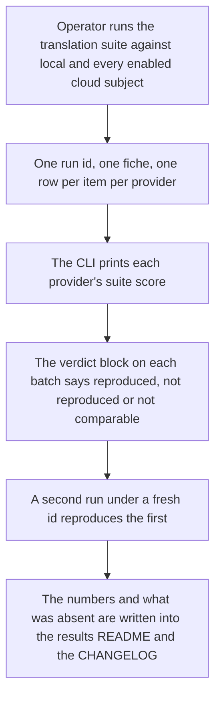
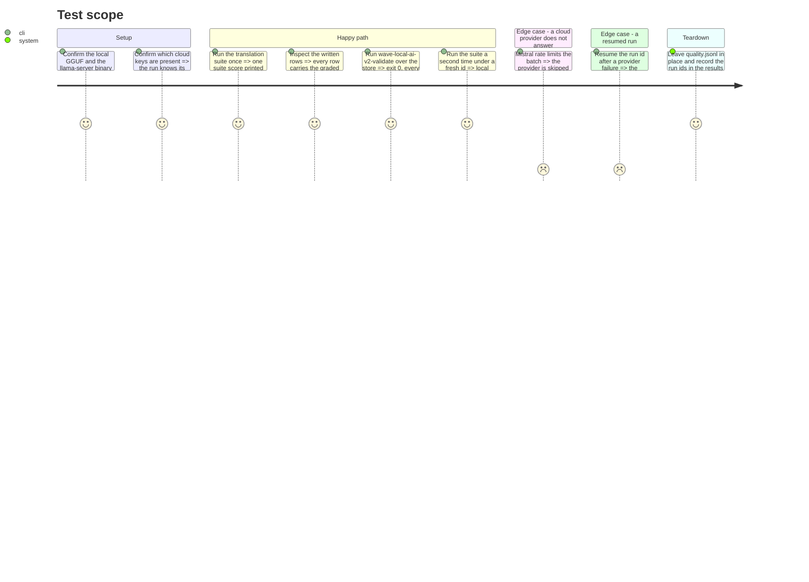

# Instruction: The live run and the record it leaves

## Architecture projection

```txt
.
├── CHANGELOG.md                          ✏️ the Unreleased entry for this increment
├── README.md                             ✏️ the quality command gains --suite
├── docs/setup.md                         ✏️ how to run the translation suite
├── aidd_docs/
│   ├── results/
│   │   ├── README.md                     ✏️ the translation suite, its metric, its caveat
│   │   └── suite-definitions/
│   │       └── translation-business-short-form.json   ✅ committed in phase 2, cited here
│   ├── memory/
│   │   ├── cli.md                        ✏️ --suite, the two suites, the graded row
│   │   ├── codebase-map.md               ✏️ chrf.py and translation_suite.py
│   │   └── architecture.md               ✏️ the two score shapes in one store
│   └── backlog/
│       └── stories/translation-scoring-extends-deterministic-coverage.md  ✏️ status and the divergence record
└── aidd_docs/results/quality.jsonl       ✏️ untracked live store, written by the run
```

## User Journey



## Test Scope



## Tasks to do

### `1)` The live run

> One full run with the verdict machinery, then a second to prove it reproduces.

1. Export both suite definitions and confirm the tracked translation JSON matches the code (`uv run python -m wave_local_ai_v2.suite_snapshot`, then `git status` clean on the classification file).
2. Run `wave-local-ai-v2-quality --suite translation` against `local` + `google`, and `mistral` when the workspace answers. Record the `run_id`, each provider's printed suite score, and the wall-clock cost.
3. If a cloud provider fails, do not retry blindly: capture the shortest decisive stderr line, then use `--resume <run_id>` so the batches already on disk are not re-paid for. If Mistral still does not answer, ship local + google and say so in the record — a missing optional subject is a documented absence, not a blocked phase.
4. Run `wave-local-ai-v2-validate` over the live store: exit 0, every row's `fiche_hash` resolves.
5. Run the suite a second time under a fresh `run_id`, with the first run's rows copied into a scratch reference file, and confirm the verdict comes back `reproduced` on `item_score` for the local batch. Record what the cloud batches returned; a cloud provider that does not honour a seed will come back `not_reproduced`, and that is a finding to write down, not a bug to hide.
6. Note any live finding worth keeping — a truncation at the 128-token cap, a model answering with a preamble, a systematically low score in one direction — as a one-line observation for the record and, if it changes behaviour, as a tech-debt entry rather than an unplanned fix here.

### `2)` The record

1. `CHANGELOG.md`, `## [Unreleased] / ### Added`, in the established voice: the chrF module and why it is in-repo rather than a dependency; the 21-item suite and its three directions; the graded scorer and the taxonomy it shares; `SCHEMA_VERSION` `"9"` → `"10"` and the conditional graded block that leaves existing rows valid; the verdict now deciding on a score when there is no label; the `task_suite`-aware resume; the `--suite` flag and the deliberate absence of a registry. State the divergences from the story (`plan.md`'s table) and the single-reference caveat.
2. `README.md` and `docs/setup.md`: the quality command's `--suite` flag, what each suite scores, the translation suite's caps, and one line on reading a graded row.
3. `aidd_docs/results/README.md`: the translation suite as published evidence — its id, version, prompt-set hash, metric and metric parameters, the run ids from task 1, each provider's suite score, what was absent and why, and the caveat that a single-reference chrF compares models against identical references rather than measuring translation quality absolutely.
4. `aidd_docs/memory/cli.md`: the `--suite` flag, the two suites and their different row shapes, the resume rule now being per `(run_id, provider, task_suite)`.
5. `aidd_docs/memory/codebase-map.md`: `chrf.py` and `translation_suite.py` in the package description; nothing else moves.
6. `aidd_docs/memory/architecture.md`, Gotchas: one store now holds two score shapes — an exact-match row and a graded row — distinguishable by `task_suite` and by whether the graded block is present, and a reader must select by suite before comparing any score column.
7. The story file: set `status` to reflect the work, and append the divergence record from `plan.md` so the backlog carries why the built thing differs from the written one.

## Test acceptance criteria

| Task | Acceptance criteria |
| ---- | ------------------- |
| 1 | One translation run produced rows for the local subject and every cloud subject that answered; `wave-local-ai-v2-validate` exits 0 over the store; a second run returns a `reproduced` verdict decided on `item_score` for the local batch; every provider that did not answer is named with the line that says why. |
| 2 | The CHANGELOG entry names the schema bump, the new modules, the new flag and every divergence from the story; the results README carries the run ids, the per-provider suite scores and the single-reference caveat; `cli.md`, `codebase-map.md` and `architecture.md` describe the shipped behaviour with no stale claim that the quality CLI scores one hardwired suite. |
