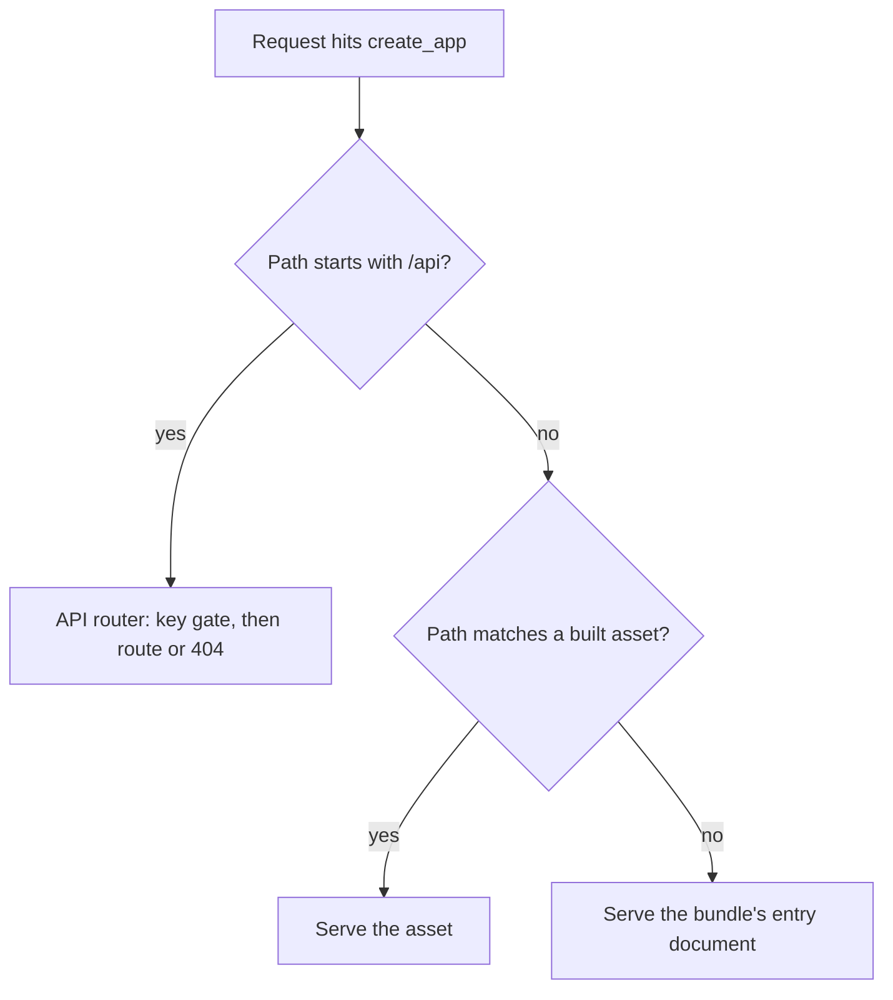
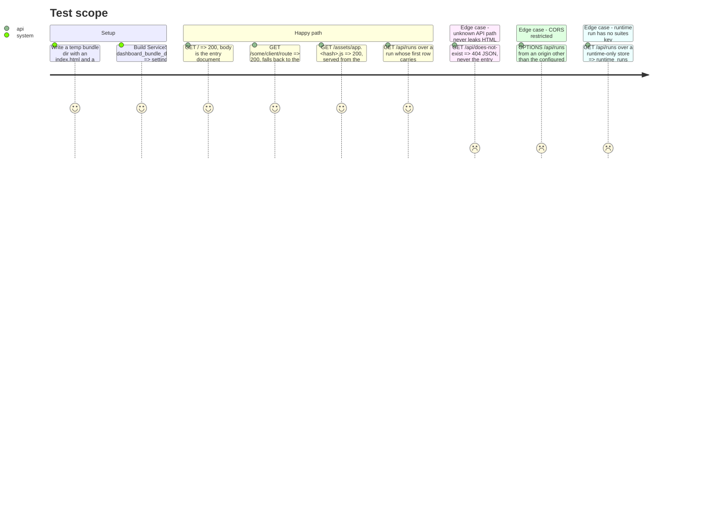

# Instruction: Decisions, origin plumbing, runs-view extension

## Architecture projection

> Tree of the final files. ✅ create · ✏️ modify · ❌ delete

```txt
.
├── .pre-commit-config.yaml            ✏️ comment recording the CI-only decision
├── .gitignore                          ✏️ frontend/node_modules, frontend/dist
├── src/wave_local_ai_v2/
│   ├── read_model.py                   ✏️ RUNS_VIEW_FIELDS gains 3 fields; _runs_collection gains models/suites
│   ├── service.py                      ✏️ static mount, entry fallback, CORS
│   └── settings.py                     ✏️ dashboard_bundle_dir, dashboard_origin
└── tests/
    ├── test_read_model.py              ✏️ partition + new fields + models/suites cases
    └── test_service.py                 ✏️ root serves entry doc, non-/api fallback, unknown /api is 404, CORS origin
```

## User Journey



## Test Scope



## Tasks to do

### `1)` Record the decisions

> Nothing to code; the decisions are already written into `plan.md`'s Decisions table — this task is the checkpoint that they were taken before any code below depends on them.

1. Confirm `plan.md`'s Decisions table covers: bundle built at setup vs. committed; npm + committed lockfile; `.nvmrc` for the Node pin; the `RUNS_VIEW_FIELDS` relocation; the `models`/`suites` enumeration; pre-commit CI-only front-end checks; CORS as defence-in-depth. Nothing else to write here.

### `2)` Extend `read_model.py`'s runs view

> Surface `release_version`, `commit_sha`, `tree_dirty` and the run's covered models/suites on `/api/runs`, with no new absence-handling machinery.

1. Move `"release_version"`, `"commit_sha"`, `"tree_dirty"` out of `RUNTIME_VIEW_FIELDS` and `QUALITY_VIEW_FIELDS` and into `RUNS_VIEW_FIELDS`. Re-run the partition assertions in `tests/test_read_model.py` mentally: the union against `row_contract.REQUIRED_FIELDS` per kind must still hold, and the sets must stay pairwise disjoint — these three now live only in `RUNS_VIEW_FIELDS`.
2. In `_runs_collection`, alongside `first_row` and `row_counts`, accumulate per `run_id`: the distinct `roster_entry_id` values seen across every row of that run (resolved to entries via `resolve_roster_entry`, deduped by `entry_id`, unresolved ids kept as their own absence rather than dropped silently), and — quality store only — the distinct `task_suite` values seen.
3. Add `"models"` to every entry the runs collection builds (both stores). Add `"suites"` only when building the quality collection; do not add the key at all for the runtime collection — a key that's always absent is worse than a key that doesn't exist.
4. Keep `row_count`'s existing full-row scan and fold the new accumulation into the same loop rather than a second pass over `store.rows`.

### `3)` Serve the bundle from `service.py`, single origin

> `/api` is never shadowed; an unknown non-`/api` path falls back to the entry document; CORS is restricted to the one configured origin.

1. Add `dashboard_bundle_dir: Path` and `dashboard_origin: str` to `ServiceSettings`, and read them in `load_service_settings` from `DASHBOARD_BUNDLE_DIR` (default `frontend/dist`) and `DASHBOARD_ORIGIN` (default computed as `http://{host}:{port}`, matching the single-origin decision — not a separate hardcoded default that could drift from the bound address).
2. In `create_app`, register the `/api` router first (as today), then mount the built assets directory and add a catch-all `GET` route for everything else that serves the bundle's entry document (`index.html`) — ordering matters: FastAPI/Starlette resolves routes in registration order, so `/api/*` must be declared before the catch-all can shadow it.
3. Add `CORSMiddleware` restricted to `[settings.dashboard_origin]`, `allow_methods=["GET"]` (the service answers no other verb), no credentials beyond the header the front end already sends explicitly.
4. An unknown `GET /api/...` path stays a 404 from the API router (unchanged from story 1) — verify the catch-all does not intercept it.

### `4)` Record the pre-commit decision and gitignore entries

1. Add a comment block to `.pre-commit-config.yaml` (no new hook) stating the CI-only decision and its reason from `plan.md`.
2. Add `frontend/node_modules` and the bundle output path (`frontend/dist`, per the "not committed" decision) to `.gitignore`.

## Test acceptance criteria

| Task | Acceptance criteria              |
| ---- | --------------------------------- |
| 2    | `GET /api/runs` over a fixture run whose row carries `tree_dirty: true`, a `release_version` and a `commit_sha` returns all three on that run's entry in both collections; a run whose rows cite two roster entries returns both under `models`, deduped; a quality run spanning two `task_suite` values returns both under `suites`; a runtime-only collection's entries carry no `suites` key at all. |
| 3    | `GET /` over a temp bundle returns 200 with the entry document's content; `GET /some/unknown/client/route` returns the same entry document; `GET /api/does-not-exist` returns 404 with a JSON body, never HTML; a preflight from an origin other than `dashboard_origin` is not granted. |
| 4    | `.pre-commit-config.yaml` contains no `npm`/`eslint`/`prettier`/`tsc` entry; `git check-ignore frontend/node_modules frontend/dist` both report ignored. |
