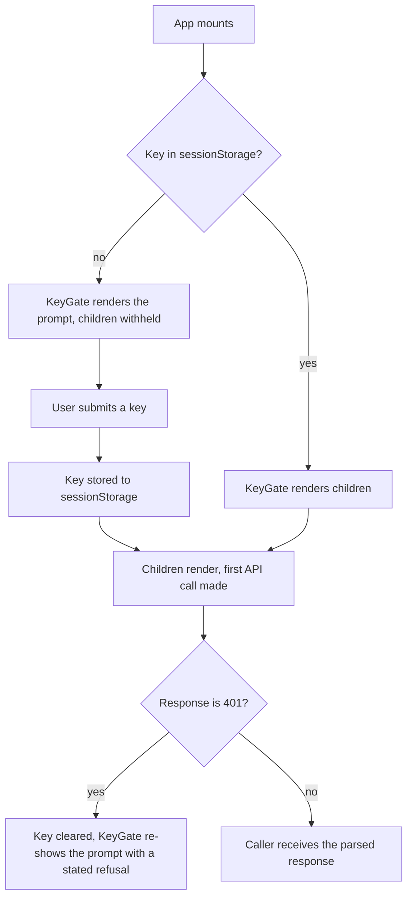
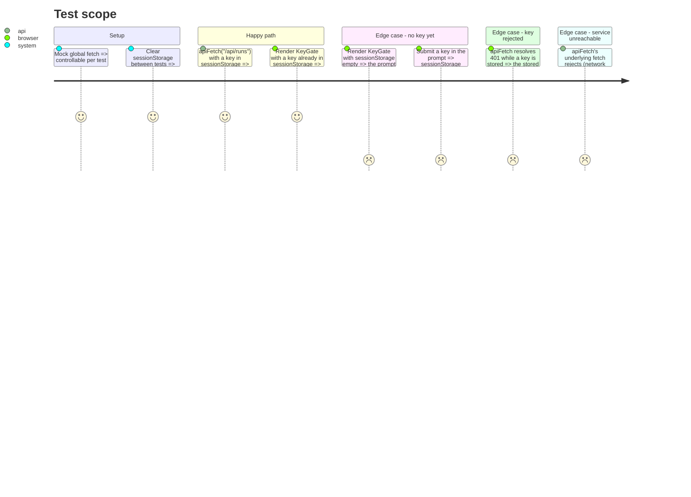

# Instruction: Frontend scaffold, API client, key gate

## Architecture projection

> Tree of the final files. ✅ create · ✏️ modify · ❌ delete

```txt
.
└── frontend/                           ✅
    ├── package.json                    ✅ vite, react, react-dom, typescript, vitest, @testing-library/react, eslint, prettier
    ├── package-lock.json               ✅ committed
    ├── .nvmrc                          ✅ pinned Node version
    ├── vite.config.ts                  ✅ dev proxy /api -> service, vitest config, coverage 80%
    ├── tsconfig.json                   ✅ strict, noEmit
    ├── eslint.config.js                ✅
    ├── .prettierrc                     ✅
    ├── index.html                      ✅ entry document
    └── src/
        ├── main.tsx                    ✅ mounts App
        ├── App.tsx                     ✅ wraps the app in the key gate
        ├── api/
        │   ├── client.ts               ✅ typed fetch wrapper, X-API-Key from sessionStorage
        │   ├── client.test.ts          ✅
        │   ├── types.ts                ✅ the runs-view response shape, Absent
        │   └── keyStore.ts             ✅ sessionStorage read/write, no persistence beyond the tab session
        └── components/
            ├── KeyGate.tsx             ✅ the one-time key prompt, shown on 401
            └── KeyGate.test.tsx        ✅
```

## User Journey



## Test Scope



## Wireframe

```
┌───────────────────────────────────────────────┐
│ (1) Key prompt (modal overlay, shown on 401)   │
│   "This dashboard needs the service's API key" │
│   [ input: key            ] [ Continue ]       │
│   (2) refusal message slot (empty until 401)   │
└───────────────────────────────────────────────┘
```

1. Modal blocks the app until a key is entered; the input is never pre-filled from anywhere but this tab's own `sessionStorage`.
2. A submitted key that still gets refused shows a named message here — never a silent retry loop and never a raw error dump.

## Tasks to do

### `1)` Scaffold the toolchain

> Vite + React + TS, pinned versions, vitest + Testing Library, ESLint + Prettier, `tsc --noEmit` — nothing wired into CI yet, that is phase 4.

1. `npm create vite@latest` (React + TypeScript template) under `frontend/`, then pin every dependency version in `package.json` rather than leaving carets unreviewed, and commit `package-lock.json`.
2. `frontend/.nvmrc` names the Node version CI and a local `nvm use` both read.
3. `vite.config.ts`: dev server proxies `/api/*` to `http://127.0.0.1:8000` (the service's default bind); vitest config block sets environment `jsdom`, includes `@testing-library/jest-dom` setup, and coverage thresholds at 80% lines (`--cov-fail-under` equivalent).
4. `tsconfig.json` strict mode, `noEmit: true`. ESLint flat config + Prettier config matching this repo's general style (no opinionated rewrite of Vite's own template beyond what's needed).

### `2)` The API client module

> One module every view fetches through. Reads `X-API-Key` from `sessionStorage`, attaches it to every `/api` call, and gives callers a typed way to distinguish "needs a key" from every other failure.

1. `api/keyStore.ts`: `getKey()` / `setKey(key)` / `clearKey()` over `sessionStorage` under one named key — never `localStorage`, since the key must not outlive the tab session (epic: "the browser holds the key for the session only").
2. `api/client.ts`: `apiFetch<T>(path: string): Promise<T>` — attaches `X-API-Key` when a key is stored, parses JSON on success, and on a `401` response clears the stored key and throws a typed `UnauthorizedError` distinct from a typed `NetworkError` (fetch rejection) and a typed `ApiError` (any other non-2xx, carrying the response's own status and body).
3. `api/types.ts`: the TypeScript shapes for `/api/runs`'s response — `RunsView`, `RunEntry`, and `Absent` (`{ absent: true; reason: string; detail: Record<string, unknown> }`) mirroring `read_model.Absent.as_json()` exactly, including the `models`/`suites` fields phase 1 added.

### `3)` The key gate component

> The gate half of the story title: renders children once a key is present, the one-time prompt otherwise, and re-prompts with a stated refusal on a 401 without the caller having to know about it.

1. `components/KeyGate.tsx`: on mount, checks `keyStore.getKey()`; renders the prompt when absent. On submit, stores the key and renders children. Exposes (via context or a passed-down callback) a way for `apiFetch`'s `UnauthorizedError` to route back to re-showing the prompt with its refusal message — children do not each re-implement 401 handling.
2. `App.tsx` wraps its content in `KeyGate`; `main.tsx` mounts `App`.

## Test acceptance criteria

| Task | Acceptance criteria              |
| ---- | --------------------------------- |
| 1    | `npm run build`, `npm run lint`, `npx prettier --check .`, `npx tsc --noEmit`, `npm run test -- --coverage` all exit 0 on the scaffold before any feature code is added. |
| 2    | `apiFetch` attaches `X-API-Key` only when a key is stored; a 401 throws `UnauthorizedError` and clears the stored key; a network rejection throws a distinct `NetworkError`; a non-401 non-2xx throws `ApiError` carrying the status. |
| 3    | With `sessionStorage` empty, `KeyGate` renders the prompt and not its children; submitting a key renders the children and persists the key to `sessionStorage`; simulating an `UnauthorizedError` from a child's fetch re-shows the prompt with a non-empty refusal message and an empty `sessionStorage` key. |
