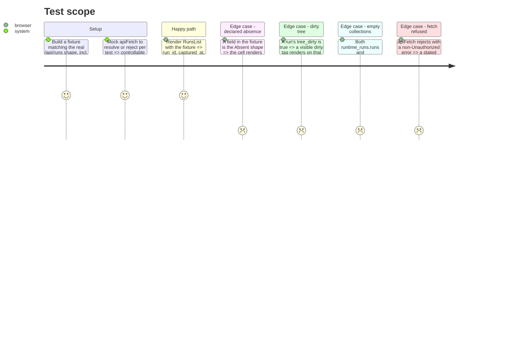

# Instruction: Runs list view, absence rendering, local build proof

## Architecture projection

> Tree of the final files. ✅ create · ✏️ modify · ❌ delete

```txt
.
└── frontend/src/
    ├── App.tsx                         ✏️ fetches /api/runs on mount, renders RunsList or a stated error
    ├── components/
    │   ├── Absent.tsx                  ✅ shared component every future view reuses
    │   └── Absent.test.tsx             ✅
    └── views/
        ├── RunsList.tsx                ✅ the runs-list screen
        ├── RunsList.test.tsx           ✅
        └── fixtures/runsView.fixture.ts ✅ a fixture matching /api/runs's real shape
```

## User Journey

```mermaid
flowchart TD
  A[RunsList mounts] --> B[apiFetch("/api/runs")]
  B --> C{Success?}
  C -- yes --> D{Any runs in either collection?}
  D -- yes --> E[Render runtime_runs and quality_runs as two named sections]
  D -- no --> F["Render a named 'no runs recorded' state"]
  C -- no, UnauthorizedError --> G[KeyGate re-prompts, handled above this view]
  C -- no, other error --> H["Render a stated 'could not reach the service' message"]
  E --> I{A field on a row is absent?}
  I -- yes --> J["Render <Absent reason=.../> in that cell"]
  I -- no --> K[Render the value]
```

## Test Scope



## Wireframe

```
┌─────────────────────────────────────────────────────────┐
│ (1) Header: "wave-local-ai-v2" · (2) key status/reset     │
├─────────────────────────────────────────────────────────┤
│ (3) Runs list                                              │
│  ┌───────────────────────────────────────────────────┐   │
│  │ (4) Run row: run_id · captured_at · suites/models  │   │
│  │     · release_version · commit_sha · (5) dirty tag │   │
│  └───────────────────────────────────────────────────┘   │
│  (6) Empty/error state slot (named absence or API error)  │
└─────────────────────────────────────────────────────────┘
```

1. Header names the app; no navigation yet — this story ships one screen.
2. Small control that clears the stored key via `keyStore.clearKey()`, forcing `KeyGate` to re-prompt — optional; cut if it adds scope beyond phase 2's gate.
3. `runtime_runs` and `quality_runs` render as two clearly separate sections (matching the API's own two-collection shape) — never merged into one list.
4. One row per run; `models` and, on the quality section, `suites`, render as a short joined list.
5. `tree_dirty: true` renders as a visible inline tag — Methodology 19's disclosure, not an aside.
6. Zero runs, or a fetch failure, renders a named message here — never an empty table indistinguishable from "no runs".

## Tasks to do

### `1)` The shared `Absent` component

> Every later view (quality table, runtime table, energy detail) reuses this; get its contract right once.

1. `components/Absent.tsx`: `<Absent reason={string} detail={Record<string, unknown>} />` renders a short, visibly-styled "not reported" marker naming the reason (e.g. "predates schema version 7", "missing from row", "roster_entry_id abc123 not found") — never blank, a dash, `0`, or an em-dash with nothing behind it. Takes the parsed `Absent` shape from `api/types.ts` directly, so a caller never re-derives the message from the raw JSON marker.

### `2)` The runs list view

1. `views/RunsList.tsx`: calls `apiFetch<RunsView>("/api/runs")` on mount; while loading, shows a loading state; on success, renders `runtime_runs` and `quality_runs` as two named sections, each row via a small `RunRow` (inline or its own file) that renders every `RunsView`-carried field, routing any field typed as `Absent` through the `Absent` component from task 1 rather than through ad-hoc per-field checks.
2. Each collection with an empty `runs` array renders a stated "no runs recorded" message instead of an empty table.
3. A caught non-`UnauthorizedError` (network or other API error) renders a stated "could not reach the service" message carrying the error's own text; `UnauthorizedError` itself is not caught here — it propagates to `KeyGate` from phase 2, which owns re-prompting.
4. Wire `App.tsx` to render `RunsList` as its (only, for this story) content inside `KeyGate`.

### `3)` Local build and manual verification (phase evidence)

> Not automated — the documented proof this phase actually works end to end, over the real service.

1. `npm run build` inside `frontend/` produces `frontend/dist/`.
2. Point `DASHBOARD_BUNDLE_DIR` at that `dist/` directory, start the service (`uv run wave-local-ai-v2-serve` or the existing entry point) over a store carrying at least one run with a declared absence and one with `tree_dirty: true`.
3. Open the served root in a browser: confirm the runs list renders without a terminal, the absence renders as its named marker, and the dirty run shows its tag. Capture this as the phase's evidence (a screenshot or a short note of what was observed), not asserted from reading the code.

## Test acceptance criteria

| Task | Acceptance criteria              |
| ---- | --------------------------------- |
| 1    | `Absent` renders visibly distinct, non-empty text for every `reason` value `read_model.ABSENCE_REASONS` defines; snapshot or text-query tests cover at least one of each. |
| 2    | `RunsList` rendered against the fixture shows every real value from the fixture and every `Absent` field via the shared component; an empty-collections fixture shows the named empty state; a rejected `apiFetch` (non-401) shows the named unreachable state. |
| 3    | The manual walk is documented (screenshot or written observation) as the phase's evidence, showing a real run's absence rendered and a real `tree_dirty` tag rendered, over the built bundle served by `service.py` — not a mocked fetch. |

## Task 3 evidence: manual walk over the real service

`npm run build` produced `frontend/dist/`. The service was started with
`DASHBOARD_BUNDLE_DIR` pointed at it, `RUNTIME_RESULTS_PATH`/`QUALITY_RESULTS_PATH`
pointed at a temp store built from `tests/store_fixtures.py`'s own fixtures, over
two runtime rows (`clean-run` with `commit_sha="abc1234"`, `tree_dirty=false`;
`dirty-run` with `commit_sha=None` — a declared `null_in_row` absence —
`tree_dirty=true`) and one quality row.

Opened `http://127.0.0.1:8123/` in a real browser (Claude in Chrome), entered a
key past the client-side `KeyGate` prompt, and confirmed on the rendered page:

- The runs list renders with no dev tooling, over the real built bundle served
  by `service.py` (not a mocked fetch) — two named sections, `Runtime runs`
  and `Quality runs`.
- `dirty-run`'s `commit_sha` cell renders `not reported (not captured on this
  row)` via the shared `Absent` component — never blank, a dash, or `0`.
- `dirty-run` (and `quality-run-a`, which had no `tree_dirty` override in this
  ad hoc fixture) show the visible red `dirty tree` tag; `clean-run`
  (`tree_dirty=false`) shows no tag.

Screenshot: [`evidence/phase-3-manual-verification.jpg`](./evidence/phase-3-manual-verification.jpg).
