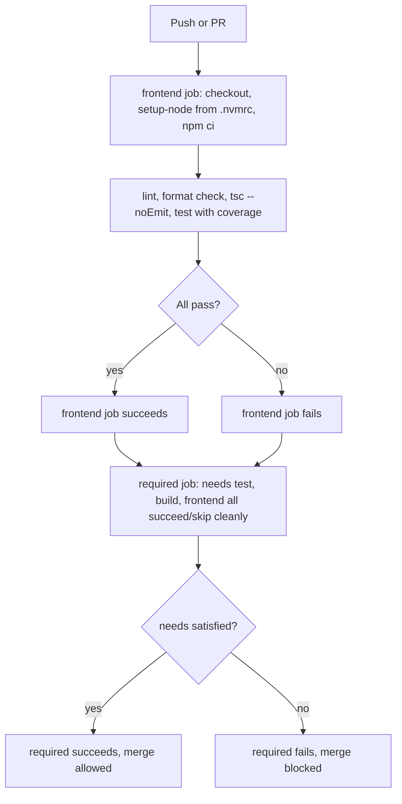
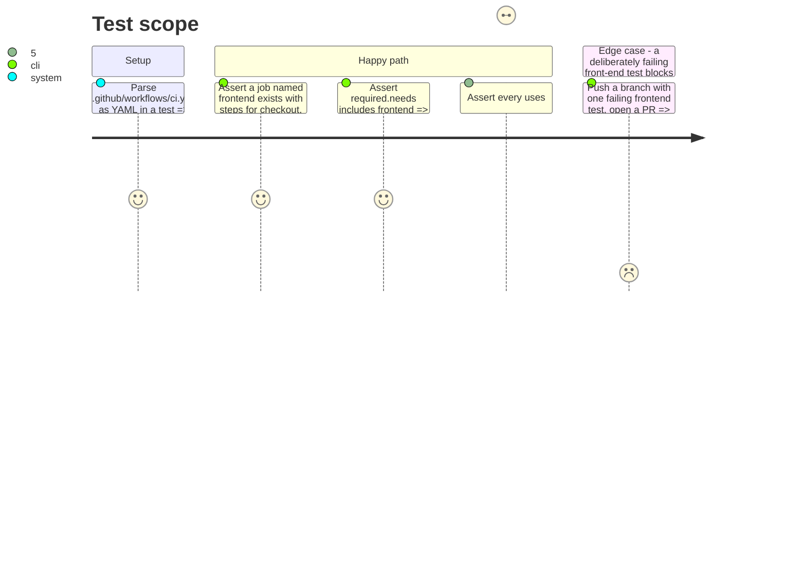

# Instruction: CI `frontend` job, docs, setup path

## Architecture projection

> Tree of the final files. ✅ create · ✏️ modify · ❌ delete

```txt
.
├── .github/workflows/ci.yml            ✏️ new `frontend` job; `required.needs` gains it
├── tests/test_ci_workflow.py           ✅ asserts the job exists, is required, every `uses:` is sha-pinned
├── docs/setup.md                       ✏️ front-end prerequisite + the one build command
└── README.md                           ✏️ front-end prerequisite named at a glance
```

## User Journey



## Test Scope



## Tasks to do

### `1)` The `frontend` CI job

> Same enforcement posture as `test`: installs from the lockfile, runs every gate, fails the build below 80% coverage.

1. Add a `frontend` job to `.github/workflows/ci.yml`: `runs-on: ubuntu-latest` only (the story scopes this job to Ubuntu, unlike `test`'s two-OS matrix — front-end tooling has no OS-specific behavior this project depends on). Triggers on both `push` and `pull_request` (the workflow's existing top-level `on:` already covers both; no per-job trigger override needed).
2. Steps: checkout (pinned exactly as the existing `actions/checkout@v4` reference — verify whether that reference is itself sha-pinned elsewhere in the file or needs pinning now, since the story requires every action in the file pinned by sha, not only new ones); a Node setup action (e.g. `actions/setup-node`) pinned by commit sha with its version in a trailing comment, matching `astral-sh/setup-uv`'s own comment convention in this file, configured to read the version from `frontend/.nvmrc` (`node-version-file`); `npm ci` inside `frontend/` (installs from the committed lockfile, refusing a lockfile/package.json mismatch); lint; `prettier --check`; `tsc --noEmit`; `npm test -- --coverage` with the 80% floor phase 2's vitest config already enforces.
3. Add `frontend` to the `required` job's `needs` list, and extend its check-matrix-result logic to also fail when `needs.frontend.result` is not `success`.

### `2)` `tests/test_ci_workflow.py`

> The assertion the story names as the one that silently regresses.

1. New test file: parses `.github/workflows/ci.yml`, asserts a `frontend` job exists with the steps task 1 describes (by name/command, not by exact YAML formatting), asserts `frontend` is present in the `required` job's `needs`, and asserts every `uses:` value across the whole file matches `<owner>/<repo>@<40-character-hex-sha>` — the existing entries already do; this is the regression guard the story specifically calls out, so it must fail loudly if a future edit adds an unpinned `uses:` anywhere in the file, not only inside the new job.

### `3)` Docs and setup path

1. `docs/setup.md`: name the front-end prerequisite (Node, the version `.nvmrc` pins) and the one documented command producing a served bundle from a fresh clone (`cd frontend && npm ci && npm run build`, then starting the service pointed at that `dist/`) — coordinated with the bundle-not-committed decision from phase 1, so the fresh-machine walk this file already documents for the Python half gets its front-end counterpart in the same place rather than a second document.
2. `README.md`: name the front-end prerequisite where the existing "Setup, running, results — at a glance" section already lists `uv sync`, so a reader sees both halves' setup commands together.

## Test acceptance criteria

| Task | Acceptance criteria              |
| ---- | --------------------------------- |
| 1    | A PR with a deliberately failing `frontend` step shows that job red and `required` red on the same PR; a clean PR shows both green. |
| 2    | `uv run pytest tests/test_ci_workflow.py` passes against the real file, and fails if a `uses:` line without a sha is introduced (verified by temporarily editing one during development, per the CI epic's own "each check can fail" evidence pattern). |
| 3    | Following `docs/setup.md` on a machine with only Node and the repo cloned (no prior npm state) produces a served bundle with no undocumented manual step. |
