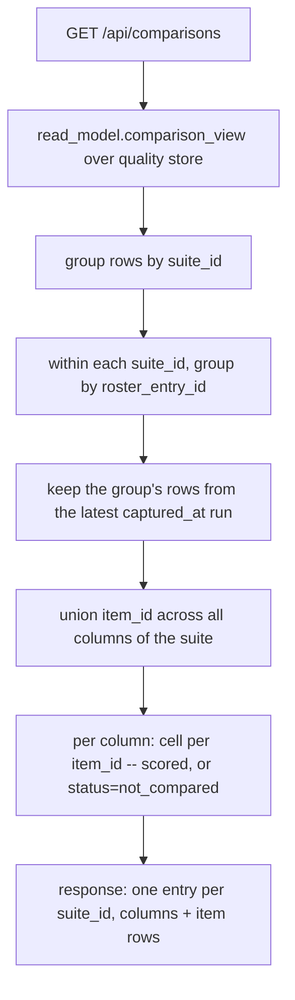
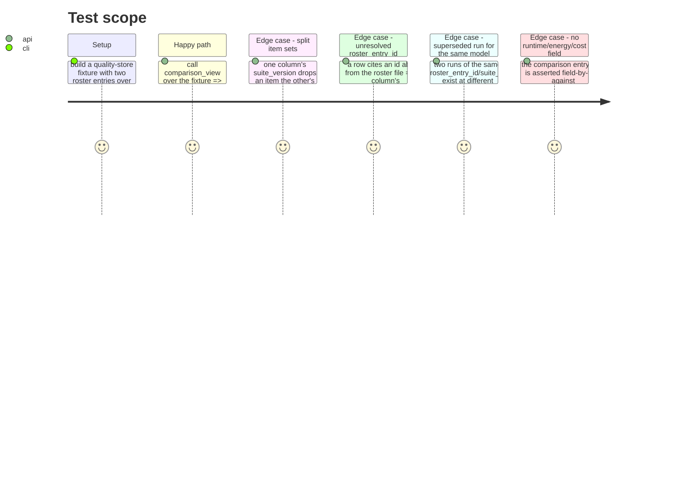

<!-- Fill or omit these sections; never add, rename, or reorder one. -->

# Instruction: `read_model.comparison_view`, the `/api/comparisons` route, column/cell semantics, tests

## Architecture projection

> Tree of the final files. ✅ create · ✏️ modify · ❌ delete

```txt
.
├── src/wave_local_ai_v2/
│   ├── read_model.py   ✏️ COMPARISON_DIMENSIONS, comparison_view() and its column/cell helpers
│   └── service.py      ✏️ GET /api/comparisons, store-wide, no {run_id}
└── tests/
    └── test_read_model.py   ✏️ column selection, dimensions list, not-compared cells, unresolved roster_entry_id, no runtime/energy/cost field on the type
```

## User Journey



## Test Scope

<!-- Required for every phase. Keep Setup, Happy path, any qualifying Edge cases, and any required Teardown in this one journey. -->



## Tasks to do

### `1)` `COMPARISON_DIMENSIONS` and the column key

> Give the column its extensible identity before assembling any row data.

1. In `read_model.py`, add `COMPARISON_DIMENSIONS: tuple[str, ...] = ("architecture",)` beside the existing `RUNS_VIEW_FIELDS`-style constants, with a docstring naming the three future entries (`machine`, `engine`, `prompt_variant`) and that each resolves from the row once it exists there, `architecture` alone resolving from the roster entry today.
2. Add a helper resolving one dimension's value for a row + its resolved roster entry, returning the roster entry's `architecture` sub-dict for `"architecture"` (propagating its own `Absent` when the roster entry did not resolve), and reserved for `resolve_field(row, dimension)` on any future entry not yet implemented as literal.

### `2)` Column selection: `(suite_id, roster_entry_id)`, latest `captured_at` wins

> One column per model per suite, never one per run.

1. Add `_comparison_columns(store, roster_file)` grouping the quality store's rows by `suite_id` then by `roster_entry_id` (via `resolve_field`/`_dedup_key`, matching `_runs_collection`'s own dedup style), keeping per group the row set whose `captured_at` is greatest -- ties broken by `run_id` string order, deterministic rather than arbitrary dict order.
2. Each column carries: `roster_entry_id`, `run_id`, `suite_version`, `prompt_set_hash`, `thinking_policy`, `roster_entry` (via the existing `resolve_roster_entry`), `dimensions` (task 1's helper over `COMPARISON_DIMENSIONS`), and its own `rows_by_item: dict[item_id, row]` (kept internal to the module, not serialized).

### `3)` Item union and cell rendering

> Every item any column's suite carries gets a row; every column states compared or not for it.

1. Per `suite_id`, compute the union of `item_id` across every column's `rows_by_item`, sorted for a stable response order.
2. For each `item_id`, build one cell per column: if the column's `rows_by_item` holds that id, reuse `_quality_entry`'s existing per-row rendering (score shape, language breakdown, indicative marks, `contamination_risk`, `failure_counts` -- the same fields `QualityView.tsx` already renders per row) wrapped with `"status": "compared"`; otherwise `{"status": "not_compared", "item_id": item_id}` and nothing else.
3. Assemble `comparison_view(quality_path, floor, roster_file, suite_definitions_dir, fiche_registry_dir) -> dict[str, Any]`: `{"store": "quality", "schema_floor": floor, "suites": [{"suite_id": ..., "columns": [...], "items": [...]}], "unreadable": [...]}`. No `run_id` parameter -- store-wide by decision.

### `4)` The route

> Exposed under the quality family, reading only the quality store.

1. In `service.py`, add `@api.get("/comparisons")` calling `comparison_view` with `settings.quality_results_path`, `settings.schema_floor`, `loaded_roster()`, `settings.suite_definitions_dir`, `settings.fiche_registry_dir`; return `read_model.to_jsonable(view)`. No `run_id` path parameter, no reference to `settings.runtime_results_path`.

### `5)` Tests

> `tests/test_read_model.py`, following the file's own fixture and assertion style (see `test_the_runs_view_enumerates_distinct_models_and_suites`, `test_a_roster_entry_id_absent_from_the_roster_is_a_named_pointer_absence`).

1. A fixture with rows for two roster entries over one `suite_id` at two `suite_version`s, one item present only at the newer version: assert two columns, each with its own `suite_version`; assert the item missing from the older version's column renders `status: "not_compared"` there and `status: "compared"` in the newer column.
2. A fixture with an unresolvable `roster_entry_id`: assert the column still appears, naming the id, with `roster_entry`/`dimensions.architecture` carrying the existing `pointer_unresolved` absence -- never a column silently dropped or rendered with a missing key.
3. A fixture with two runs of the same `roster_entry_id` on one `suite_id` at different `captured_at`: assert only the later run's rows back the column (check via one field that differs between the two runs, e.g. `accuracy` or `run_id`).
4. A structural test asserting the comparison entry's rendered field set is disjoint from `RUNTIME_VIEW_FIELDS` and `ENERGY_VIEW_FIELDS` (set difference, not a fixture inspection) -- the comparison is quality-only per the acceptance, asserted the same way `test_no_field_is_owned_by_two_sets_of_one_kind` already asserts partitions.

## Test acceptance criteria

<!-- Each criterion is an observable behavior, not a command. -->

| Task | Acceptance criteria              |
| ---- | -------------------------------- |
| 1... | `COMPARISON_DIMENSIONS` exists and is iterated, not hand-listed, when a column's `dimensions` dict is built |
| 2... | Two rows sharing `(suite_id, roster_entry_id)` at different `captured_at` collapse into one column backed by the later run |
| 3... | An item absent from one column's backing rows renders `status: "not_compared"` in that column and a scored cell in any column that has it |
| 4... | `GET /api/comparisons` returns without a `run_id`, reading only `quality_results_path` |
| 5... | `pytest tests/test_read_model.py -k comparison` passes, including the field-partition test against runtime/energy field sets |
