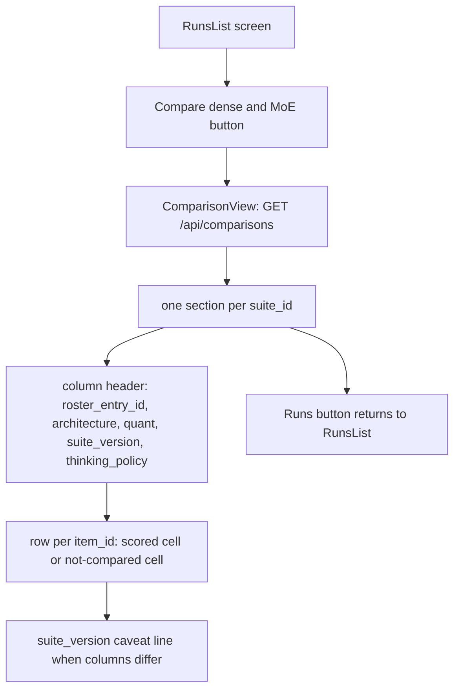
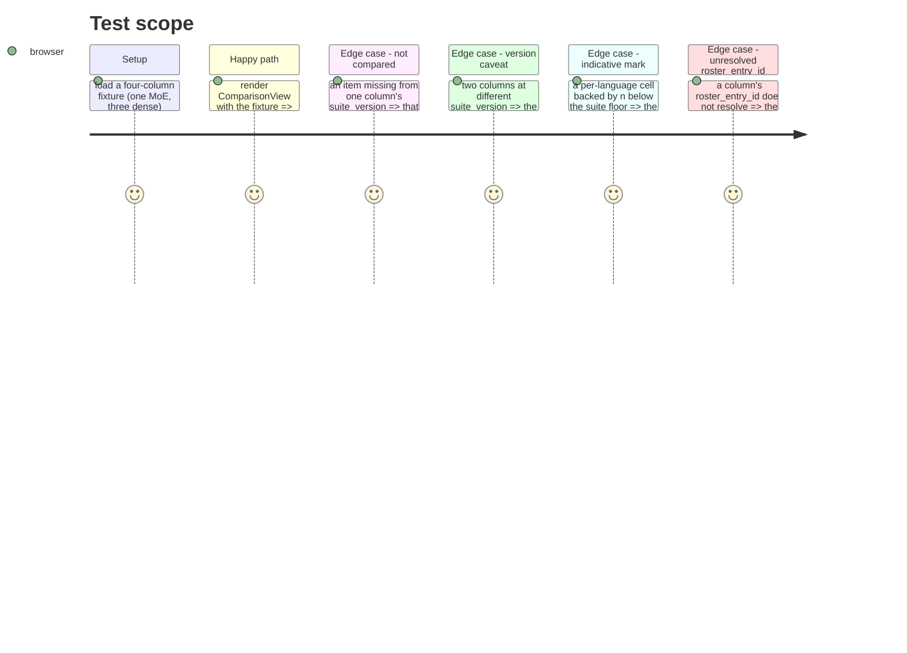

<!-- Fill or omit these sections; never add, rename, or reorder one. -->

# Instruction: The `views/comparison/` screen over fixtures, App.tsx entry point, boundary test extended

## Architecture projection

> Tree of the final files. ✅ create · ✏️ modify · ❌ delete

```txt
.
└── frontend/src/
    ├── views/
    │   ├── comparison/                         ✅
    │   │   ├── ComparisonView.tsx               ✅ fetches /api/comparisons, renders one table per suite_id
    │   │   ├── ComparisonView.test.tsx           ✅
    │   │   ├── types.ts                          ✅ mirrors comparison_view's JSON shape
    │   │   └── fixtures/comparisonView.fixture.ts ✅
    │   └── boundary.test.ts                      ✏️ third pairwise check: views/comparison/ <-> views/runtime/
    └── App.tsx                                    ✏️ Selection gains { status: 'comparison' }, RunsList gets an entry point
```

## User Journey



## Test Scope



## Wireframe

```txt
┌────────────────────────────────────────────────────────────────┐
│ (1) Header: wave-local-ai-v2                                     │
├────────────────────────────────────────────────────────────────┤
│ (2) ← Runs        Compare dense and MoE                          │
├────────────────────────────────────────────────────────────────┤
│ (3) Suite: classification-support-routing                        │
│ ┌──────────┬──────────────┬──────────────┬──────────────┐       │
│ │ (4) Item │ (5) gemini…  │ (5) Qwen3.6..│ (5) Qwen3-4B │  ...  │
│ │          │ dense/moe    │ suite_ver    │ policy       │       │
│ ├──────────┼──────────────┼──────────────┼──────────────┤       │
│ │ item-01  │ (6) score    │ score        │ score        │       │
│ │ item-02  │ (7) not      │ score        │ score        │       │
│ │          │  compared    │              │              │       │
│ └──────────┴──────────────┴──────────────┴──────────────┘       │
│ (8) version caveat: columns at suite_version "2" and "3"          │
├────────────────────────────────────────────────────────────────┤
│ (9) Suite: translation-business-short-form  (same layout)         │
└────────────────────────────────────────────────────────────────┘
```

1. Header: unchanged app title.
2. Top nav: back to Runs, and the Comparison entry point -- reachable without picking a run, since the comparison reads the whole store.
3. One section per `suite_id` present in the response, no assumption of exactly two.
4. Item column: the union of every column's `item_id`s for this suite.
5. Column header: `roster_entry_id`, architecture (dense, or moe + expert count + active params), quant, `suite_version`, `thinking_policy` -- everything the acceptance requires named per column.
6. A compared cell: the item's score (exact-match or graded), reusing `renderScore`/`renderLanguageBreakdown`-equivalent logic and `labels/IndicativeLabel` unchanged.
7. A not-compared cell: this item sits outside that column's suite_version item set -- an explicit label, never a blank or a `0`.
8. A caveat line, shown only when the section's columns span more than one `suite_version`, naming every version present.
9. Further suite sections repeat the structure.

## Tasks to do

### `1)` `views/comparison/types.ts`

> Mirror `comparison_view`'s JSON shape exactly, the same discipline `views/quality/types.ts` holds.

1. Define `ComparisonSuite`, `ComparisonColumn` (including `dimensions: Record<string, Maybe<unknown>>`), and `ComparisonCell` as a discriminated union on `status: 'compared' | 'not_compared'`, importing only from `../../api/types` -- never from `../quality/types` or `../runtime/types`.

### `2)` `ComparisonView.tsx`

> One table per suite, columns from the response, no runtime/energy import.

1. Fetch `/api/comparisons` on mount (same `apiFetch`/`useKeyGate`/loading-unreachable pattern as `QualityView.tsx`).
2. Render one `<section>` per suite: a header row built from each column's `dimensions`, `roster_entry_id`, `roster_entry.quant`, `suite_version`, `thinking_policy`; a body row per item with one cell per column, reusing `labels/IndicativeLabel`, `labels/ContaminationRiskLabel`, `labels/VerdictLabel` exactly as `QualityView.tsx` does, and a bare "not compared" span for `status: 'not_compared'` cells.
3. When a suite's columns carry more than one distinct `suite_version`, render one caveat line naming every version present -- computed from the response, never hand-written per suite.

### `3)` Fixture and test

1. `fixtures/comparisonView.fixture.ts`: one suite, four columns (the MoE flagship and the three-rung dense ladder), one item present in every column and one item present only in the newer-`suite_version` columns.
2. `ComparisonView.test.tsx`: renders the fixture; asserts four architectures and four quants render; asserts the not-compared cell renders its label, not a blank or `"0"`; asserts an indicative cell keeps `IndicativeLabel`'s mark; asserts the version caveat line names both versions present.

### `4)` `App.tsx` entry point

1. `Selection` gains `{ status: 'comparison' }`. `RunsList`'s caller (or `RunsList` itself) renders a "Compare dense and MoE" button that sets this selection; a top nav bar in the `comparison` branch offers "← Runs" back to `{ status: 'runs' }`. No router library added.

### `5)` `views/boundary.test.ts`

1. Add a third `it()`: no file under `views/comparison/` imports a module specifier containing `runtime`, glob-scanned the same way the existing two checks are. Confirm it actually fails first (temporarily add a cross-import, run, observe the failure, remove it) -- same proof method the file's own header documents for the original pair.

## Test acceptance criteria

| Task | Acceptance criteria              |
| ---- | -------------------------------- |
| 1... | `views/comparison/types.ts` imports nothing from `views/quality/` or `views/runtime/` |
| 2... | `ComparisonView` renders one section per suite_id and one column per model, each naming its `roster_entry_id` |
| 3... | `npm test` in `frontend/` passes `ComparisonView.test.tsx`, including the not-compared and indicative-mark assertions |
| 4... | Clicking "Compare dense and MoE" from `RunsList` reaches the comparison screen without selecting a run first |
| 5... | `views/boundary.test.ts` fails when a cross-import is temporarily added under `views/comparison/`, and passes clean afterward |
