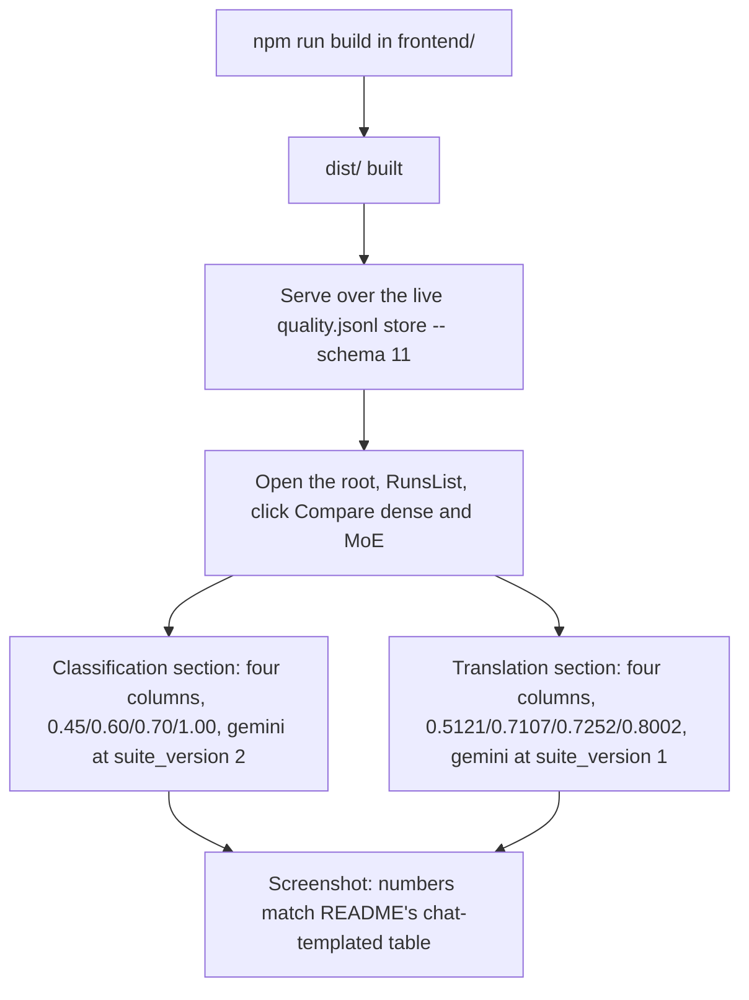
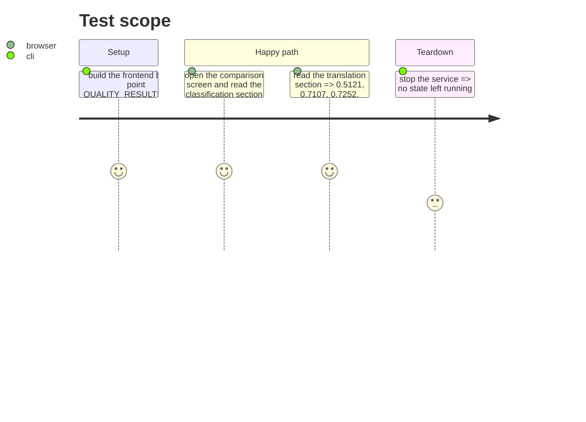

<!-- Fill or omit these sections; never add, rename, or reorder one. -->

# Instruction: Evidence over the live store, `aidd_docs/results/README.md`, CHANGELOG

## Architecture projection

> Tree of the final files. ✅ create · ✏️ modify · ❌ delete

```txt
.
├── CHANGELOG.md                      ✏️ Unreleased/Added: the comparison route and screen
├── aidd_docs/results/README.md       ✏️ note pointing the "Dense versus MoE" sections at the screen that now renders them
└── aidd_docs/tasks/2026_09/2026_09_21_dense-and-moe-side-by-side/
    └── evidence/
        ├── phase-3-comparison-classification.png   ✅ four-column classification comparison over the live store
        └── phase-3-comparison-translation.png      ✅ four-column translation comparison over the live store
```

## User Journey



## Test Scope



## Tasks to do

### `1)` Serve the live store and capture the comparison screen

1. `npm run build` inside `frontend/`; point `DASHBOARD_BUNDLE_DIR` at `frontend/dist/`, `QUALITY_RESULTS_PATH` at `aidd_docs/results/quality.jsonl` (the untracked live store, `schema_version` up to `"11"`), `RUNTIME_RESULTS_PATH` unchanged; start `wave-local-ai-v2-serve`.
2. Open the served root (Claude in Chrome), click through to the comparison screen. Confirm the classification section shows four columns citing `qwen3.6-35b-a3b-ud-iq4xs`, `qwen3-4b-q4km`, `qwen3-1.7b-q8`, `qwen3-0.6b-q8` and the cited `gemini-3.5-flash-lite` row, with accuracies `1.00`, `0.70`, `0.60`, `0.45` matching `aidd_docs/results/README.md`'s "The same eight batches, chat-templated" table; the gemini column names `suite_version` `"2"` against the ladder's `"3"`. Screenshot.
3. Confirm the translation section shows the same four models' `suite_score` `0.8400` / `0.8002` / `0.7252` / `0.7107` / `0.5121`, gemini's column naming `suite_version` `"1"` against the ladder's `"2"`, and every per-direction cell carrying its `IndicativeLabel` mark (7-item cells against the 10-item floor). Screenshot.
4. Confirm at least one item on screen shows the not-compared state if the live store's two suite_versions do not share their full item sets; if every item is shared, note that explicitly in the evidence rather than fabricating a gap.

### `2)` `aidd_docs/results/README.md`

1. Add one short note at the top of the "Dense versus MoE, side by side" section (or immediately before "The same eight batches, chat-templated," whichever reads better in place) pointing at the comparison screen that now renders this same data live, naming the route (`GET /api/comparisons`) so a reader can check the table against the running service.

### `3)` `CHANGELOG.md`

1. `## [Unreleased]` → `### Added`: the `GET /api/comparisons` route and the `views/comparison/` screen, in the file's existing terse, mechanism-naming style.

## Test acceptance criteria

| Task | Acceptance criteria              |
| ---- | -------------------------------- |
| 1... | Two screenshots exist, each captioned with the run_ids and accuracy/suite_score figures they show, and those figures match `aidd_docs/results/README.md`'s committed tables exactly |
| 2... | The README's new note names the live route and does not restate or duplicate the existing tables |
| 3... | `CHANGELOG.md`'s `Unreleased/Added` entry names the route and the screen, not a restatement of the story's acceptance text |
