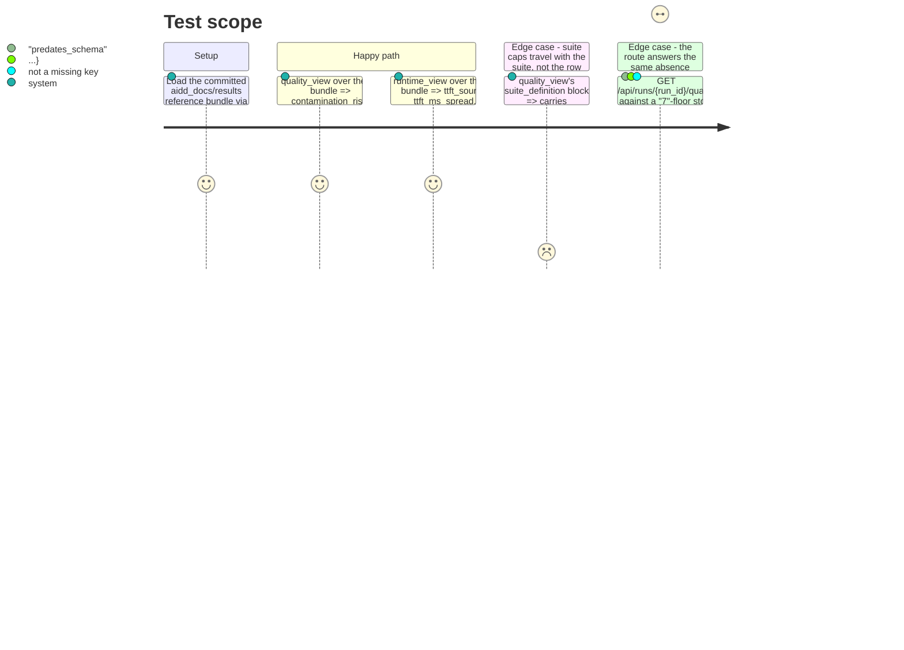

# Instruction: Read-model verification, the one real gap, route tests

## Architecture projection

> Tree of the final files. ✅ create · ✏️ modify · ❌ delete

```txt
.
├── src/wave_local_ai_v2/
│   └── read_model.py                 (unchanged — verified, not modified; see plan.md Decisions)
└── tests/
    ├── test_read_model.py            ✏️ named tests tying each story-cited field to its resolution
    └── test_service.py               ✏️ one route-level test naming the same fields over HTTP
```

## User Journey

```mermaid
flowchart TD
  A[Read the "7" reference bundle's first quality row] --> B{Field the story names present?}
  B -- contamination_risk / indicative_reasons / failure_counts --> C[Real value, already rendered by QUALITY_VIEW_FIELDS]
  B -- thinking_policy --> D["Absent(predates_schema), row_schema_version: '7'"]
  A --> E[Read the "7" reference bundle's runtime rows]
  E --> F[ttft_source / *_spread all real values, already rendered by RUNTIME_VIEW_FIELDS]
  G[GET /api/runs/id/quality over the "7" bundle] --> H[Response carries thinking_policy as a named absence, not a missing key]
```

## Test Scope



## Tasks to do

### `1)` Confirm the field inventory against `row_contract.REQUIRED_FIELDS`

> No code change expected; this task's output is the evidence for task 2 and 3's assertions, and for `plan.md`'s Decisions entry.

1. For each field the story's "Code it changes" line names (`thinking_policy`, `contamination_risk`, `indicative_reasons`, the failure-count breakdown, `ttft_source`, the three spread figures, the suite's caps), confirm in `read_model.py` which of `QUALITY_VIEW_FIELDS` / `RUNTIME_VIEW_FIELDS` / `resolve_suite_definition` already carries it, and at which `row_contract.py` schema-history comment it became required.
2. Confirm against `aidd_docs/results/quality-reference.jsonl` and `runtime-reference.jsonl` (both entirely schema `"7"`) which of those fields the reference bundle's rows actually carry and which resolve to an absence — `thinking_policy` is the one expected gap (required only from schema `"11"`).
3. If this pass finds a field the story names that `read_model.py` genuinely does not render (contradicting `plan.md`'s Decision), add it to the matching `*_VIEW_FIELDS` set and extend the partition test's expectations — the only circumstance under which this phase touches `read_model.py`.

### `2)` `tests/test_read_model.py`: name the fields against the reference bundle

1. A new test loads the `"7"` reference bundle (reuse the existing bundle fixture the file's other tests already use) and asserts, on `quality_view`'s first entry: `contamination_risk`, `indicative_reasons`, `failure_counts` are real values (not `Absent`), and `thinking_policy` is `Absent` with `reason == read_model.ABSENT_PREDATES_SCHEMA` and `detail["row_schema_version"] == "7"`.
2. A new test asserts the same entry's `suite_definition` carries `max_output_tokens`, `stop_sequences`, `context_length` — the suite's own caps, resolved independently of the row's copy of the same three fields.
3. A new test loads the `"7"` reference bundle's `runtime_view` and asserts `ttft_source`, `ttft_ms_spread`, `prompt_tok_per_s_spread`, `gen_tok_per_s_spread`, `unreliable` are all real values, none `Absent` — closing the "these need not be added, they're already there" half of the story's claim with a test that would fail if a future schema bump ever pushed one of them behind a floor this bundle sits below.

### `3)` `tests/test_service.py`: the same fields, over HTTP

1. One new test builds a `TestClient` over a store at floor `"7"` (or reuses an existing fixture at that floor) and asserts the `GET /api/runs/{run_id}/quality` JSON body's `thinking_policy` is `{"absent": true, "reason": "predates_schema", ...}` and its `contamination_risk`/`indicative_reasons`/`failure_counts` are present, non-absent values — so the story's field list is proven at the route boundary the frontend actually calls, not only at the `read_model` layer task 2 already covers.

## Test acceptance criteria

| Task | Acceptance criteria |
| ---- | -------------------- |
| 1    | The inventory in `plan.md`'s Decisions is confirmed field-by-field against `row_contract.py` and the reference bundle; any genuine gap found is closed in `read_model.py` and its own partition-test expectations before task 2 is written. |
| 2    | `uv run pytest tests/test_read_model.py` passes with the three new tests, each of which fails if run against a stubbed `read_model` that defaults or drops the named field. |
| 3    | `uv run pytest tests/test_service.py` passes with the new route-level test, which fails if the route ever silently drops `thinking_policy`'s absence or one of the four other fields from the response body. |
