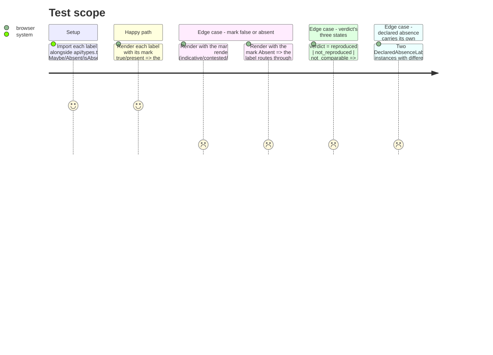

# Instruction: The nine mark label components, unit-tested per state

## Architecture projection

> Tree of the final files. ✅ create · ✏️ modify · ❌ delete

```txt
.
└── frontend/src/labels/
    ├── IndicativeLabel.tsx            ✅ per-language cell (with n) and suite-level (without n)
    ├── IndicativeLabel.test.tsx       ✅
    ├── ContaminationRiskLabel.tsx     ✅
    ├── ContaminationRiskLabel.test.tsx✅
    ├── ContestedLabel.tsx             ✅
    ├── ContestedLabel.test.tsx        ✅
    ├── SingleJudgeLabel.tsx           ✅
    ├── SingleJudgeLabel.test.tsx      ✅
    ├── UnreliableLabel.tsx            ✅
    ├── UnreliableLabel.test.tsx       ✅
    ├── VerdictLabel.tsx               ✅
    ├── VerdictLabel.test.tsx          ✅
    ├── EnergyMethodLabel.tsx          ✅
    ├── EnergyMethodLabel.test.tsx     ✅
    ├── ScopeComparabilityLabel.tsx    ✅
    ├── ScopeComparabilityLabel.test.tsx ✅
    ├── DeclaredAbsenceLabel.tsx       ✅ generic; used by phase 3 for judged-score, coverage-record, energy-headline
    └── DeclaredAbsenceLabel.test.tsx  ✅
```

## Test Scope



## Tasks to do

### `1)` `IndicativeLabel`

1. `IndicativeLabel({ indicative: Maybe<boolean>, reasons: Maybe<string[]>, n?: Maybe<number> })`: renders a visible "indicative" tag with its `reasons` joined inline when `indicative === true`; renders nothing when `false`; routes through `components/Absent` when either prop is `Absent`. When `n` is passed (the per-language cell case), it renders beside the tag; omitted (the suite-level case), it does not.
2. Unit tests: `indicative: true` with reasons renders the tag and every reason; `indicative: true, n: 5` renders `n` too; `indicative: false` renders nothing; `indicative` as `Absent` routes to `Absent`.

### `2)` `ContaminationRiskLabel`

1. `ContaminationRiskLabel({ contaminationRisk: Maybe<boolean> })`: visible tag when `true`; nothing when `false`; `Absent` routed through.
2. Unit tests for all three states.

### `3)` `ContestedLabel`

1. `ContestedLabel({ contested: Maybe<boolean>, reason: Maybe<string>, threshold: Maybe<number> })`: visible tag naming `reason` and `threshold` when `contested === true`; nothing when `false`; each `Absent` prop routed through independently (a row can be non-`Absent` `contested: false` with `Absent` `threshold` on an unjudged row, for instance).
2. Unit tests: contested with reason+threshold; not contested; each field independently `Absent`.

### `4)` `SingleJudgeLabel`

1. `SingleJudgeLabel({ singleJudge: Maybe<boolean>, reason: Maybe<string> })`: visible flag naming `reason` when `true`; nothing when `false`; `Absent` routed through.
2. Unit tests for all three states.

### `5)` `UnreliableLabel`

1. `UnreliableLabel({ unreliable: Maybe<boolean>, spread: Maybe<number>, metric: string })`: visible flag naming `metric` and `spread` when `true`; nothing when `false`; the flag and the spread number are visually distinct (Methodology 7: "the spreads are shown for interpretation and are visibly not the flag") — `spread` renders even when `unreliable` is `false`, `UnreliableLabel` itself renders nothing in that case (the caller renders the bare spread number beside it, this component owns only the flag).
2. Unit tests: `unreliable: true` renders the flag with its spread and metric name; `unreliable: false` renders nothing from this component; `unreliable` as `Absent` routes through.

### `6)` `VerdictLabel`

1. `VerdictLabel({ verdict: Maybe<string>, referenceRunId?: Maybe<string>, differingFields?: Maybe<string[]> })`: three visibly distinct renders for `"reproduced"` / `"not_reproduced"` / `"not_comparable"` (from `verdict.VERDICT_REPRODUCED` etc, mirrored as string literals since the frontend has no Python import); `not_comparable` additionally renders `differingFields` when present, any other verdict additionally renders `referenceRunId` when present; `Absent` routed through; an unrecognised string renders the raw value rather than throwing (the type is `Maybe<string>` from JSON, not a closed union).
2. Unit tests: one per verdict value, one for `not_comparable` with `differingFields`, one for `Absent`.

### `7)` `EnergyMethodLabel`

1. `EnergyMethodLabel({ channel: 'cpu' | 'gpu' | 'ram', method: Maybe<string> })`: renders the channel name beside its method string; `Absent` routed through — never a shared composite method across channels (Methodology 15: "wherever a Scope-2 local figure appears beside a Scope-3 cloud one," each channel keeps its own label).
2. Unit tests: one per channel with a real method string; one with `method: Absent`.

### `8)` `ScopeComparabilityLabel`

1. `ScopeComparabilityLabel({ text: Maybe<string> })`: renders `text` inline (never in a `title` attribute or a footnote-style aside); `Absent` routed through.
2. Unit tests: present text renders visibly in the DOM text content (not only in an attribute); `Absent` routes through.

### `9)` `DeclaredAbsenceLabel`

1. `DeclaredAbsenceLabel({ reason: string, detail?: string })`: the generic "this whole construct is not here" marker for a design-time absence `components/Absent` cannot express (no API-carried three-reason shape backs it) — the judged-score-withheld case, the not-yet-built coverage record, and the energy-headline-withheld composite (phase 3 wires each). Renders `reason` and, when present, `detail`, visibly and distinctly from `components/Absent`'s own text so a reader can tell "this field was not on the row" from "this whole thing does not exist yet."
2. Unit tests: two instances with different `reason` strings render their own distinct text, not a shared generic string.

## Test acceptance criteria

| Task | Acceptance criteria |
| ---- | -------------------- |
| 1-9  | Each label has a passing `*.test.tsx` covering every state named in its task (true/false/`Absent`, or the verdict's three values), asserted by text query against `screen.getByText`/`queryByText`, never by snapshot alone. |
| all  | No label file imports anything from `views/quality/`, `views/runtime/` or `views/energy/` — verified by `grep -rL "views/" frontend/src/labels/*.tsx` returning every file (i.e. none reference a view directory), ahead of phase 3's structural boundary test which covers the views themselves. |
