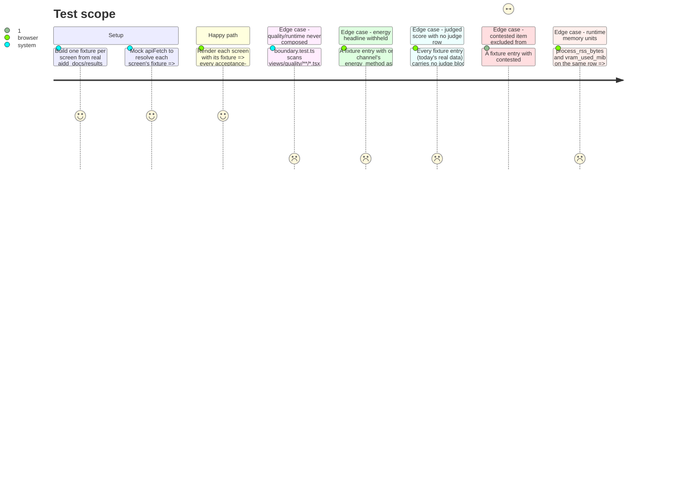

# Instruction: The three screens over fixture data, boundary test, no-scroll check

## Architecture projection

> Tree of the final files. ✅ create · ✏️ modify · ❌ delete

```txt
.
└── frontend/src/
    ├── App.tsx                              ✏️ run-scoped tab strip: Quality | Runtime | Energy
    ├── views/
    │   ├── RunsList.tsx                     ✏️ a run row click selects run_id and navigates to Quality
    │   ├── boundary.test.ts                 ✅ the structural quality/runtime import-boundary test
    │   ├── quality/
    │   │   ├── types.ts                     ✅ QualityView, QualityEntry, JudgeBlock
    │   │   ├── QualityView.tsx              ✅ fetches /api/runs/{id}/quality, renders the table
    │   │   ├── QualityView.test.tsx         ✅
    │   │   ├── CoverageRecord.tsx           ✅ static DeclaredAbsenceLabel naming the owning epic
    │   │   ├── FailureCountsCell.tsx        ✅ four distinguished reasons
    │   │   ├── FailureCountsCell.test.tsx   ✅
    │   │   ├── CapsCell.tsx                 ✅ max_output_tokens/stop_sequences/context_length/thinking_policy
    │   │   ├── CapsCell.test.tsx            ✅
    │   │   └── fixtures/qualityView.fixture.ts ✅ real rows from aidd_docs/results, incl. contested/indicative/contamination
    │   ├── runtime/
    │   │   ├── types.ts                     ✅ RuntimeView, RuntimeEntry, Fiche
    │   │   ├── RuntimeView.tsx              ✅ fetches /api/runs/{id}/runtime, renders the table + fiche
    │   │   ├── RuntimeView.test.tsx         ✅
    │   │   ├── TtftCell.tsx                 ✅ ttft_ms beside its ttft_source
    │   │   ├── TtftCell.test.tsx            ✅
    │   │   └── fixtures/runtimeView.fixture.ts ✅ real rows from aidd_docs/results
    │   └── energy/
    │       ├── types.ts                     ✅ EnergyView, EnergyEntry
    │       ├── EnergyView.tsx               ✅ fetches /api/runs/{id}/energy?store=..., renders headline + drill-down
    │       ├── EnergyView.test.tsx          ✅
    │       └── fixtures/energyView.fixture.ts ✅ incl. one hand-built withheld-headline case
    └── labels/ (from phase 2, wired in here, no new files)
```

## User Journey

```mermaid
flowchart TD
  A[RunsList: click a run] --> B[App selects run_id, screen = Quality]
  B --> C[Tab strip: Quality | Runtime | Energy]
  C -- Quality --> D[GET /api/runs/id/quality]
  C -- Runtime --> E[GET /api/runs/id/runtime]
  C -- Energy --> F[GET /api/runs/id/energy?store=]
  D --> G{Judge block present with agreement or single_judge?}
  G -- yes --> H[Render the score + SingleJudgeLabel or agreement text]
  G -- no --> I[Render DeclaredAbsenceLabel, no plain score]
  F --> J{All three channel labels present?}
  J -- yes --> K[Render energy_headline: emissions_kg + energy_kwh]
  J -- no --> L[Render DeclaredAbsenceLabel naming the missing label]
```

## Test Scope



## Wireframe

```
Quality:
┌──────────────────────────────────────────────────────────────────┐
│ (1) Header: run_id · captured_at · (2) tabs: Quality|Runtime|Energy│
├──────────────────────────────────────────────────────────────────┤
│ (3) Coverage record: exercised/covered-by-dimension/out-of-scope,  │
│     or declared absence naming its owning epic                    │
├──────────────────────────────────────────────────────────────────┤
│ (4) Quality table: item_id · lang · score(exact|graded) ·         │
│  (5) n + indicative · (6) contamination-risk · (7) failure reason ·│
│  (8) caps · (9) verdict · (10) judge block or absence             │
├──────────────────────────────────────────────────────────────────┤
│ (11) Suite-level indicative + reasons · (12) contested/excluded    │
└──────────────────────────────────────────────────────────────────┘

Runtime:
┌──────────────────────────────────────────────────────────────────┐
│ (1) Header · (2) tabs                                              │
├──────────────────────────────────────────────────────────────────┤
│ (3) Runtime table: model · (4) ttft_ms+source · prompt/gen tok/s · │
│  (5) unreliable+spread · (6) rss(MB)+vram(MiB) · wall_clock_s       │
├──────────────────────────────────────────────────────────────────┤
│ (7) Hardware fiche, always visible: CPU/RAM/GPU/driver/build/quant/│
│     flags/fiche_hash or its named absence                          │
└──────────────────────────────────────────────────────────────────┘

Energy:
┌──────────────────────────────────────────────────────────────────┐
│ (1) Header · (2) tabs · (3) store: runtime|quality                 │
├──────────────────────────────────────────────────────────────────┤
│ (4) Headline: emissions_kg+energy_kwh, or withheld naming the       │
│     missing channel label                                          │
├──────────────────────────────────────────────────────────────────┤
│ (5) Per-channel drill-down: cpu/gpu/ram, each with EnergyMethodLabel│
│ (6) emission_factor/region/scope/formula_id                        │
│ (7) ScopeComparabilityLabel inline beside the figure it qualifies  │
└──────────────────────────────────────────────────────────────────┘
```

1-2. Identity + tab strip, shared, from `App.tsx`'s `{ run_id, screen }` state.
3. `CoverageRecord.tsx`: a static `DeclaredAbsenceLabel` today (see `plan.md` Decisions).
4-12. As detailed in `plan.md`'s wireframe notes from the `explore`/`wireframe` pass — each numbered region maps to one label or screen-local component from phase 2/this phase's task list.

## Tasks to do

### `1)` View-model types, one file per screen

1. `views/quality/types.ts`, `views/runtime/types.ts`, `views/energy/types.ts`: mirror `quality_view`/`runtime_view`/`energy_view`'s JSON shape exactly (every field `Maybe<T>`), the same discipline `api/types.ts` already holds for `RunsView`. None of the three imports another screen's `types.ts`.

### `2)` Fixtures built from the real reference bundle

1. Start the service locally over `aidd_docs/results` (`RUNTIME_RESULTS_PATH`/`QUALITY_RESULTS_PATH` pointed at the `*-reference.jsonl` files, matching floor `"7"`), `curl` each of the three routes for a real `run_id`, and hand-transcribe representative rows into `fixtures/*.fixture.ts` in the existing `runsView.fixture.ts` style — real values, not invented ones, so tests exercise the shapes `read_model` actually produces.
2. Add the edge cases the reference bundle may not naturally contain, by editing a copy of a real row rather than fabricating one from nothing: one quality entry with `contested: true` (or a hand-set `Absent` where a real contested row does not exist in the bundle, documented as such in a fixture comment), one energy entry with one channel's `*_energy_method` set to `Absent` (withheld headline).

### `3)` `views/quality/QualityView.tsx`

1. Fetches `apiFetch<QualityView>(\`/api/runs/${runId}/quality\`)`, renders the table over `entries`, one row per entry, columns per the wireframe: item_id, language, the score (routed by `score_shape`, exact-match and graded columns never sharing one column), `IndicativeLabel` (per-language cell, with `n`), `ContaminationRiskLabel`, a failure cell via `FailureCountsCell`, a caps cell via `CapsCell`, `VerdictLabel`, and the judge block: two judges with `agreement` present renders the score plus the agreement figure; `single_judge === true` renders the score plus `SingleJudgeLabel`; neither renders `DeclaredAbsenceLabel` and no score number.
2. `CoverageRecord.tsx`: renders above the table, a static `DeclaredAbsenceLabel` naming `no-use-case-is-silently-absent` — no fetch, no prop from the API.
3. `FailureCountsCell.tsx`: renders `failure_counts`' four keys (`empty`, `unparseable`, `truncated_max_tokens`, `truncated_context`) as four distinguished, individually-labelled counts — never summed into one number.
4. `CapsCell.tsx`: renders `max_output_tokens`, `stop_sequences`, `context_length`, `thinking_policy` together, beside the score they qualify; a row whose `thinking_policy` is `disabled` states "routing score, not the model's ceiling" per Methodology 3.
5. Suite-level: one `IndicativeLabel` instance (no `n`) per suite, and a `ContestedLabel`-driven count of items excluded from the suite's headline (`judged_headline_excluded_n`, when present).

### `4)` `views/runtime/RuntimeView.tsx`

1. Fetches `apiFetch<RuntimeView>(\`/api/runs/${runId}/runtime\`)`, renders one row per entry: `TtftCell` (ttft_ms beside `ttft_source`), `prompt_tok_per_s`/`gen_tok_per_s`, `UnreliableLabel` beside whichever throughput its flag concerns with its raising spread, `process_rss_bytes` rendered in decimal MB and `vram_used_mib` in MiB with each unit suffix in the cell text (never only in a header).
2. The fiche block renders always, not behind a toggle, from `entry.fiche`: CPU, RAM, GPU, driver, llama.cpp build, quant, the flag list, and `fiche_hash`; an unresolved fiche routes `entry.fiche`'s `Absent` through `components/Absent`, naming the hash from its `detail`.
3. `TtftCell.tsx`: renders `ttft_ms` and `ttft_source` together as plain text (see `plan.md`'s Decision on why this is not a `labels/` component).

### `5)` `views/energy/EnergyView.tsx`

1. A store selector (`runtime` | `quality`, a simple toggle) drives `apiFetch<EnergyView>(\`/api/runs/${runId}/energy?store=${store}\`)`.
2. Headline: `energy_headline.withheld === true` renders `DeclaredAbsenceLabel` naming each entry of `missing_labels`; otherwise renders `energy_kwh` + `emissions_kg` together with each channel's method via `EnergyMethodLabel`.
3. Drill-down: one row per channel (`channels.cpu/gpu/ram`), each energy figure beside its own `EnergyMethodLabel`; the composite fields (`emission_factor_kg_per_kwh`, `emission_region`, `emissions_scope`, `emissions_scope_formula_id`); `ScopeComparabilityLabel` rendered inline on the same row as the figure it explains whenever `scope_comparability` is present.

### `6)` Navigation: `App.tsx`, `RunsList.tsx`

1. `App.tsx` holds `{ runId: string | null; screen: 'runs' | 'quality' | 'runtime' | 'energy' }`; renders `RunsList` when `runId` is `null`, otherwise the tab strip plus the selected screen, each screen taking `runId` as a prop.
2. `RunsList.tsx`: a run row click sets `runId` and `screen: 'quality'` (via a callback prop from `App.tsx`) — the only new behavior added to this file; its existing rendering is untouched.

### `7)` The structural quality/runtime boundary test

1. `views/boundary.test.ts`: reads every `.tsx`/`.ts` file under `views/quality/` and asserts none of their source text imports from a path matching `views/runtime` or vice versa. A deliberately-added cross-import, added and removed during development, confirms the test fails before it is trusted to pass.

### `8)` The 1280×800 check (see `plan.md`'s Decision)

1. One cheap automated guard: a Vitest test rendering each screen and asserting no element's inline `style.width`/`minWidth` (where set) exceeds `1280`.
2. The primary evidence is a manual walk at a real 1280×800 browser viewport over each screen, screenshot filed under this phase's `evidence/` — carried out here if the built bundle is already usable against the fixtures' source data, otherwise deferred to phase 4's live-bundle walk and cross-referenced from here.

## Test acceptance criteria

| Task | Acceptance criteria |
| ---- | -------------------- |
| 1    | Each `types.ts` compiles (`tsc -b --noEmit`) and matches its route's JSON shape field-for-field against `read_model.py`'s `*_VIEW_FIELDS`. |
| 2    | Fixtures load without a live service; at least one entry per screen exercises each acceptance-listed mark (indicative, contamination-risk, contested, unreliable, verdict's three states, per-channel energy method, scope comparability, a withheld energy headline, an absent judge block). |
| 3    | `QualityView` rendered against its fixture shows every acceptance-listed quality mark; a judge-less entry renders `DeclaredAbsenceLabel` and no bare score; exact-match and graded columns never share one column in the same render. |
| 4    | `RuntimeView` rendered against its fixture shows the fiche unconditionally, `ttft_source` beside `ttft_ms`, and both memory units with distinct, correct suffixes. |
| 5    | `EnergyView` rendered against the withheld-headline fixture entry shows no headline and names the missing channel; against a fully-labelled entry it shows the composite headline and all three per-channel methods. |
| 6    | Clicking a run in `RunsList` opens the quality screen for that run; the tab strip switches screens without re-navigating away from the selected run. |
| 7    | `views/boundary.test.ts` passes on the finished code and is confirmed (by a temporary deliberate violation) to fail when a cross-import exists. |
| 8    | The width guard passes on all three screens; the manual 1280×800 walk is documented with a screenshot per screen, filed in `evidence/` (here or cross-referenced to phase 4). |
