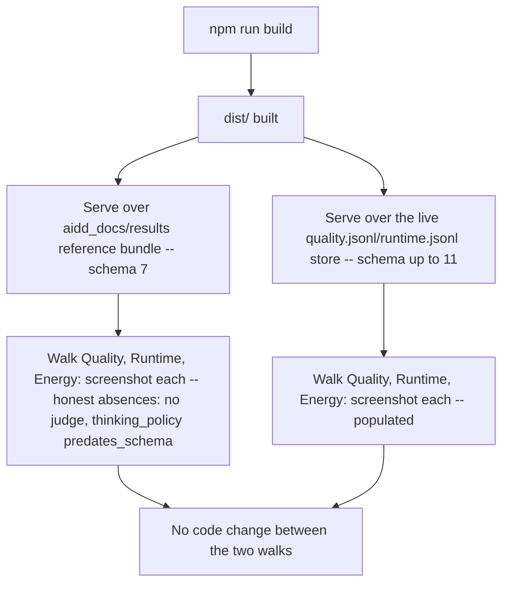

# Instruction: Evidence over the reference bundle and the live store, CHANGELOG, docs

## Architecture projection

> Tree of the final files. ✅ create · ✏️ modify · ❌ delete

```txt
.
├── CHANGELOG.md                      ✏️ Unreleased/Added: the three screens and the labels/ boundary
├── aidd_docs/results/README.md       ✏️ new section: what the dashboard withholds and why
└── aidd_docs/tasks/2026_09/2026_09_21_quality-runtime-energy-pitch-screens/
    └── evidence/
        ├── phase-4-quality-reference-bundle.png   ✅ "7" bundle: honest absences
        ├── phase-4-runtime-reference-bundle.png   ✅
        ├── phase-4-energy-reference-bundle.png    ✅
        ├── phase-4-quality-live-store.png         ✅ "11" (quality) / "10" (runtime) live store: populated
        ├── phase-4-runtime-live-store.png         ✅
        └── phase-4-energy-live-store.png          ✅
```

## User Journey



## Tasks to do

### `1)` Build and serve the reference bundle

1. `npm run build` inside `frontend/`, point `DASHBOARD_BUNDLE_DIR` at `frontend/dist/`, `RUNTIME_RESULTS_PATH`/`QUALITY_RESULTS_PATH` at `aidd_docs/results/runtime-reference.jsonl`/`quality-reference.jsonl`, start `wave-local-ai-v2-serve`.
2. Open the served root in a browser (Claude in Chrome), select a real `run_id` from the runs list, walk Quality → Runtime → Energy. Confirm: every quality row shows `DeclaredAbsenceLabel` for its judge block (no store holds a judged row); `thinking_policy` on the caps cell shows the `predates_schema` absence naming `row_schema_version: "7"`; the fiche and every other acceptance-listed mark render from real values. Screenshot each screen.

### `2)` Build and serve the live store

1. Same bundle, `RUNTIME_RESULTS_PATH`/`QUALITY_RESULTS_PATH` pointed at `aidd_docs/results/runtime.jsonl`/`quality.jsonl` instead — **no rebuild, no code change** between this walk and task 1's.
2. Walk the same three screens for a `run_id` whose rows sit at the store's current ceiling (quality: schema `"11"`; runtime: schema `"10"`, the store's own ceiling today — note this in the evidence rather than claiming `"11"` runtime data that does not exist). Confirm the same marks now render populated: real indicative/contamination/contested/unreliable states wherever the live data carries them, `thinking_policy` present and real on the quality rows. Screenshot each screen.

### `3)` `aidd_docs/results/README.md`

1. Add a section recording what the dashboard withholds and why: the judged score withheld pending a judged row (cite the epic that will supply one), the energy headline withheld when a channel's label is missing (real mechanism, cite `read_model._energy_entry`), and the coverage record's declared absence naming `no-use-case-is-silently-absent` — each stated as documented evidence of honest withholding, not as an apparent gap in this story's own delivery.

### `4)` `CHANGELOG.md`

1. `## [Unreleased]` → `### Added`: the three screens (`views/quality`, `views/runtime`, `views/energy`), the nine `labels/` mark components and the boundary they enforce, and the run-scoped tab navigation — in the file's existing terse, mechanism-naming style (see the read-only-service entry already there).

## Test acceptance criteria

| Task | Acceptance criteria |
| ---- | -------------------- |
| 1    | Six screenshots exist (three screens × two stores per task 1+2), each captioned with what it demonstrates; the reference-bundle walk shows at least one named absence per screen. |
| 2    | The live-store walk uses the same built bundle and service process family as task 1, only the results paths changed — stated explicitly in the phase file's evidence narrative, matching phase 3 of the prior story's own evidence format. |
| 3    | `aidd_docs/results/README.md`'s new section names all three withheld constructs and the code path or owning epic behind each. |
| 4    | `CHANGELOG.md`'s `Unreleased/Added` entry is present and accurately names the shipped files, not a restatement of the story's acceptance text. |
