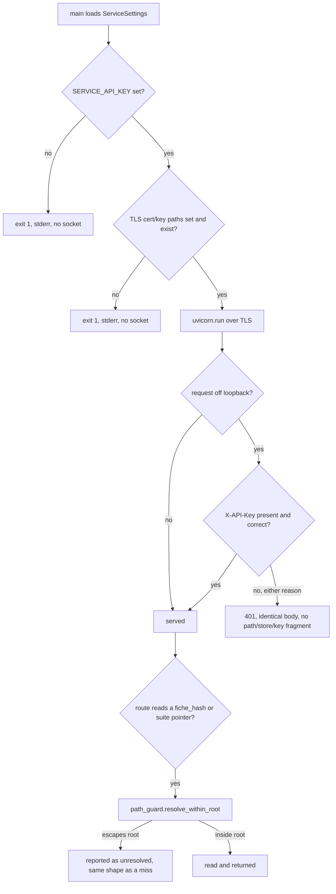
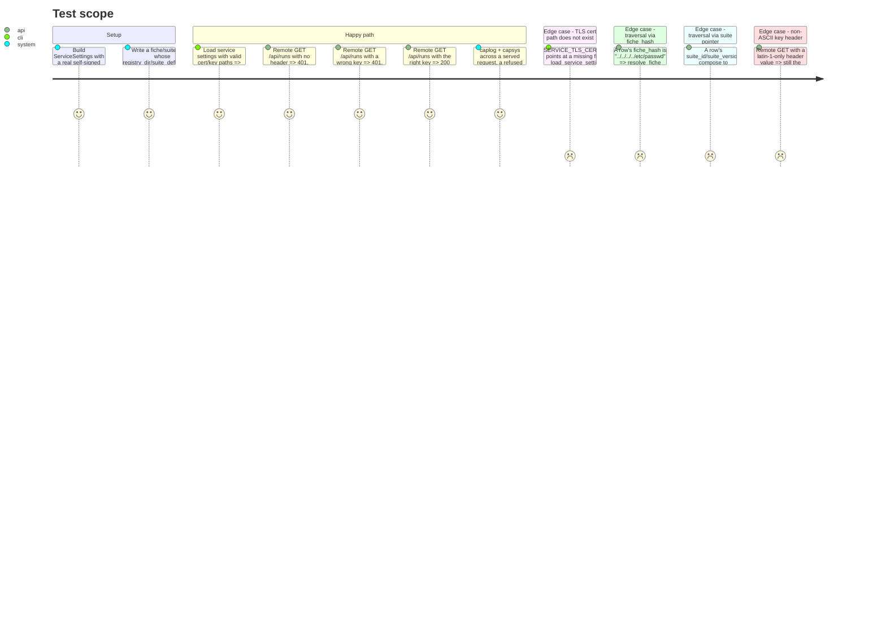

# Instruction: TLS enforcement, unified refusal, store-root guard

## Architecture projection

> Tree of the final files. ✅ create · ✏️ modify · ❌ delete

```txt
.
├── pyproject.toml                      ✏️ cryptography moves from transitive to a direct dependency
├── uv.lock                             ✏️ regenerated (`uv add cryptography`), version unchanged (50.0.0)
├── src/wave_local_ai_v2/
│   ├── settings.py                     ✏️ ServiceSettings gains tls_certfile/tls_keyfile; load_service_settings validates both exist; dashboard_origin default scheme becomes https
│   ├── service.py                      ✏️ _require_key raises one identical detail string; main() always serves over TLS, no plain-HTTP path
│   ├── path_guard.py                   ✅ resolve_within_root(root, *parts) -> Path | None
│   ├── fiche_registry.py               ✏️ read_fiche resolves fiche_hash through path_guard
│   └── read_model.py                   ✏️ resolve_suite_definition resolves the snapshot filename through path_guard
└── tests/
    ├── test_settings.py                ✏️ tls_certfile/tls_keyfile required + existence-checked; dashboard_origin default is https; test_load_service_settings_does_not_require_any_path_to_exist carves out the TLS pair
    ├── test_service.py                 ✏️ missing/wrong key assert the identical body; new byte-identical test; TLS wiring into uvicorn.run asserted via a captured call; key-leak log-capture test
    ├── test_path_guard.py              ✅ resolve_within_root: inside root, escape via `../`, escape via an absolute path, a root-relative no-op
    ├── test_fiche_registry.py          ✏️ a fiche_hash carrying `../` resolves to None, not a read outside registry_dir
    └── test_read_model.py              ✏️ a suite_id/suite_version pair carrying `../` resolves to pointer_unresolved, not a read outside suite_definitions_dir
```

## User Journey



## Test Scope



## Tasks to do

### `1)` Add `path_guard.py` and wire it into the two pointer-resolved reads

> One helper, two call sites; an escape degrades exactly like today's "not found," never a 500 or a read outside the configured root.

1. `path_guard.py`: `resolve_within_root(root: Path, *parts: str) -> Path | None`. Join `root` with `*parts`, `.resolve()` the result, and confirm it via `Path.is_relative_to(root.resolve())` (Python 3.12, already the project floor — no need for `os.path.commonpath`). Return `None` on escape, the resolved `Path` otherwise. No filesystem I/O beyond the two `.resolve()` calls — existence is still the caller's own check.
2. `fiche_registry.read_fiche`: replace `registry_dir / f"{fiche_hash}.json"` with `path_guard.resolve_within_root(registry_dir, f"{fiche_hash}.json")`; a `None` result returns `None`, exactly as a missing file does today — no new branch in the caller's contract.
3. `read_model.resolve_suite_definition`: replace `suite_definitions_dir / filename` with `path_guard.resolve_within_root(suite_definitions_dir, filename)`; a `None` result returns `_unresolved(POINTER_SUITE, filename)`, exactly as today's missing/unreadable branch does.

### `2)` Unify the key refusal body

> One literal string, one status, for both refusal reasons — the response must not let a client tell "absent" from "wrong."

1. In `service._require_key`, replace the two distinct `HTTPException(status_code=401, detail=f"missing {API_KEY_HEADER}")` / `f"invalid {API_KEY_HEADER}"` raises with one: `HTTPException(status_code=401, detail=f"missing or invalid {API_KEY_HEADER}")`, raised for both the `presented_key is None` branch and the `compare_digest` failure branch.
2. Update `tests/test_service.py`'s two existing assertions (`test_a_non_loopback_client_without_the_key_is_refused`, `test_a_non_loopback_client_with_a_wrong_key_is_refused`, and the non-ASCII test) to the new literal.
3. Add a test that issues both requests and asserts the two response bodies are byte-identical (`response.content == other.content`), not just equal status codes — the acceptance is about indistinguishability, not merely about the string chosen.

### `3)` TLS settings and enforcement

> `SERVICE_TLS_CERTFILE`/`SERVICE_TLS_KEYFILE` join `SERVICE_API_KEY` as unconditionally required, existence-checked configuration; `main()` has no plain-HTTP path left.

1. Add `DEFAULT_SERVICE_TLS_CERTFILE`/`DEFAULT_SERVICE_TLS_KEYFILE`? No — no default value ships, mirroring `SERVICE_API_KEY`: an unset or non-existent path is a `SettingsError` naming the variable, raised from `load_service_settings` before the app is built. Add a small `_require_existing_path`-equivalent inside `settings.py` for the service path (the existing one is `load_settings`-only and requires `Settings`-side globals); reuse its logic rather than duplicate the message shape.
2. Add `tls_certfile: Path` and `tls_keyfile: Path` to `ServiceSettings`.
3. Change `dashboard_origin`'s computed default from `f"http://{host}:{port}"` to `f"https://{host}:{port}"` — the single-origin topology now always serves over TLS, so an unset override must not compute an origin the browser will never actually see.
4. `service.main()`: pass `ssl_certfile=settings.tls_certfile, ssl_keyfile=settings.tls_keyfile` to `uvicorn.run`; change the printed line from `serving http://...` to `serving https://...`. Remove the docstring/comment on both `main()` and the `settings.py` block above `DEFAULT_SERVICE_HOST` that says TLS is a later story — it is this one.
5. Update `tests/test_settings.py::test_load_service_settings_does_not_require_any_path_to_exist` — the TLS pair is now the one exception among service-side paths (alongside the key), so either split it into two tests or add an explicit comment plus a companion assertion that the TLS paths *do* require existence.

### `4)` Key-leak log-capture test

> The key value appears in no logged or printed record across settings load, `main()`'s startup print, a served request, and a refused one — asserted by searching captured output, not by reading the middleware.

1. Add a test using `capsys` (for the startup `print` line, with `uvicorn.run` monkeypatched to a no-op as the existing `test_the_serve_entry_refuses_to_start_without_a_key` already does) and `caplog` (for anything uvicorn's own loggers emit during the `TestClient` request cycle) around: loading `ServiceSettings` with a known key, a served loopback request, a served remote request carrying the correct key in its header, and a refused remote request carrying a wrong key in its header. Assert the literal key value is absent from `capsys.readouterr()` combined and from `caplog.text`.

## Test acceptance criteria

| Task | Acceptance criteria              |
| ---- | --------------------------------- |
| 1    | A fiche row citing `fiche_hash="../../../../etc/passwd"` against a real `fiche_registry_dir` resolves to `None` from `read_fiche` (never raises, never reads the escaped path); a suite row citing a `suite_id`/`suite_version` pair that composes to a filename starting with `../` resolves to a `pointer_unresolved` absence from `resolve_suite_definition`, both verified by asserting the target file (planted at the escaped path in the test) is never opened. |
| 2    | A 401 for a missing header and a 401 for a wrong key carry the identical `detail` string and byte-identical response bodies. |
| 3    | `load_service_settings()` raises `SettingsError` naming `SERVICE_TLS_CERTFILE` (or `SERVICE_TLS_KEYFILE`) when unset, and again when set to a path that does not exist; with both valid, `ServiceSettings.tls_certfile`/`tls_keyfile` are populated and `main()`'s call into `uvicorn.run` (captured via monkeypatch) carries `ssl_certfile`/`ssl_keyfile` matching them; `dashboard_origin`'s unset default is `https://<host>:<port>`. |
| 4    | Across the four captured phases (settings load, served loopback, served remote with the right key, refused remote with a wrong key), the literal `SERVICE_API_KEY` value used in the test is found in neither `capsys` output nor `caplog.text`. |
