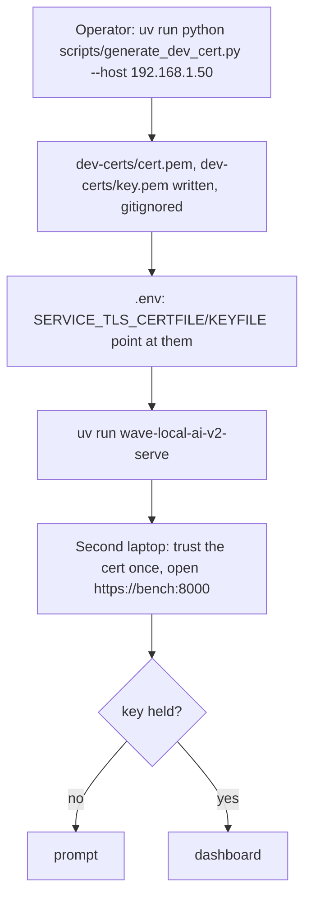
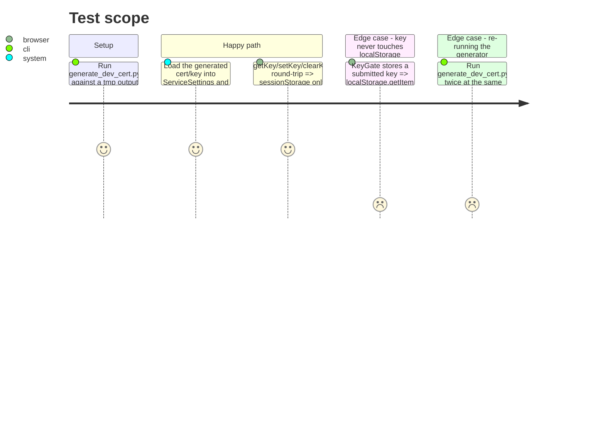

# Instruction: Cert-generation script, docs, frontend closure, security review

## Architecture projection

> Tree of the final files. ✅ create · ✏️ modify · ❌ delete

```txt
.
├── .gitignore                          ✏️ dev-certs/ (the script's default output dir)
├── .env.example                        ✏️ SERVICE_TLS_CERTFILE/SERVICE_TLS_KEYFILE, no value
├── scripts/
│   └── generate_dev_cert.py            ✅ self-signed cert/key pair via `cryptography`, SAN configurable
├── docs/
│   ├── setup.md                        ✏️ one cross-link to docs/demo.md next to the existing dashboard section
│   └── demo.md                         ✅ the operator path: key, bind address, certificate, start
├── frontend/src/
│   ├── api/keyStore.test.ts            ✅ the key never reaches localStorage
│   └── components/KeyGate.tsx          ✏️ only if the security review or task 2 below finds the existing copy under-states "key required, nothing else"
└── aidd_docs/tasks/2026_09/2026_09_21_tls-and-keyless-refusal/
    └── evidence/
        └── security-review.md          ✅ filed at the end of this phase, each finding's resolution recorded
```

## User Journey



## Test Scope



## Tasks to do

### `1)` `cryptography` as a direct dependency

> Declare it where the script needs it, not only where a dev tool happens to pull it in.

1. `uv add cryptography` (no version pin beyond what `uv.lock` already resolves at `50.0.0` — the resolver has no new work to do). Confirm `pyproject.toml`'s `[project.dependencies]` gains the line and `uv.lock`'s existing `cryptography` entry is otherwise unchanged.

### `2)` `scripts/generate_dev_cert.py`

> One command, self-signed, valid for the addresses the demo actually uses.

1. Build an RSA key pair and a self-signed X.509 certificate via `cryptography.x509`/`cryptography.hazmat`, subject/issuer `CN=wave-local-ai-v2 demo`, a 397-day validity window (under the CA/Browser Forum's public-cert ceiling, though this cert is never publicly trusted — matching a sane default rather than an arbitrary one), and a `SubjectAlternativeName` carrying `127.0.0.1`, `localhost`, and every `--host` value the operator passes (repeatable flag; parse each as an `ipaddress` when it parses as one, else as a DNS name) — the second laptop's LAN address must be a name the certificate actually covers, or the trust step in `docs/demo.md` fails.
2. CLI: `--host` (repeatable, at least the bench machine's LAN IP for a real two-machine demo), `--out-dir` (default `dev-certs/`, matching `.gitignore`), writes `cert.pem` and `key.pem`. Re-running overwrites rather than refusing — a re-issued cert is a documented retry, not a manual delete-first step.
3. Print the two written paths and nothing else; mypy-clean under `uv run mypy src/ scripts/` (the existing gate already scans `scripts/`).

### `3)` `.env.example` and `.gitignore`

1. Add `SERVICE_TLS_CERTFILE=`/`SERVICE_TLS_KEYFILE=` to `.env.example` beside `SERVICE_API_KEY`, commented the same way that block already documents the key's no-default posture — variable names only, no path that would imply a real deployment layout.
2. Add `dev-certs/` to `.gitignore`, next to the other generated-and-never-committed entries (`frontend/dist` pattern).

### `4)` `docs/demo.md`

> The operator path in the order a consultant actually runs it, cross-linked from `docs/setup.md`'s existing dashboard section rather than duplicated into it.

1. Write the walk: generate a key (`SERVICE_API_KEY`, e.g. via `python -c "import secrets; print(secrets.token_urlsafe(32))"` — never a value this doc ships), choose the bind address (`SERVICE_HOST` set to the bench machine's LAN IP, not `0.0.0.0`), generate or obtain the certificate (`scripts/generate_dev_cert.py --host <that LAN IP>`, or point `SERVICE_TLS_CERTFILE`/`KEYFILE` at an operator-provided one), start the service (`uv run wave-local-ai-v2-serve`), and the second-machine step: trust the self-signed cert once (OS-specific one-liners or "open the URL once and accept the browser warning" as the documented fallback), then open `https://<bench-ip>:<port>` and enter the key.
2. State explicitly what the refusal looks like (the named screen) and that a wrong key clears and re-prompts, so an operator recognizes it as expected rather than a bug mid-pitch.
3. Add one line to `docs/setup.md`'s section 1.1 (the dashboard/front-end section) pointing at `docs/demo.md` for the TLS+key path, rather than repeating it there.

### `5)` Frontend closure

1. Add `frontend/src/api/keyStore.test.ts`: after `setKey`, `localStorage.getItem('wave-local-ai-v2:api-key')` (and every key) is `null`; `clearKey` removes it from `sessionStorage`.
2. Re-read `KeyGate.tsx`'s two copy strings (`'This dashboard needs the service's API key'`, `'The service refused that key. Enter it again.'`) against the acceptance ("states that a key is required and nothing else: no path, no store location, no key fragment, no hint whether absent or wrong") — already compliant on inspection; change only if the security review below finds otherwise. Do not create a `views/key/` split; the story text predates the existing `KeyGate.tsx` + `api/client.ts` + `keyStore.ts` implementation and this phase extends it in place, per this task's own dispatch.

### `6)` Security review

1. Run the `security-review` skill over the branch, scoped exactly as the epic's Dependencies table states: key handling and leakage, TLS configuration, bind address, CORS, traversal on the configurable store path, and what a refusal discloses — not the public-internet model the PRD's Non-Goals exclude.
2. File the report at `evidence/security-review.md` in this feature folder. Every finding is either fixed in this branch (loop back into phase 1's files if a code change is needed) or recorded here with the reason it was accepted as-is.

## Test acceptance criteria

| Task | Acceptance criteria              |
| ---- | --------------------------------- |
| 2    | `uv run python scripts/generate_dev_cert.py --host 127.0.0.1 --out-dir <tmp>` writes a `cert.pem`/`key.pem` pair; the certificate's SAN (read back via `cryptography.x509.load_pem_x509_certificate`) contains `127.0.0.1`, `localhost`, and the passed `--host` value; loading the pair into a real `ssl.SSLContext` does not raise. |
| 5    | `localStorage` is empty of the storage key after `KeyGate` stores a submitted key, asserted directly against `localStorage.getItem`, not inferred from `sessionStorage` alone. |
| 6    | `evidence/security-review.md` exists, covers every named scope item, and every finding row states either its fix commit/diff or its accepted reason. |
