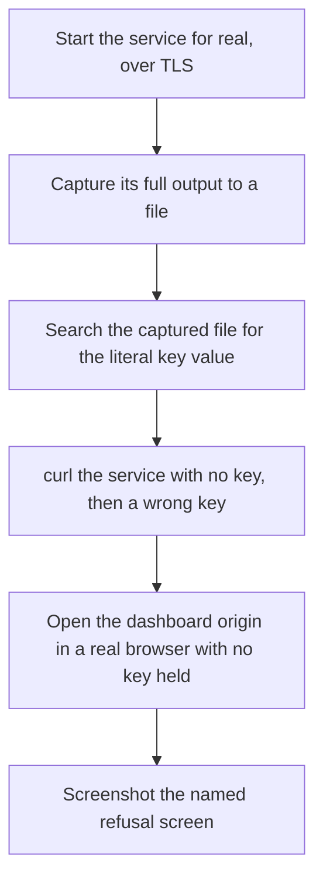
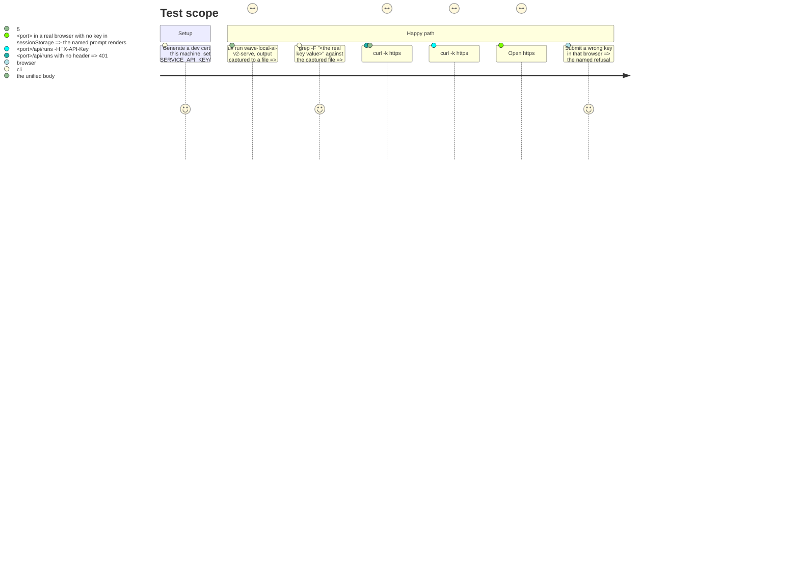

# Instruction: Evidence — a real HTTPS run, a keyless transcript, a screenshot

## Architecture projection

> Tree of the final files. ✅ create · ✏️ modify · ❌ delete

```txt
.
└── aidd_docs/tasks/2026_09/2026_09_21_tls-and-keyless-refusal/
    └── evidence/
        ├── https-run-output.txt        ✅ full captured stdout/stderr of a real `uv run wave-local-ai-v2-serve` over TLS
        ├── https-run-key-search.txt    ✅ the search over that output for the key value, showing zero matches
        ├── keyless-curl-refusal.txt    ✅ transcript of a keyless (and a wrong-key) curl against the running service
        └── browser-refusal-screenshot.png  ✅ the named refusal screen, from a real browser against the running service
```

## User Journey



## Test Scope



## Tasks to do

### `1)` Real HTTPS run and the key-search check

> The epic's own second success check, done as it states it: by searching a captured run's output, not by re-reading the middleware.

1. Generate a dev certificate for this machine (`scripts/generate_dev_cert.py`), set `SERVICE_API_KEY`, `SERVICE_TLS_CERTFILE`, `SERVICE_TLS_KEYFILE` (and `SERVICE_HOST` to a real non-loopback address reachable on this machine's LAN, if a second machine is available this session — loopback is an acceptable fallback for the capture itself, since the check is about the key's appearance in output, not about reachability).
2. Run `uv run wave-local-ai-v2-serve`, drive a handful of requests against it (served and refused, loopback and remote if reachable), stop it, and save the full combined stdout+stderr to `evidence/https-run-output.txt`.
3. Search that file for the literal `SERVICE_API_KEY` value used and save the search command and its (empty) result to `evidence/https-run-key-search.txt`.

### `2)` Keyless and wrong-key curl transcript

1. Against the running service from task 1, run a keyless `curl -k -i https://<host>:<port>/api/runs` and a wrong-key one, capture both full transcripts (request line, response status, headers, body) into `evidence/keyless-curl-refusal.txt`, and confirm by inspection that the two bodies are identical and carry no path, store location or key fragment.

### `3)` Browser refusal screenshot

1. Open the running service's dashboard origin in a real browser with no key held (a fresh session or `sessionStorage` cleared), confirm the named prompt renders, submit a wrong key, and screenshot the resulting named refusal screen to `evidence/browser-refusal-screenshot.png`.

## Test acceptance criteria

| Task | Acceptance criteria              |
| ---- | --------------------------------- |
| 1    | `evidence/https-run-output.txt` shows a `serving https://...` line (not `http://`); `evidence/https-run-key-search.txt` shows the search command and zero matches for the real key value. |
| 2    | `evidence/keyless-curl-refusal.txt` shows two `401` responses whose bodies are textually identical, neither containing a filesystem path, a store name, or any fragment of the configured key. |
| 3    | `evidence/browser-refusal-screenshot.png` exists and visibly shows the named refusal state, not a stack trace, blank page, or hang. |

## Status

Tasks 1 and 2 done: `evidence/https-run-output.txt`, `evidence/https-run-key-search.txt`
and `evidence/keyless-curl-refusal.txt` are on disk, captured against a real
`uv run wave-local-ai-v2-serve` bound to this machine's LAN address
(`10.42.47.37`) with a `scripts/generate_dev_cert.py`-issued cert. The real
`SERVICE_API_KEY` value is deliberately not reproduced in
`https-run-key-search.txt` — only its sha256 and the fact of the zero-match
search — so the evidence file does not itself become the leak it is proving
absent.

Task 3 is **blocked**: the Claude-in-Chrome browser extension is not
connected in this environment (`tabs_context_mcp` returns "Browser extension
is not connected"), so no real browser is drivable here to render the
dashboard, submit a wrong key and capture
`evidence/browser-refusal-screenshot.png`. Needs a human to install/connect
the extension (or to take the screenshot manually against a running
`uv run wave-local-ai-v2-serve` per `docs/demo.md`'s step 5), after which
this task can resume.
