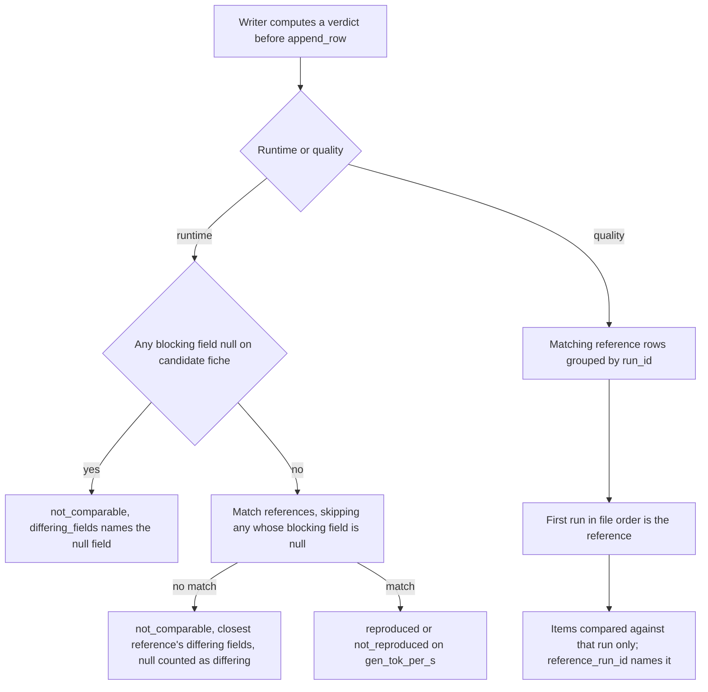
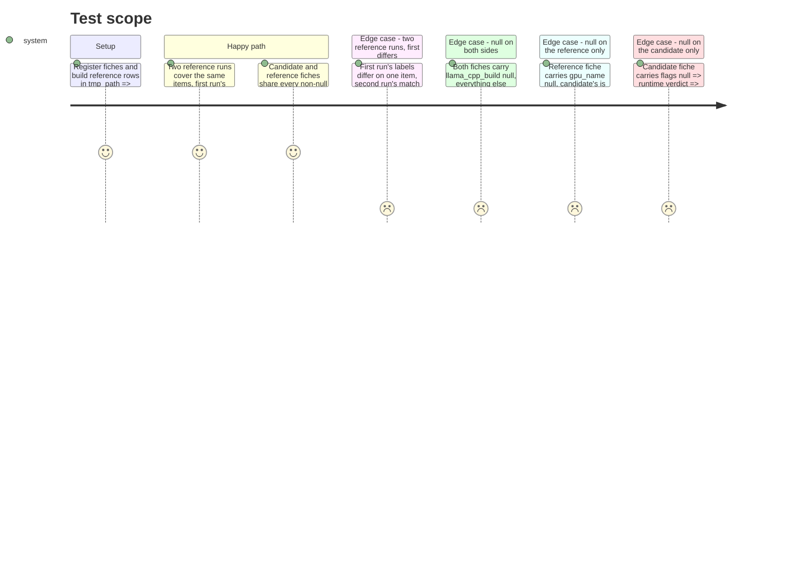

<!-- Fill or omit these sections; never add, rename, or reorder one. -->

# Instruction: Reproduction verdict: the named run is the compared run, and unknowns never match

## Architecture projection

> Tree of the final files. ✅ create · ✏️ modify · ❌ delete

```txt
.
├── src/wave_local_ai_v2/
│   └── verdict.py        ✏️ C1: quality reference narrowed to one run; C2: null blocking field => not_comparable
├── tests/
│   └── test_verdict.py   ✏️ two-reference-run test; null-on-either-side tests
└── aidd_docs/tasks/2026_08/
    └── 2026_08_21-wave-local-ai-v2-benchmark-suite-prd.md  ✏️ one sentence in Methodology 8 recording the null rule
```

## User Journey



## Test Scope



## Tasks to do

### `1)` Quality verdict names the run it compared against (C1)

> `reference_by_item` and `reference_run_id` come from the same single run.

1. In `quality_verdict` (`verdict.py:273-324`), after `select_quality_references`, keep only the rows whose `run_id` equals the first matching row's `run_id` (file order); build `reference_by_item` from those rows only.
2. Every returned block (`unmatched_items`, no-comparable-field, final) takes `reference_run_id` from that chosen run.
3. Document the rule in the `quality_verdict` docstring: several reference runs => the first in file order, same tie-break as `select_runtime_reference`.
4. Add `test_quality_two_reference_runs_compare_against_the_named_run` and its mirror (first run differs, second matches => `not_reproduced`) in `tests/test_verdict.py`.

### `2)` A null blocking field never matches (C2)

> null on either side of `_RUNTIME_BLOCKING_FIELDS` => `not_comparable` naming the field.

1. Add a helper returning the blocking fields that are `None` in a fiche.
2. In `runtime_verdict`, before `select_runtime_reference`: when the candidate fiche has any null blocking field, return `not_comparable` with `differing_fields` naming each such field and a reason stating a null blocking field cannot be compared.
3. In `select_runtime_reference`, skip a reference whose fiche has a null blocking field.
4. In `_closest_reference_differing_fields`, count a field null on either side as differing even when both are null.
5. Update the module docstring (`verdict.py:1-11`) with the null rule.
6. Add three tests: null on both sides, reference only, candidate only; each asserts `not_comparable` and the named field.

### `3)` Record the rule in the PRD (C2)

> One sentence, Methodology 8.

1. In PRD Methodology 8 (`2026_08_21-wave-local-ai-v2-benchmark-suite-prd.md:50`), after the sentence listing the verdict-blocking fiche fields, add: a verdict-blocking field that is null on either side makes the pair not comparable, naming that field; two unknown values never count as a match.

## Test acceptance criteria

| Task | Acceptance criteria |
| ---- | ------------------- |
| 1 | With two reference runs of one batch, `reference_run_id` names the run whose items decided the verdict, and a disagreement confined to that run changes the verdict |
| 1 | Existing quality verdict tests pass unchanged |
| 2 | A runtime pair where `llama_cpp_build` is null on both fiches is `not_comparable` with `llama_cpp_build` in `differing_fields`, never `reproduced` |
| 2 | A null blocking field on only one side yields `not_comparable` naming that field |
| 2 | A pair with every blocking field non-null behaves exactly as before (existing runtime verdict tests pass unchanged) |
| 3 | PRD Methodology 8 states the null rule in one sentence and no other PRD line changes |
