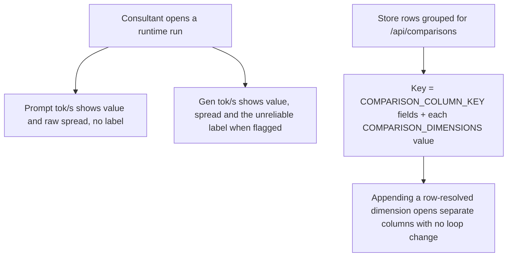
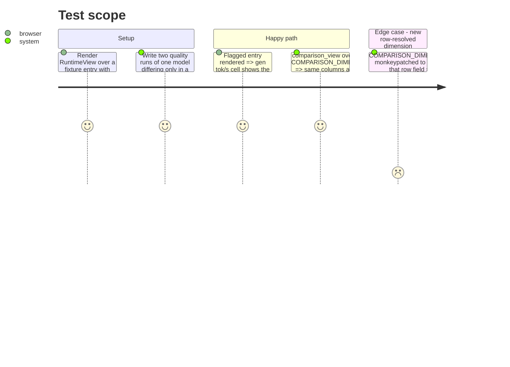

<!-- Fill or omit these sections; never add, rename, or reorder one. -->

# Instruction: Read side: runtime label on its own metric, comparison key built from the dimension list

## Architecture projection

> Tree of the final files. ✅ create · ✏️ modify · ❌ delete

```txt
.
├── src/wave_local_ai_v2/
│   └── read_model.py                          ✏️ column key includes the resolved COMPARISON_DIMENSIONS values
├── tests/
│   └── test_read_model.py                     ✏️ an extra row-resolved dimension splits a column
└── frontend/src/views/runtime/
    ├── RuntimeView.tsx                        ✏️ unreliable label on gen_tok_per_s only (W5)
    └── RuntimeView.test.tsx                   ✏️ prompt column never shows the label
```

## User Journey



## Test Scope



## Tasks to do

### `1)` The unreliable label names the metric it was computed on (W5)

> `aggregation.py:33-38` gates `unreliable` on gen tok/s; the prompt column must not show it.

1. In `RuntimeView.tsx:108-113`, stop passing `unreliable` to the prompt `ThroughputCell` (pass `false`, or make the prop optional and omit it; pick whichever keeps `ThroughputCell` simplest).
2. The prompt cell keeps rendering its raw spread value.
3. In `RuntimeView.test.tsx`, assert a flagged entry shows the label once, in the gen column.

### `2)` Comparison column key gains the dimension-list seam

> `COMPARISON_DIMENSIONS` claims to build column identity (`read_model.py:339-347`) but the key at `:885-887` ignores it.

1. In `_comparison_columns`, build the grouping key from `COMPARISON_COLUMN_KEY` fields plus, for each name in `COMPARISON_DIMENSIONS`, the `_dedup_key` of `_resolve_comparison_dimension(row, name, resolve_roster_entry(row, roster_file))`.
2. Keep the per-column `dimensions` dict built from the same resolved values (resolve once per group, not twice per row, if it stays simple).
3. Update the comments on both constants so the key and the dimension list read as one seam.
4. Add a `test_read_model.py` test: monkeypatch `COMPARISON_DIMENSIONS` to append a row field that differs between two runs of one model => two columns; plus an assertion that today's store yields the same column count as before.

## Test acceptance criteria

| Task | Acceptance criteria |
| ---- | ------------------- |
| 1 | A flagged runtime entry shows the unreliable label on gen tok/s only; prompt tok/s shows its spread with no label |
| 1 | An unflagged entry renders as before (existing RuntimeView tests pass) |
| 2 | Appending a row-resolved name to `COMPARISON_DIMENSIONS` splits columns by that value with no edit to the grouping loop |
| 2 | With `COMPARISON_DIMENSIONS == ("architecture",)` the comparison response is unchanged (existing comparison tests pass) |
