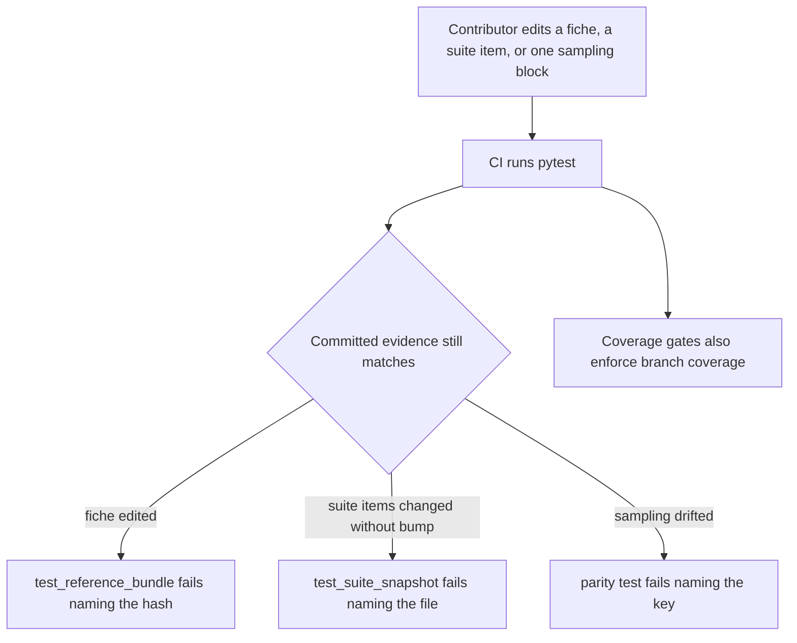
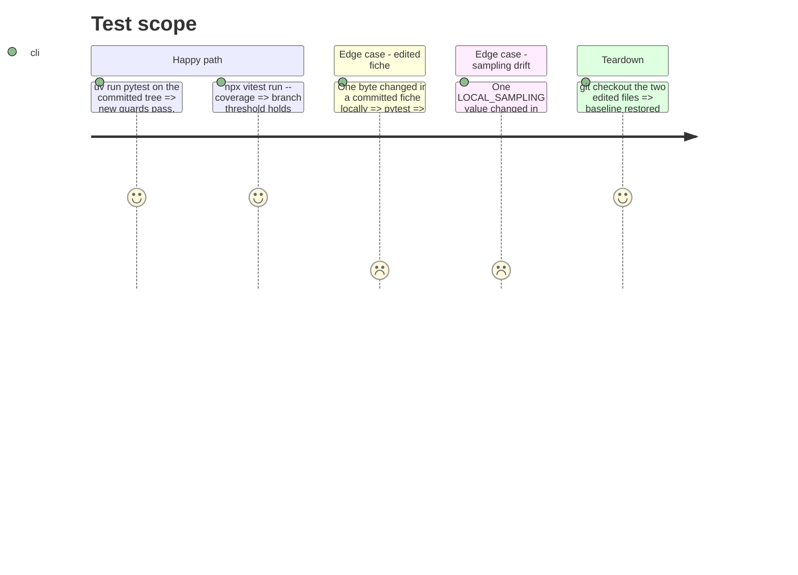

<!-- Fill or omit these sections; never add, rename, or reorder one. -->

# Instruction: CI integrity guards: committed evidence re-verified, sampling parity, branch coverage

## Architecture projection

> Tree of the final files. ✅ create · ✏️ modify · ❌ delete

```txt
.
├── pyproject.toml                    ✏️ --cov-branch (W21)
├── frontend/vite.config.ts           ✏️ branches threshold (W21)
└── tests/
    ├── test_reference_bundle.py      ✏️ every cited fiche verifies "ok" (W10)
    ├── test_suite_snapshot.py        ✏️ committed snapshot equals builder() output (W11)
    ├── test_judge_probe.py           ✏️ probe/quality sampling parity + finish_reason="length" probe test (W7)
    └── test_ci_workflow.py           ✏️ pins --cov-branch in the pytest gate
```

## User Journey



## Test Scope



## Tasks to do

### `1)` Committed fiches re-hash to their names (W10)

> Existence is not integrity.

1. In `tests/test_reference_bundle.py`, add a test asserting `fiche_registry.verify_fiche(hash, registry_dir)["status"] == "ok"` for every distinct cited `fiche_hash`, the message naming hash and status.

### `2)` Committed suite snapshots equal their builders (W11)

> Items cannot change without a version bump.

1. In `tests/test_suite_snapshot.py`, add a test loading each committed file for `builder()` and asserting equality with `builder()`'s output, the message naming the file and pointing to re-export.

### `3)` Probe and quality generate under the same sampling (W7 parity only)

> Enforce the "must stay identical" comments; the shared-module extraction stays in the writer story.

1. In `tests/test_judge_probe.py`, assert `judge_probe.LOCAL_SAMPLING == quality_cli.LOCAL_SAMPLING`, same for `GOOGLE_SAMPLING`, `REQUEST_TIMEOUT_S`, `_RETRY_BASE_DELAY_S`, and `PROBE_SEED == QUALITY_SEED`. If a value differs today, stop and report instead of editing either module.
2. Add the missing probe truncation test: a local chat response with `finish_reason="length"` is recorded as truncated.

### `4)` Branch coverage in both gates (W21)

> Metric code is mostly early-return branches.

1. Add `--cov-branch` to `addopts` (`pyproject.toml:26`); run the suite; if total falls below 80, set `--cov-fail-under` to the measured value rounded down and record the number in the phase evidence. Never lower it below the measured value.
2. In `frontend/vite.config.ts` thresholds, add `branches` at the measured value rounded down (66.87% at audit time => 66).
3. In `tests/test_ci_workflow.py`, pin that the pytest gate runs with branch coverage.

## Test acceptance criteria

| Task | Acceptance criteria |
| ---- | ------------------- |
| 1 | A committed fiche whose content no longer hashes to its name fails the suite, naming the hash |
| 2 | A committed suite snapshot differing from its builder's output fails the suite, naming the file |
| 3 | Changing any sampling, timeout, retry-delay or seed value in one writer alone fails the suite, naming the value |
| 3 | A probe generation ending on `finish_reason="length"` is recorded as truncated |
| 4 | The Python and frontend coverage gates both fail when branch coverage drops below their threshold, and both pass on the committed tree |
