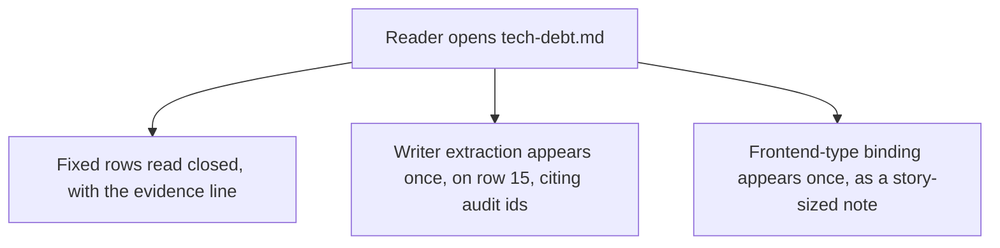
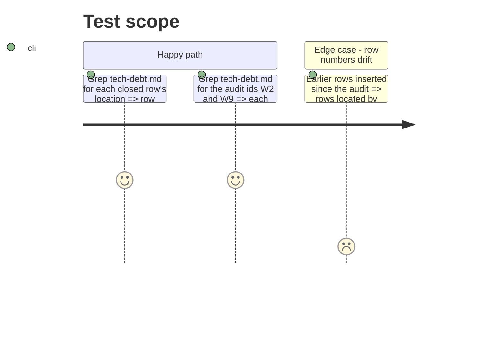

<!-- Fill or omit these sections; never add, rename, or reorder one. -->

# Instruction: Backlog: close fixed rows, log story-sized items without duplicates

## Architecture projection

> Tree of the final files. ✅ create · ✏️ modify · ❌ delete

```txt
.
└── aidd_docs/backlog/
    └── tech-debt.md   ✏️ rows 9, 20, 38 closed; row 100 closed by phase 3; row 15 widened with the writer story; one new row for W2
```

## User Journey



## Test Scope



## Tasks to do

### `1)` Close rows the code already fixed

> Locate by content, not by line number.

1. `settings.py:27` `mistral_api_key` repr row (line 9): closed, evidence `settings.py:144` `field(default="", repr=False)`.
2. `LLAMA_CPP_BUILD` hardcoded row (line 20): closed, evidence `__init__.py:251` `build_probe.probe_build(...)` (audit M16).
3. Mutable action tags row (line 38): closed, evidence every `uses:` in `.github/workflows/ci.yml` is SHA-pinned with a version comment.
4. Sampling-copy row (line 100, `judge_probe.py:73,78,89-105`): closed by phase 3's parity test, which is the row's own "or assert equality in a test" option; note the shared module moves to the writer story.
5. Follow the file's existing closing convention (`**Closed yyyy-mm-dd**: ...` in the Issue cell, `closed` in Status, as row 99 does).

### `2)` Log the two story-sized items, deduped

> One row per concern; widen an existing row when the report names one.

1. Shared writer extraction (audit W3, W7 module, W8, W9, W13, W14, M6, M7): append to row 15's Issue cell a dated widening naming those ids, the report path, and "story-sized: slice with `aidd-pm:02-user-stories`"; add no new row. Row 99 stays closed, as the report's Corrections section confirms.
2. Frontend-type binding (audit W2): no existing row covers it, so append one row, source `2026_09_22_audit`, marked story-sized.
3. Add no other audit row: W19 (row 125), W22 (row 63), W23 (row 54) are already logged and out of scope; W26 is distinct from row 32 but out of scope; all stay in the audit report.

## Test acceptance criteria

| Task | Acceptance criteria |
| ---- | ------------------- |
| 1 | The repr, `LLAMA_CPP_BUILD`, action-pinning and sampling-copy rows read `closed`, each with an evidence line |
| 2 | Writer extraction is recorded once, on the existing duplication row, citing its audit ids |
| 2 | Frontend-type binding is recorded on exactly one new row |
| 2 | No other row is added to `tech-debt.md` |
