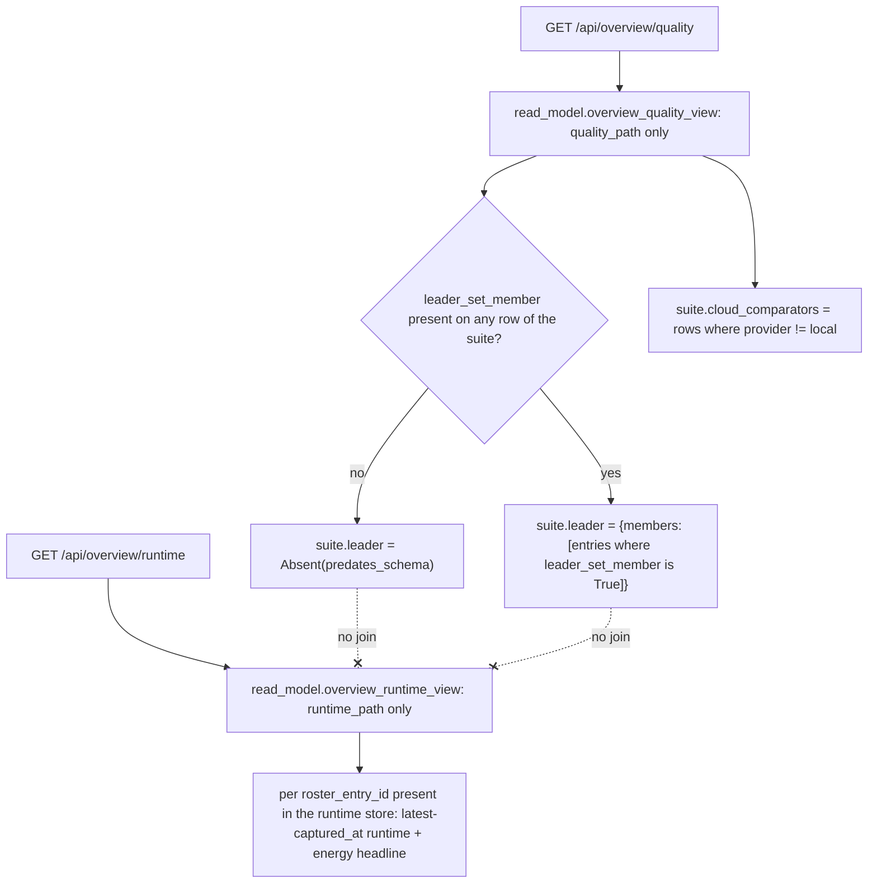

# Instruction: Two read-model selections and the two overview routes, Python tests

## Architecture projection

> Tree of the final files. ✅ create · ✏️ modify · ❌ delete

```txt
.
├── src/wave_local_ai_v2/
│   ├── read_model.py                 ✏️ overview_quality_view, overview_runtime_view + helpers
│   └── service.py                    ✏️ GET /api/overview/quality, GET /api/overview/runtime
└── tests/
    ├── test_read_model.py            ✏️ both selections: reference bundle (all-absent) + a fixture carrying a leader set
    └── test_service.py               ✏️ both routes: key gate, 405s, no cross-store key in either body
```

## User Journey



## Test Scope

```mermaid
---
title: Test scope
---
journey
  section Setup
    Load the committed "7" reference bundle and a hand-built fixture bundle carrying leader_set_member: true on two rows of one suite => two ready fixtures: 5: system
  section Happy path
    overview_quality_view over the reference bundle => one suite entry per distinct task_suite present, every suite.leader an Absent naming predates_schema, every suite.cloud_comparators drawn only from rows with provider != "local": 5: system
  section Happy path
    overview_quality_view over the leader-set fixture => the suite carrying two leader_set_member: true rows returns both as suite.leader.members, each rendered with its own score, run_id and quality labels: 5: system
  section Happy path
    overview_runtime_view over the reference bundle => one entry per roster_entry_id present, each carrying a runtime headline (median gen_tok_per_s + fiche/machine identity) and an energy headline built the same way _energy_entry already builds one: 5: system
  section Edge case - a leader row's runtime row lacks energy_method
    overview_runtime_view over a fixture whose leader roster_entry_id's runtime row omits one energy channel's method => that roster_entry_id's energy headline is withheld (missing_labels), never a bare figure: 1: system
  section Edge case - store separation
    Both response bodies over the same fixture pair => neither JSON body contains a key or nested value sourced from the other store's path; grep each body for the other store's identity fields: 1: system
  section Edge case - the routes over HTTP
    GET both routes off loopback without a key, then with a wrong key, then with the right key; POST both routes => 401 / 401 / 200 / 405: 1: api
```

## Tasks to do

### `1)` `read_model.py`: `overview_quality_view`

> Selection only — filters and resolves rows already validated by `row_contract`; computes no score, no rank.

1. Add `LEADER_SET_MEMBER_FIELD = "leader_set_member"` and a short module comment: the field is anticipated, not owned here (cites the story and `a-score-is-published-with-its-interval-a-difference-with-its-test.md`'s unowned-derivation line); resolved with the existing `resolve_field`, no new `ABSENCE_REASONS` member.
2. Add `PROVIDER_LOCAL = "local"` as a `read_model.py`-local constant, comment citing `judge_probe.PROVIDER_LOCAL` as the convention's origin (see plan.md's Decisions on why it is not imported).
3. Add `OVERVIEW_QUALITY_FIELDS` (or reuse the existing per-entry builder): the leader-membership rendering and the cloud-comparator rendering both go through `_quality_entry` (unmodified) so label parity with the quality detail view is structural, not re-implemented — the story's "imported from `frontend/src/labels/`, never re-implemented" AC's server-side half.
4. `_leader_membership(rows: list[dict]) -> Absent | dict`: for the suite's rows, resolve `LEADER_SET_MEMBER_FIELD` per row via `resolve_field`. If every row resolves to `Absent`, return that shared `Absent` (first row's, matching `_quality_entry`'s "resolve once" style) directly — this is the whole return value, assigned to the suite's `"leader"` key as-is, never re-wrapped. Otherwise return `{"members": [_quality_entry(row, ...) for row whose LEADER_SET_MEMBER_FIELD resolved to True]}` — a row resolving to `False` is a real "evaluated, not a member" fact and is excluded from `members` without affecting whether the suite counted as "published."
5. `_cloud_comparators(rows: list[dict]) -> list[dict]`: `_quality_entry(row, ...)` for every row whose `provider` resolves to a value other than `PROVIDER_LOCAL` (an `Absent` provider is excluded, not treated as cloud — a field the pointer machinery cannot resolve says nothing about the model's origin).
6. `overview_quality_view(quality_path, floor, roster_file, suite_definitions_dir, fiche_registry_dir) -> dict`: read the quality store once; group rows by `task_suite` (`resolve_field`'s dedup convention, matching `_dedup_key`'s handling of an `Absent` `task_suite` — such rows form their own group rather than being dropped); for each distinct `task_suite` present, build `{"task_suite": <value or its Absent>, "leader": _leader_membership(...), "cloud_comparators": _cloud_comparators(...)}`; return `{"store": "quality", "schema_floor": floor, "use_cases": [...], "unreadable": ...}`, suites ordered by string form of `task_suite` for a stable response (same ordering discipline as `comparison_view`).

### `2)` `read_model.py`: `overview_runtime_view`

1. `_runtime_headline(row: dict) -> dict`: `{"median_gen_tok_per_s": resolve_field(row, "gen_tok_per_s"), "machine": resolve_fiche(row, fiche_registry_dir)}` — `gen_tok_per_s` is the field `aggregation.py` writes as the repetition set's median (confirmed: `_mean`/`_sd`/`_spread` are the separate, additionally-rendered statistics), so no new computation is introduced; the machine identity is the row's own fiche, read exactly as `runtime_view` already reads it.
2. `_energy_headline_for(row: dict) -> dict`: extracted from the existing `_energy_entry`'s headline-building block (channels, composite, `missing_labels`/`withheld` shape) so the overview's energy headline is the same code path the energy detail view already uses — a refactor of `_energy_entry` into a shared helper, not a second implementation.
3. `overview_runtime_view(runtime_path, floor, fiche_registry_dir) -> dict`: read the runtime store once; group rows by `roster_entry_id` (`_dedup_key`, same convention as `_runs_collection`); for each distinct id, take the row with the greatest `_captured_at_sort_key` (same tie-break `_comparison_columns` already uses) and build `{"roster_entry_id": ..., "runtime_headline": _runtime_headline(row), "energy_headline": _energy_headline_for(row)}`; return `{"store": "runtime", "schema_floor": floor, "entries": [...], "unreadable": ...}`. Reads only `runtime_path` — no roster file, no quality store, no suite dimension (matches `runs_view`'s documented fact about the runtime store).

### `3)` `service.py`: the two routes

1. `@api.get("/overview/quality")` → `read_model.to_jsonable(read_model.overview_quality_view(settings.quality_results_path, settings.schema_floor, loaded_roster(), settings.suite_definitions_dir, settings.fiche_registry_dir))`.
2. `@api.get("/overview/runtime")` → `read_model.to_jsonable(read_model.overview_runtime_view(settings.runtime_results_path, settings.schema_floor, settings.fiche_registry_dir))`.
3. No new dependency wiring: both sit under the existing `api` router, so the key gate, the CORS policy and the 405-on-non-`GET` behavior apply exactly as they do to the four existing routes.

### `4)` `tests/test_read_model.py`

1. Reuse `store_fixtures.make_row`/`write_store` to build a fixture bundle with two quality rows in one suite carrying `leader_set_member: True`, one row in another suite carrying no `leader_set_member` key at all, and one row carrying `provider: "mistral"` (cloud) alongside `provider: "local"` rows in the same suite.
2. Assert `overview_quality_view` over the committed `"7"` reference bundle: every suite's `leader` is `Absent` with `reason == ABSENT_PREDATES_SCHEMA`; `cloud_comparators` is `[]` for every suite (the reference bundle carries no cloud rows — confirm by grep before asserting, per the task-1 verification style phase 1 of the sibling story used).
3. Assert `overview_quality_view` over the new fixture: the suite with the two `leader_set_member: True` rows returns both under `leader.members`, each carrying its own `run_id`, score fields and quality labels (`indicative`, `contamination_risk`, etc., unchanged from `_quality_entry`'s existing shape); the cloud-mixed suite's `cloud_comparators` contains exactly the `mistral` row, not the `local` ones.
4. Assert `overview_runtime_view` over the reference bundle: one entry per distinct `roster_entry_id`; `runtime_headline.median_gen_tok_per_s` equals the row's own `gen_tok_per_s` value (not `_mean`); `energy_headline` matches what `_energy_entry` would build for the same row (call both and compare the `energy_headline` sub-dict, proving the shared-helper refactor did not drift).
5. Assert the edge case: a fixture row for one `roster_entry_id` with `gpu_energy_method` deleted yields `energy_headline.withheld == True` with `missing_labels` naming `gpu_energy_method`.
6. Assert store separation directly: `json.dumps(overview_quality_view(...))` contains no `roster_entry_id` value that only exists in the runtime fixture and vice versa (a structural proof, not just "the two functions take different paths").

### `5)` `tests/test_service.py`

1. `TestClient` over the fixture bundle from task 4; assert `GET /api/overview/quality` and `GET /api/overview/runtime` each: refuse (401) off loopback with no key or the wrong key, succeed (200) with the right key or from loopback, and answer 405 to `POST`.
2. Assert neither response body contains a key that only the other store's fixture carries (the same structural check as task 4.6, run once more at the HTTP boundary, matching phase 1 of the sibling story's own "route tests re-prove what the read-model layer already proved" pattern).

## Test acceptance criteria

| Task | Acceptance criteria |
| ---- | -------------------- |
| 1    | `overview_quality_view` groups by `task_suite`, resolves `leader_set_member` and `provider` through `resolve_field` with no new absence reason, and reuses `_quality_entry` for every rendered row — verified by task 4's tests. |
| 2    | `overview_runtime_view` groups by `roster_entry_id`, reads only `runtime_path`, and its `energy_headline` is byte-identical to `_energy_entry`'s own headline for the same row — verified by task 4.4. |
| 3    | Both routes exist under the gated `api` router and answer per the service's existing contract with no new dependency wiring — verified by task 5. |
| 4    | `uv run pytest tests/test_read_model.py` passes with the new tests; each fails if run against a version that defaults, back-fills or drops `leader_set_member`, `provider`, or either store's fields. |
| 5    | `uv run pytest tests/test_service.py` passes; the store-separation assertion fails if either route is ever changed to read both stores. |
