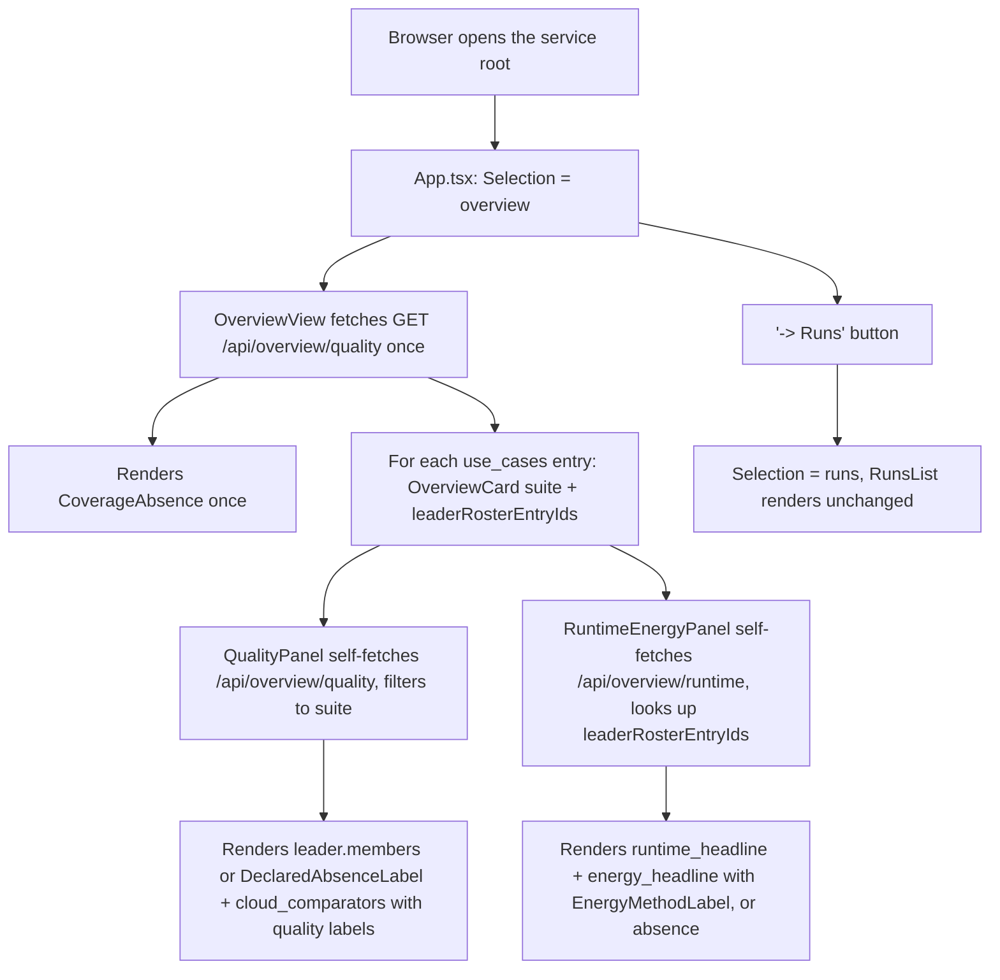

# Instruction: The overview screen — card shell, quality panel, runtime+energy panel, landing wiring, boundary and width guards

## Architecture projection

> Tree of the final files. ✅ create · ✏️ modify · ❌ delete

```txt
.
└── frontend/src/
    ├── App.tsx                                   ✏️ initial Selection is 'overview'; a button reaches 'runs'
    └── views/
        ├── boundary.test.ts                       ✏️ overview/quality <-> overview/runtime <-> shell scan added
        ├── widthGuard.test.tsx                     ✏️ OverviewView added to the 1280x800 guard
        └── overview/                               ✅
            ├── OverviewView.tsx                    ✅ fetches /api/overview/quality once; suite list + leader ids + coverage banner
            ├── OverviewCard.tsx                    ✅ the shell: suite: string, leaderRosterEntryIds: string[] only
            ├── CoverageAbsence.tsx                 ✅ the once-per-page absence banner
            ├── fixtures/overviewQuality.fixture.ts ✅
            ├── quality/
            │   ├── QualityPanel.tsx                ✅ self-fetches /api/overview/quality, filtered to its suite
            │   └── types.ts                        ✅ mirrors overview_quality_view's JSON shape
            └── runtime/
                ├── RuntimeEnergyPanel.tsx           ✅ self-fetches /api/overview/runtime, looked up by roster_entry_id
                └── types.ts                        ✅ mirrors overview_runtime_view's JSON shape
```

## User Journey



## Test Scope

```mermaid
---
title: Test scope
---
journey
  section Setup
    Mock apiFetch to return the overviewQuality/overviewRuntime fixtures => OverviewView, QualityPanel, RuntimeEnergyPanel render from fixtures, not the network: 5: browser
  section Happy path
    Open the root => OverviewView renders one OverviewCard per use_cases entry, CoverageAbsence exactly once, and a button that switches to the runs list: 5: browser
  section Happy path
    A suite whose fixture leader.members holds two entries => QualityPanel renders both, each with its score and quality labels; RuntimeEnergyPanel renders both roster_entry_ids' headlines: 5: browser
  section Edge case - no leader set published
    A suite whose fixture leader is an Absent => QualityPanel renders DeclaredAbsenceLabel naming the absence, no model substituted; RuntimeEnergyPanel receives an empty leaderRosterEntryIds and renders the same "no leader, no headline" absence: 1: browser
  section Edge case - withheld energy headline
    A fixture entry whose energy_headline.withheld is true => RuntimeEnergyPanel renders the missing-label absences, never a bare kg CO2e figure: 1: browser
  section Edge case - out-of-scope use case with no coverage record
    No coverage record in either fixture => the overview renders no guessed use-case card and states the absence exactly once, naming no-use-case-is-silently-absent: 1: browser
  section Edge case - the component boundary
    Source scan of overview/quality/**, overview/runtime/**, and the two shell files => no file under overview/quality imports from overview/runtime (or vice versa), and OverviewCard.tsx imports neither subdirectory's types: 1: system
  section Edge case - width guard
    Render OverviewView with the fixtures at jsdom default width => no element declares an inline width/min-width exceeding 1280px: 1: browser
```

## Wireframe

```txt
┌────────────────────────────────────────────────────────────────┐
│ (1) Header: wave-local-ai-v2                    (2) [→ Runs]   │
├────────────────────────────────────────────────────────────────┤
│ (3) CoverageAbsence: "not yet available: no-use-case-is-        │
│      silently-absent (…)"                                       │
├────────────────────────────────────────────────────────────────┤
│ (4) Card grid, one per task_suite present in the quality store  │
│ ┌────────────────────────────┐  ┌────────────────────────────┐ │
│ │ classification              │  │ translation                  │ │
│ │ ┌─(5) QualityPanel ───────┐ │  │  ...                          │ │
│ │ │ Best local: <leader/    │ │  │                                │ │
│ │ │  absence>, labels        │ │  │                                │ │
│ │ │ Cloud comparators: rows  │ │  │                                │ │
│ │ │  with run_id + labels    │ │  │                                │ │
│ │ └──────────────────────────┘ │  │                                │ │
│ │ ┌─(6) RuntimeEnergyPanel ─┐ │  │                                │ │
│ │ │ median tok/s + machine   │ │  │                                │ │
│ │ │ kg CO2e + method labels  │ │  │                                │ │
│ │ │  or absence               │ │  │                                │ │
│ │ └──────────────────────────┘ │  │                                │ │
│ └────────────────────────────┘  └────────────────────────────┘ │
└────────────────────────────────────────────────────────────────┘
```

1. Header: unchanged brand.
2. One button to the runs list — the story's "stays one navigation step away."
3. `CoverageAbsence`: rendered once at the page level, never per card, naming the owning epic.
4. Card grid: `OverviewCard` per distinct `task_suite` `OverviewView`'s fetch found; no card is invented for a use case the quality store does not carry.
5. `QualityPanel`: leader set or its absence, plus every cloud comparator row, each through the same `labels/` components the quality detail view uses.
6. `RuntimeEnergyPanel`: the leader's runtime and energy headlines, or the absence that follows from no leader existing.

## Tasks to do

### `1)` `overview/quality/types.ts` and `overview/runtime/types.ts`

1. Mirror `overview_quality_view`'s and `overview_runtime_view`'s JSON shapes exactly (`Maybe<T>` for every field `read_model` can report absent), the same discipline `quality/types.ts` and `runtime/types.ts` already hold. Each imports only from `../../../api/types` — never from the sibling overview subdirectory, never from `views/quality` or `views/runtime`.

### `2)` `overview/quality/QualityPanel.tsx`

1. Self-fetches `/api/overview/quality` (own `useEffect`/`apiFetch` pair, same shape as `QualityView`'s), filters its response to the `suite: string` prop.
2. Renders `leader`: if `Absent`, `DeclaredAbsenceLabel` naming the story's stated reason ("no leader set published for this suite and machine class"); if `members`, one row per member reusing `_quality_entry`-shaped rendering — the same score/label rendering `QualityView.tsx`'s `renderScore`/label components already implement, imported, not re-implemented.
3. Renders `cloud_comparators`: one row per entry, its own `run_id` and the same quality labels (`ContaminationRiskLabel`, `IndicativeLabel`, `VerdictLabel` as applicable) — no ranking, no "best cloud model" picked.

### `3)` `overview/runtime/RuntimeEnergyPanel.tsx`

1. Self-fetches `/api/overview/runtime` once, receives `leaderRosterEntryIds: string[]` as a prop (never a quality type).
2. When `leaderRosterEntryIds` is empty (no leader set): render the same class of absence as the quality panel's ("no model to take a headline from").
3. Otherwise, for each id in `leaderRosterEntryIds`, look up the matching `entries[].roster_entry_id` and render `runtime_headline.median_gen_tok_per_s` plus the machine identity from `runtime_headline.machine` (the fiche), and `energy_headline` through `EnergyMethodLabel` exactly as `EnergyView.tsx`'s `HeadlineBlock` already does (reused rendering logic, not a new implementation) — a `withheld` headline renders the missing-label absences instead of a figure.

### `4)` `overview/OverviewCard.tsx` (the shell)

1. Props: `suite: string`, `leaderRosterEntryIds: string[]` — no import from `overview/quality/` or `overview/runtime/`'s type modules, only their components.
2. Renders `<QualityPanel suite={suite} />` and `<RuntimeEnergyPanel leaderRosterEntryIds={leaderRosterEntryIds} />` side by side as one visual card.

### `5)` `overview/CoverageAbsence.tsx`

1. A static `DeclaredAbsenceLabel` naming `no-use-case-is-silently-absent`, structurally identical to `views/quality/CoverageRecord.tsx` (see plan.md's Decisions on why it is a separate file, not a shared import).

### `6)` `overview/OverviewView.tsx`

1. Fetches `/api/overview/quality` once on mount (own loading/unreachable states, matching every other view's `LoadState` union).
2. Derives the suite list (`use_cases[].task_suite`, string values only — an `Absent` `task_suite` is skipped, not rendered as a card with no name) and, per suite, the `roster_entry_id`s of `leader.members` (bare strings) to pass as `leaderRosterEntryIds`.
3. Renders `<CoverageAbsence />` once, then one `<OverviewCard key={suite} suite={suite} leaderRosterEntryIds={ids} />` per suite.

### `7)` `App.tsx`

1. `Selection`'s initial `useState` becomes `{ status: 'overview' }`; a new `selection.status === 'overview'` branch renders `<OverviewView />` plus a nav button `onClick={() => setSelection({ status: 'runs' })}`.
2. The existing `'runs'` branch (currently the default) is otherwise unchanged — reachable, just no longer the landing state.

### `8)` `views/boundary.test.ts`

1. Add `overviewQualitySources`/`overviewRuntimeSources` globs over `./overview/quality/**/*.{ts,tsx}` and `./overview/runtime/**/*.{ts,tsx}`, and a third glob over the shell files (`./overview/*.{ts,tsx}`, excluding the two subdirectories).
2. Three assertions, same style as the existing quality/runtime pair: no `overview/quality` file imports a specifier containing `runtime`; no `overview/runtime` file imports a specifier containing `quality`; no shell-level file (`OverviewCard.tsx`, `OverviewView.tsx`) imports a specifier containing both `overview/quality` and `overview/runtime`'s type-module paths — proven by the same temporarily-break-it method the file's header already documents for the other pairs.

### `9)` `views/widthGuard.test.tsx`

1. Add an `OverviewView` case: mock `apiFetch` with the overview fixture, render inside `KeyGate`, wait for a known fixture string, assert `assertNoElementExceedsWidth`.

### `10)` Component tests

1. `overview/OverviewView.test.tsx`, `overview/quality/QualityPanel.test.tsx`, `overview/runtime/RuntimeEnergyPanel.test.tsx` — one leader set of two renders both; an absent leader set renders the absence and no model; a withheld energy headline renders absences; an out-of-scope/no-coverage-record state renders the single banner and no guessed card; every rendered number traces to the fixture payload it came from (assert against the fixture's own values, not a hard-coded duplicate).

## Test acceptance criteria

| Task | Acceptance criteria |
| ---- | -------------------- |
| 1    | Both `types.ts` files compile against the fixtures built in task 10 and import only `api/types`. |
| 2-3  | `QualityPanel`/`RuntimeEnergyPanel` render every state their Test Scope names, each reusing an existing `labels/` component rather than a new one. |
| 4    | `OverviewCard.tsx` contains no import specifier matching `overview/quality` or `overview/runtime` beyond the two component imports themselves — verified by task 8's scan. |
| 5-6  | Opening the root renders `CoverageAbsence` exactly once and one card per real `task_suite`, never a guessed one. |
| 7    | Opening the service root shows the overview; one click reaches the unchanged runs list — verified by rendering `App` and asserting the initial screen, then the post-click screen. |
| 8    | `npx vitest run views/boundary.test.ts` passes, and fails when a temporary cross-import is added (documented the same way the existing pairs are). |
| 9    | `npx vitest run views/widthGuard.test.tsx` passes with the new `OverviewView` case. |
| 10   | `npx vitest run` passes across the new component tests; each fails if a figure not present in its fixture were rendered. |
