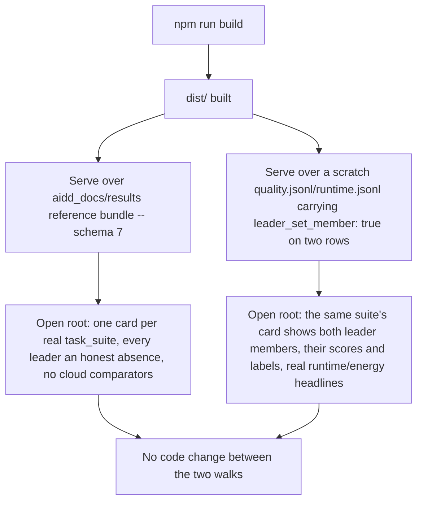

# Instruction: Evidence over the reference bundle and a leader-set fixture bundle, README note

## Architecture projection

> Tree of the final files. ✅ create · ✏️ modify · ❌ delete

```txt
.
├── CHANGELOG.md                      ✏️ Unreleased/Added: the overview screen, the two routes, the landing swap
├── aidd_docs/results/README.md       ✏️ new section: what the overview withholds on day one and why
└── aidd_docs/tasks/2026_09/2026_09_22_pitch-overview-one-card-per-use-case/
    └── evidence/
        ├── phase-3-overview-reference-bundle.png    ✅ "7" bundle: every card an honest absence
        └── phase-3-overview-leader-set-bundle.png   ✅ scratch bundle: a leader set of two, real headlines
```

## User Journey



## Tasks to do

### `1)` Build and serve over the reference bundle

1. `npm run build` inside `frontend/`, point `DASHBOARD_BUNDLE_DIR` at `frontend/dist/`, `RUNTIME_RESULTS_PATH`/`QUALITY_RESULTS_PATH` at `aidd_docs/results/runtime-reference.jsonl`/`quality-reference.jsonl`, start `wave-local-ai-v2-serve`.
2. Open the served root (Claude in Chrome). Confirm: the overview is the landing screen; one card exists per `task_suite` the reference bundle actually carries; every card's `QualityPanel` shows the `DeclaredAbsenceLabel` for "no leader set published," never a substituted highest score; `cloud_comparators` is empty on every card (the reference bundle carries no non-local `provider` rows — confirmed in phase 1); `RuntimeEnergyPanel` shows the matching "no leader, no headline" absence; `CoverageAbsence` renders once, naming `no-use-case-is-silently-absent`; one click reaches the unchanged runs list. Screenshot.

### `2)` Build a leader-set fixture bundle and serve it

1. Copy `aidd_docs/results/quality-reference.jsonl` and `runtime-reference.jsonl` to a scratch directory; hand-edit two rows of one suite in the quality copy to add `"leader_set_member": true` (one already-`correct` row and one with a different `model_id`/`roster_entry_id`, so two distinct leaders render); ensure their `roster_entry_id`s each have at least one row in the runtime copy carrying all three `*_energy_method` fields, so the energy headline resolves rather than withholds.
2. Point `RUNTIME_RESULTS_PATH`/`QUALITY_RESULTS_PATH` at the scratch copies — **no rebuild, no code change** from task 1's serve.
3. Open the root again. Confirm the edited suite's card now shows both leader members under `QualityPanel` (their own scores and quality labels — `contamination_risk`, `indicative`, etc.), and `RuntimeEnergyPanel` shows both roster entries' `median_gen_tok_per_s`, machine identity and a real, non-withheld `kg CO2e` figure with its three method labels. Every other suite's card is unchanged from task 1's absence state. Screenshot.

### `3)` `aidd_docs/results/README.md`

1. Add a section recording what the overview withholds on day one and why: the leader set (real mechanism — `leader_set_member` resolved via `resolve_field`, empty everywhere until the stats epic writes it; cite `a-score-is-published-with-its-interval-a-difference-with-its-test.md`'s unowned-derivation entry), the runtime/energy headline that follows from having no leader, and the coverage record's declared absence (cite `no-use-case-is-silently-absent`) — each stated as documented evidence of honest withholding, matching the format the sibling `quality-runtime-and-energy-read-at-pitch-distance` story's own README section already established.

### `4)` `CHANGELOG.md`

1. `## [Unreleased]` → `### Added`: the overview screen (`views/overview`), the two routes (`GET /api/overview/quality`, `GET /api/overview/runtime`), and the landing-screen swap (overview is now root; the runs list is one click away) — in the file's existing terse, mechanism-naming style.

## Test acceptance criteria

| Task | Acceptance criteria |
| ---- | -------------------- |
| 1    | The reference-bundle screenshot shows every card as an honest absence — no leader, no cloud comparator, no runtime/energy headline — and the coverage banner exactly once. |
| 2    | The leader-set screenshot uses the same built bundle and service process, only the results paths changed; it shows a real, populated card (two leader members, real headlines) beside unchanged absent cards for every other suite. |
| 3    | `aidd_docs/results/README.md`'s new section names all three withheld constructs and the code path or owning epic behind each. |
| 4    | `CHANGELOG.md`'s `Unreleased/Added` entry accurately names the shipped files, not a restatement of the story's acceptance text. |
