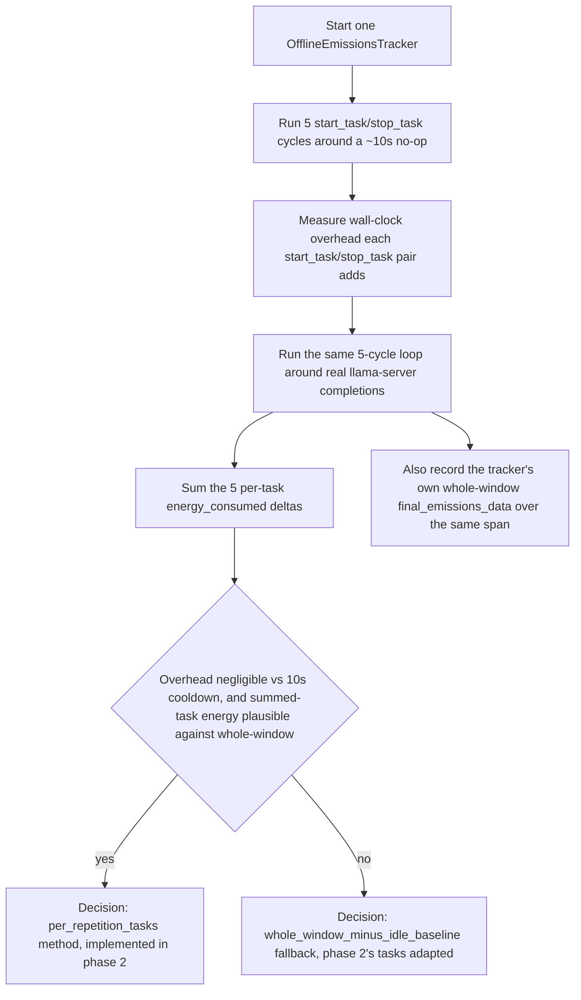
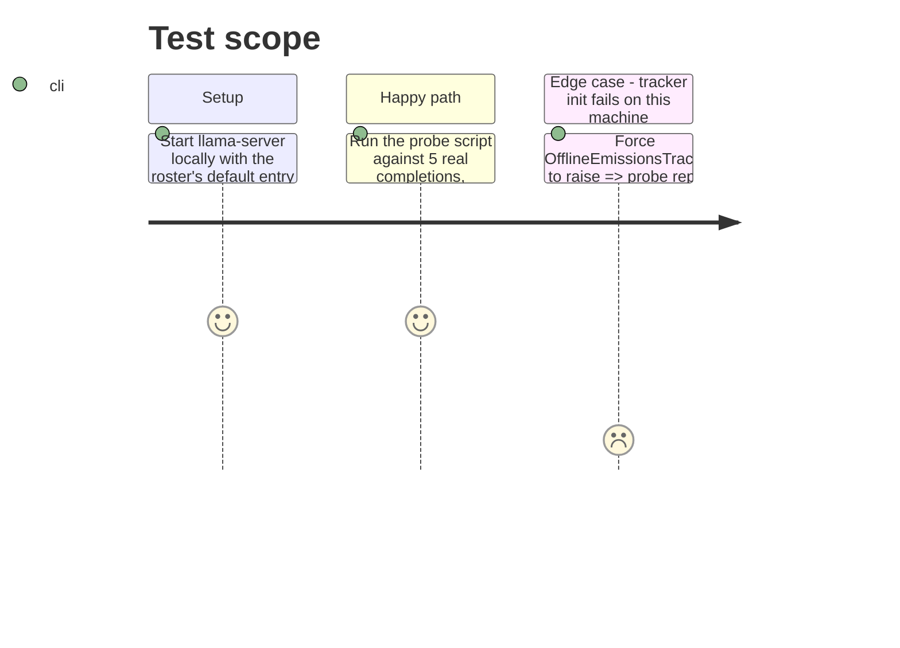

<!-- Fill or omit these sections; never add, rename, or reorder one. -->

# Instruction: Probe: verify per-repetition CodeCarbon tasks on this machine, decide the method

## Architecture projection

> Tree of the final files. ✅ create · ✏️ modify · ❌ delete

```txt
.
└── (scratchpad only, nothing committed)
    └── probe_repetition_energy.py   run and discarded, not part of the repo
```

No production or test file changes in this phase: it produces a decision recorded in phase 2, not code.

## User Journey



## Test Scope



## Tasks to do

### `1)` Write and run a throwaway probe script

**Outcome (2026-09-22, real `llama-server` run, `qwen3.6-35b-a3b-ud-iq4xs` roster entry, 5 counted repetitions, 10 s cooldown):**

- Overhead: `start_task`/`stop_task` pair costs median 1.650 ms (min 1.543 ms, max 2.044 ms) -- four orders of magnitude below the 10 s cooldown, not just the "tens of ms" bar the task set. **Pass.**
- Plausibility: pass 1 (today's `measure_energy`, whole 5-rep window including cooldowns) measured `0.0017348461115447875` kWh. Pass 2 (`start_task`/`stop_task` around each repetition only) summed to `0.0011334639758371003` kWh -- positive, finite, and 65.3% of the whole-window figure (ratio 0.6534), i.e. a smaller subset of it, consistent with the audit's own idle-share estimate (cooldown was ~35% of this run's span) rather than double-counting or leaking. **Pass.**
- **Decision: phase 2 implements `per_repetition_tasks`** (one `OfflineEmissionsTracker`'s `start_task()`/`stop_task()` around each counted repetition, summed), not the `whole_window_minus_idle_baseline` fallback.

> Answer two questions on this machine: is `start_task`/`stop_task` overhead negligible next to a 10 s cooldown, and does the summed per-task energy sit in a plausible range against the whole-window figure `measure_energy` reports today.

1. In the scratchpad directory (never committed), write a script that: starts one `llama-server` process from the default roster entry (reuse `wave_local_ai_v2.server.running_server` and the same fixed prompt/`cache_prompt: False` request `__init__.py` sends), then runs 5 counted repetitions with a 10 s cooldown between them, twice:
   - Once wrapping each repetition's request in `tracker.start_task()`/`tracker.stop_task()` on one `OfflineEmissionsTracker`, summing the 5 returned `energy_consumed` deltas, and timing the added wall-clock cost of the `start_task`/`stop_task` pair itself (call it immediately before/after with `time.perf_counter()`, isolated from the request's own network time).
   - Once with today's `measure_energy` wrapping the whole 5-repetition set (current behaviour), reading `final_emissions_data.energy_consumed`.
2. Print: per-task overhead (ms, min/median/max over the 5 calls), the summed per-task `energy_consumed`, the whole-window `energy_consumed`, and the ratio of the two.
3. Judge the two questions this phase exists to answer:
   - **Overhead**: is the per-task overhead small next to the 10 s cooldown (two orders of magnitude smaller, i.e. tens of ms at most)? `start_task`/`stop_task` does no hardware re-detection (the tracker is already initialized by its own `start()`), only a channel energy read, so this is expected to pass.
   - **Plausibility**: is the summed per-task energy positive, finite, and less than the whole-window figure (which also includes the four idle cooldowns' own draw)? A summed-task figure larger than the whole window it's a subset of would mean the task API is double-counting or leaking across repetitions, and disqualifies it.
4. Record the outcome as one line in this phase's own `## Tasks to do` when marking it done (or in the executor's summary): which method phase 2 must implement, with the two measured numbers cited. Do not commit the probe script.

## Test acceptance criteria

| Task | Acceptance criteria |
| ---- | -------------------- |
| 1-3  | The probe ran against a real `llama-server` on this machine (not mocked) and printed both overhead and the two energy figures |
| 3    | A pass/fail verdict is stated for both questions, with the actual numbers, not just "looks fine" |
| 4    | Phase 2 is entered already knowing which of the two methods (`per_repetition_tasks` or `whole_window_minus_idle_baseline`) it implements — this phase's outcome is not re-litigated there |
