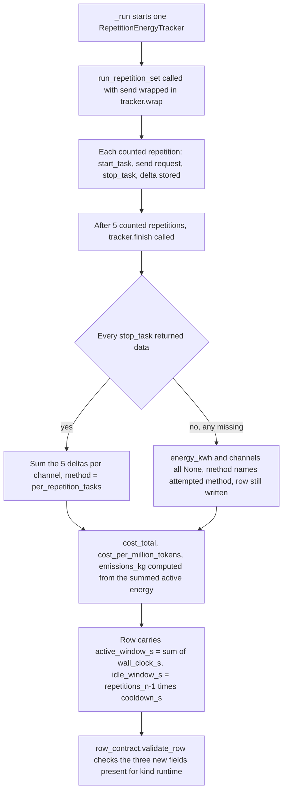
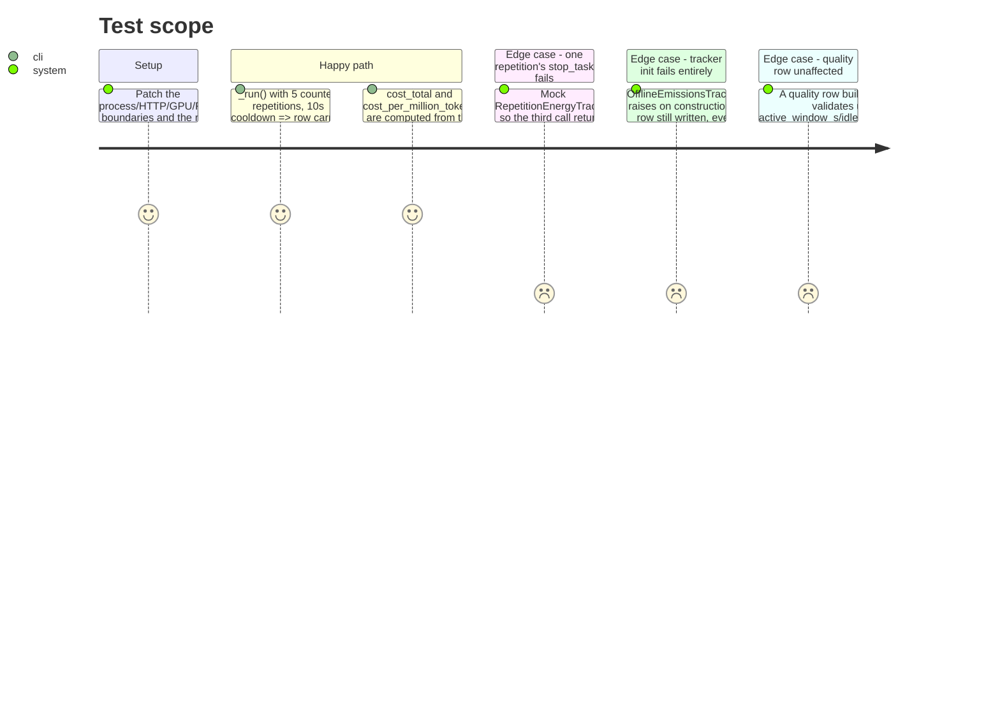

<!-- Fill or omit these sections; never add, rename, or reorder one. -->

# Instruction: Runtime harness measures energy per repetition; schema, aggregation and read-model updates

## Architecture projection

> Tree of the final files. ✅ create · ✏️ modify · ❌ delete

```txt
.
├── src/wave_local_ai_v2/
│   ├── energy.py           ✏️ add RepetitionEnergyTracker (start_task/stop_task per repetition, summed EnergyResult); measure_energy untouched (still used by quality_cli.py/judge_probe.py, W4 stays out of scope)
│   ├── __init__.py         ✏️ _run wraps send_request in the tracker instead of wrapping the whole counted set; row carries active_window_s, idle_window_s, energy_window_method
│   ├── aggregation.py      ✏️ AGGREGATION_LABELS text for energy_kwh/cpu_energy_kwh/gpu_energy_kwh/ram_energy_kwh describes the active-window span, not "including_cooldowns"
│   ├── row_contract.py     ✏️ SCHEMA_VERSION "11" -> "12"; three new required fields on the "runtime" kind only
│   └── read_model.py       ✏️ RUNTIME_VIEW_FIELDS carries the three new fields
├── tests/
│   ├── test_energy.py      ✏️ RepetitionEnergyTracker: sums task deltas, gpu-method labelling, init failure, one failed stop_task makes the row's energy unavailable
│   ├── test_cli.py         ✏️ stubbed_run patches the new call site; assertions on active_window_s/idle_window_s/energy_window_method; cost_total still derives from the (now active-window) energy_kwh
│   ├── test_row_contract.py ✏️ SCHEMA_VERSION == "12"; new required fields covered by the existing exhaustiveness tests
│   ├── test_read_model.py  ✏️ runtime view test asserts the three new fields resolve (no Absent) alongside the rest
│   └── store_fixtures.py   ✏️ runtime NAMED_VALUES/row template carries active_window_s, idle_window_s, energy_window_method
```

## User Journey



## Test Scope



## Tasks to do

### `1)` `RepetitionEnergyTracker` in `energy.py`

> One tracker, `start_task`/`stop_task` per repetition, summed into the existing `EnergyResult` shape plus a window-method label.

1. Add `ENERGY_WINDOW_METHOD_PER_REPETITION = "per_repetition_tasks"` and `ENERGY_WINDOW_METHOD_UNAVAILABLE = "unavailable"` constants (mirroring the existing `ENERGY_METHOD_*` naming).
2. Add `class RepetitionEnergyTracker`: constructed with `country_iso_code`. On construction, try to build and `.start()` one `OfflineEmissionsTracker` exactly as `measure_energy` does today (`output_methods=[]`, `log_level="error"`); on any exception, hold no tracker (mirrors `measure_energy`'s `_unavailable_energy_result` fallback).
3. Expose `wrap(fn)`: returns a zero-arg callable that, when a tracker is held, calls `tracker.start_task()`, runs `fn()`, calls `tracker.stop_task()` in a `finally`, and appends the returned `TaskEmissionsData` (or `None` on failure) to an internal list; when no tracker is held, just calls `fn()`. Never raises on the tracker side — the measured call's own exception always propagates, exactly like `measure_energy`'s existing `finally`/`_stop_tracker` discipline.
4. Expose `finish() -> EnergyResult`: stops the tracker (for hardware lifecycle and the final `gpu_count` read, same as `measure_energy`'s `_stop_tracker`); if no tracker was held, or the tracker failed to stop, or any recorded task delta is `None`, return an `EnergyResult` with every channel `None` and every method `ENERGY_METHOD_UNAVAILABLE` (reuse `total_or_none`-style all-or-nothing summation, do not import `cost.py` — inline the same rule to keep `energy.py` free of a new dependency). Otherwise sum `cpu_energy`/`gpu_energy`/`ram_energy`/`energy_consumed` across every stored delta, and label `gpu_energy_method` from the tracker's final `gpu_count` exactly as `measure_energy` does.
5. Add a `window_method` property/attribute on the returned info (or a second return value) so `__init__.py` can write `energy_window_method` onto the row: `ENERGY_WINDOW_METHOD_PER_REPETITION` on a successful sum, `ENERGY_WINDOW_METHOD_UNAVAILABLE` otherwise.
6. `measure_energy` itself is untouched — `quality_cli.py` and `judge_probe.py` keep calling it unchanged.

### `2)` Wire the runtime harness (`__init__.py`)

> Replace the whole-window `measure_energy(_run_counted, ...)` call with per-repetition tracking around the counted repetitions only; warm-ups stay unmeasured (unchanged).

1. Remove the `_run_counted` closure and its `measure_energy` call (`__init__.py:337-353`).
2. Construct `tracker = energy.RepetitionEnergyTracker(country_iso_code=settings.emission_country_iso_code)` right where `_run_counted` used to be built.
3. Call `run_repetition_set(send=tracker.wrap(send_request), read_gpu=..., ..., warmup_count=0, count=settings.runtime_repetitions, cooldown_s=settings.runtime_cooldown_s)` directly (no longer nested inside `measure_energy`), assigning its result to `_, counted`.
4. Call `energy_result = tracker.finish()`; keep the existing `**energy` row spread using this value.
5. Compute `active_window_s = sum(rep["wall_clock_s"] for rep in counted)` — state in a comment that this is the same span `wall_clock_s` already publishes, restated beside the energy block, not a new measurement.
6. Compute `idle_window_s = (settings.runtime_repetitions - 1) * settings.runtime_cooldown_s` when `settings.runtime_repetitions > 0` else `0.0`.
7. Add `"active_window_s": active_window_s`, `"idle_window_s": idle_window_s`, `"energy_window_method": tracker.window_method` (or however task 1's API names it) to the row dict, placed beside the existing `**energy` spread.
8. Update the docstring/comment at `__init__.py:349-353` (currently: "energy spans only the counted repetitions and the cooldowns between them") to state the new behaviour: energy spans only each repetition's own generation, excluding the cooldowns.

### `3)` Aggregation label text (`aggregation.py`)

> The four energy entries in `AGGREGATION_LABELS` describe the new span; the key set (`MEASUREMENT_FIELDS`) is unchanged, so quality rows are unaffected.

1. Change `"energy_kwh"`, `"cpu_energy_kwh"`, `"gpu_energy_kwh"`, `"ram_energy_kwh"`'s label text from `"total_over_counted_repetitions_including_cooldowns"` to `"total_over_counted_repetitions_active_window"` (or the term phase 1 settles on if the fallback method was chosen instead).
2. Update the comment above `AGGREGATION_LABELS` that currently explains the "including_cooldowns" choice, to explain the new active-window span and point at `active_window_s`/`idle_window_s`/`energy_window_method`.

### `4)` Schema bump and required fields (`row_contract.py`)

> `SCHEMA_VERSION` "12"; three new fields required on `"runtime"` only.

1. Bump `SCHEMA_VERSION = "12"`, with a one-paragraph comment in the numbered history above it, naming C3 of the 2026-09-22 audit, stating the three new fields and that quality rows are untouched (W4 tracks the quality-side fix separately).
2. Add `"active_window_s"`, `"idle_window_s"`, `"energy_window_method"` to `REQUIRED_FIELDS["runtime"]` only (not `"quality"`).
3. No change to `_validate_runtime_repetition_structure` is needed unless phase 1's probe surfaces a new invariant worth checking (e.g. `active_window_s` staying within a sane bound of `wall_clock_s`); if so, add it here with a one-line reason in its own comment.

### `5)` Read-model exposure (`read_model.py`)

> The three fields render on the runtime detail view, not the shared energy view.

1. Add `"active_window_s"`, `"idle_window_s"`, `"energy_window_method"` to `RUNTIME_VIEW_FIELDS`.
2. Do not touch `ENERGY_VIEW_FIELDS`, `ENERGY_CHANNELS`, or `_energy_entry` — the shared energy route and its "same thirteen energy fields" docstring stay accurate for both row kinds.

### `6)` Tests

> Cover the new tracker, the new fields, and the two failure paths; keep the runtime/quality parity guards green.

1. `tests/test_energy.py`: add tests for `RepetitionEnergyTracker` mirroring the existing `measure_energy` test shapes — sums multiple task deltas into one `EnergyResult`; labels `gpu_energy_method` from the tracker's final `gpu_count`; tracker construction failure leaves every channel `None` and `fn()` still runs for every repetition; one `stop_task()` returning `None` mid-sequence makes the finished result all-`None` rather than a partial sum.
2. `tests/test_cli.py`: update `stubbed_run`'s `"energy"` patch to the new call site (`RepetitionEnergyTracker` or its `wrap`/`finish` methods, however task 1 shapes it) so it still returns `FAKE_ENERGY_RESULT`'s figures without touching real hardware; add assertions for `row["active_window_s"]`, `row["idle_window_s"]` (`== 4 * 10.0` at the default `runtime_repetitions=5`/`runtime_cooldown_s=10.0`), and `row["energy_window_method"] == "per_repetition_tasks"`; confirm `cost_total`/`cost_per_million_tokens` assertions still hold (same formula, same `FAKE_ENERGY_RESULT` values, since the stub is method-agnostic).
3. `tests/store_fixtures.py`: add the three fields to the runtime row template with plausible values.
4. `tests/test_row_contract.py`: update the literal `SCHEMA_VERSION == "12"` assertion; confirm the existing exhaustiveness tests (`test_every_declared_measurement_is_a_required_runtime_field` and friends) pass unchanged since `MEASUREMENT_FIELDS`' key set did not move.
5. `tests/test_read_model.py`: extend `test_the_runtime_view_carries_its_fields_and_the_resolved_fiche` (or add a sibling assertion) to check the three new fields resolve to real values with no `Absent` in the entry; the parametrized `test_every_contract_field_is_rendered_or_declared_unrendered` needs no new fixture beyond `RUNTIME_VIEW_FIELDS`'s addition.
6. Run `uv run pytest -q` and confirm the full suite passes, quality-side tests included (`tests/test_quality_cli.py`, `tests/test_judge_probe.py` untouched and green, proving `measure_energy`'s existing behaviour is unaffected).

## Test acceptance criteria

| Task | Acceptance criteria |
| ---- | -------------------- |
| 1    | `RepetitionEnergyTracker.finish()` returns the sum of every task's channel deltas when all `stop_task()` calls succeed, and an all-`None` `EnergyResult` when any one fails or the tracker never started |
| 2    | A runtime row built by `_run()` carries `energy_window_method`, `active_window_s` equal to the summed per-repetition `wall_clock_s`, and `idle_window_s` equal to `(repetitions_n - 1) * cooldown_s` |
| 2    | `cost_total` and `cost_per_million_tokens` are computed from the summed active-window `energy_kwh`, not a whole-window figure |
| 4    | `row_contract.SCHEMA_VERSION == "12"`; a runtime row missing any of the three new fields fails `validate_row`; a quality row built without them still passes `validate_row` |
| 5    | `read_model.build_runtime` resolves the three fields on every entry with no `Absent`; `read_model.energy_view`'s output and its "same thirteen fields" docstring are unchanged |
| 6    | `uv run pytest -q` passes in full, including the quality/judge suites that exercise the untouched `measure_energy` path |
