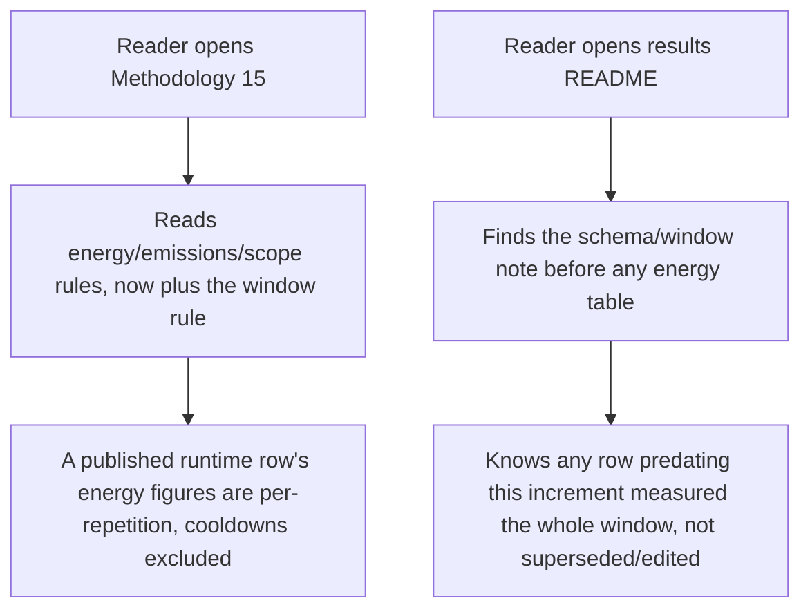
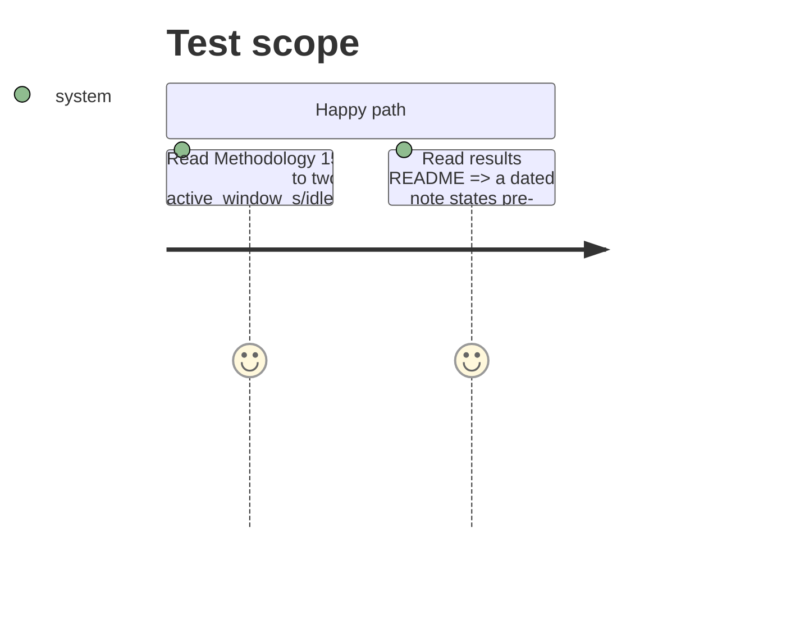

<!-- Fill or omit these sections; never add, rename, or reorder one. -->

# Instruction: PRD Methodology 15 gains the window rule; results README records the supersession

## Architecture projection

> Tree of the final files. ✅ create · ✏️ modify · ❌ delete

```txt
.
├── aidd_docs/tasks/2026_08/
│   └── 2026_08_21-wave-local-ai-v2-benchmark-suite-prd.md   ✏️ Methodology 15 gains one window-rule addition
└── aidd_docs/results/
    └── README.md                                             ✏️ new note: rows produced before this increment measured the whole window including cooldowns
```

## User Journey



## Test Scope



## Tasks to do

### `1)` PRD Methodology 15

> One addition, no other Methodology line moves.

1. In `2026_08_21-wave-local-ai-v2-benchmark-suite-prd.md`, Methodology 15 (the "Energy and carbon" paragraph, currently ending "...states that they are not like-for-like until a local Scope-3 component exists."), append: a runtime row's energy figures are measured per counted repetition — the tracker starts and stops around each generation, excluding the fixed cooldowns between them — and the row states which method produced them (`energy_window_method`) plus the active and idle window sizes (`active_window_s`, `idle_window_s`) it measured and excluded, so a fast model's cooldown never inflates its published energy, emissions or cost per token.
2. State the window method's two possible values in the same sentence or the next one (`per_repetition_tasks`, and the fallback name phase 1/2 settled on), matching whichever `energy.py` actually implements.

### `2)` Results README supersession note

> A dated note, not a rewrite of any existing table.

1. In `aidd_docs/results/README.md`, add a new dated section (after "## The published bundle is one schema behind the code", before the energy-bearing tables further down) stating: as of this increment's commit, runtime rows measure energy per counted repetition (cooldowns excluded); every runtime row produced before it — including every table already in this file — measured the whole counted-repetition span including the `(N-1)` cooldowns between repetitions, per the superseded `"total_over_counted_repetitions_including_cooldowns"` aggregation label. Those rows and tables are **not edited**: this file's own "superseded, never edited" discipline (see the "Dense versus MoE" section above) applies here too.
2. Cross-reference `SCHEMA_VERSION` "12" and `row_contract.py`'s numbered comment for the field list, so a reader can tell which stored rows are affected by `schema_version` alone.

## Test acceptance criteria

| Task | Acceptance criteria |
| ---- | -------------------- |
| 1    | Methodology 15 states the window rule in the PRD, naming all three new row fields, with no other sentence in the Methodology section altered |
| 2    | The results README carries a note, dated to this increment, stating pre-increment rows measured the whole window and are not edited; every existing table in the file is untouched |
