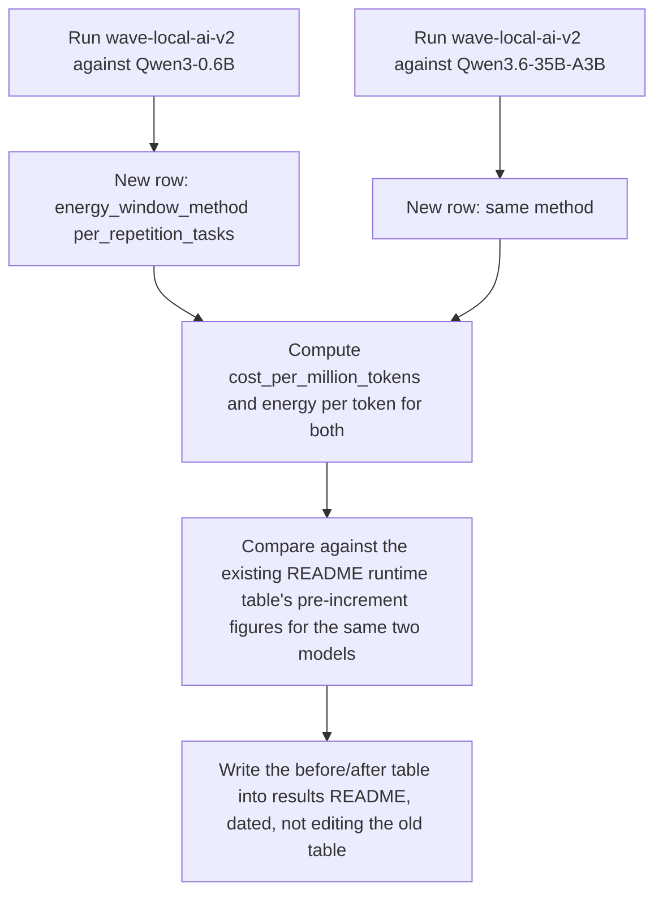
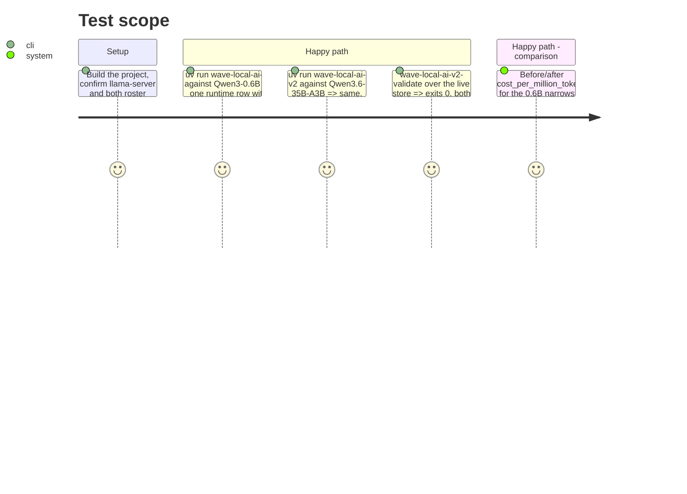

<!-- Fill or omit these sections; never add, rename, or reorder one. -->

# Instruction: Live evidence: re-run a fast dense model and the MoE flagship, publish the before/after comparison

## Architecture projection

> Tree of the final files. ✅ create · ✏️ modify · ❌ delete

```txt
.
└── aidd_docs/results/
    └── README.md   ✏️ new dated section: before/after per-token energy comparison for Qwen3-0.6B and Qwen3.6-35B-A3B
```

`aidd_docs/results/runtime.jsonl` (untracked, `.gitignore`d) gains two new rows on this machine; not committed, per this file's own convention.

## User Journey



## Test Scope



## Tasks to do

### `1)` Re-run the fast dense model and the MoE flagship

> Same protocol as the existing README table: default 1 warm-up, 5 counted repetitions, 10 s cooldown, pinned seed, 128-token cap.

1. `uv run wave-local-ai-v2` against the `Qwen3-0.6B` roster entry (the fastest dense model in the existing table, and the one with the worst idle share in the audit — 0.89).
2. `uv run wave-local-ai-v2` against the `Qwen3.6-35B-A3B` roster entry (the MoE flagship, idle share 0.43 in the audit — the model least affected by the bug, used here as the comparison anchor).
3. `uv run wave-local-ai-v2-validate` over the live runtime store; confirm exit 0 and both new rows resolve their `fiche_hash`.
4. Record each row's `run_id`, `energy_kwh`, `active_window_s`, `idle_window_s`, `energy_window_method`, `cost_total`, `cost_per_million_tokens`.

### `2)` Compute the before/after per-token comparison

> Read the "before" figures from the existing "### Runtime" table in `aidd_docs/results/README.md` (the `Qwen3-0.6B` and `Qwen3.6-35B-A3B` rows: `run_id` `68a5e1df...` and `f7faeef7...`, Energy 0.00078 / 0.00264 kWh, Cost 0.000151 / 0.000513 EUR).

1. Compute the "after" cost-per-token ratio between the two models (`cost_per_million_tokens` of the 0.6B relative to the flagship) and compare it against the same ratio from the "before" figures.
2. State plainly whether the fix narrows the gap, as the audit's idle-share numbers predict (the 0.6B's idle share was 0.89 of its measured window, so most of its "before" cost was cooldown, not generation), or does something else — report what actually happened rather than what was predicted.

### `3)` Publish the comparison in the results README

> A new dated section, not an edit to the existing "### Runtime" table.

1. Add a new dated section to `aidd_docs/results/README.md` (after phase 3's supersession note) titled with today's date, naming both `run_id`s, both fiches cited, and a table with columns: Model, `energy_kwh` before/after, `cost_per_million_tokens` before/after, `active_window_s`/`idle_window_s` (after only — the before rows never recorded this split), `energy_window_method`.
2. State the ratio finding from task 2 in one or two sentences, citing the actual numbers.
3. Note any caveat the comparison genuinely carries (e.g. different `commit_sha`/`schema_version` between the before and after rows, same as every other before/after section in this file already does).

## Test acceptance criteria

| Task | Acceptance criteria |
| ---- | -------------------- |
| 1    | Two new runtime rows exist in the live store, each with `energy_window_method` naming the method phase 2 implemented, and `wave-local-ai-v2-validate` exits 0 over the store |
| 2    | The before/after cost-per-token ratio between the two models is computed and stated, backed by the actual numbers from both the old README table and the new rows |
| 3    | The results README carries a new dated section with the comparison; the existing "### Runtime" table is untouched |
