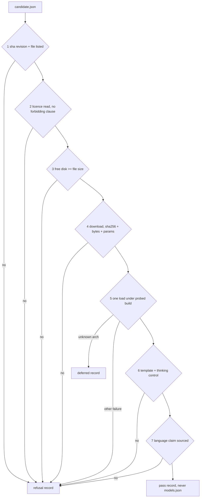
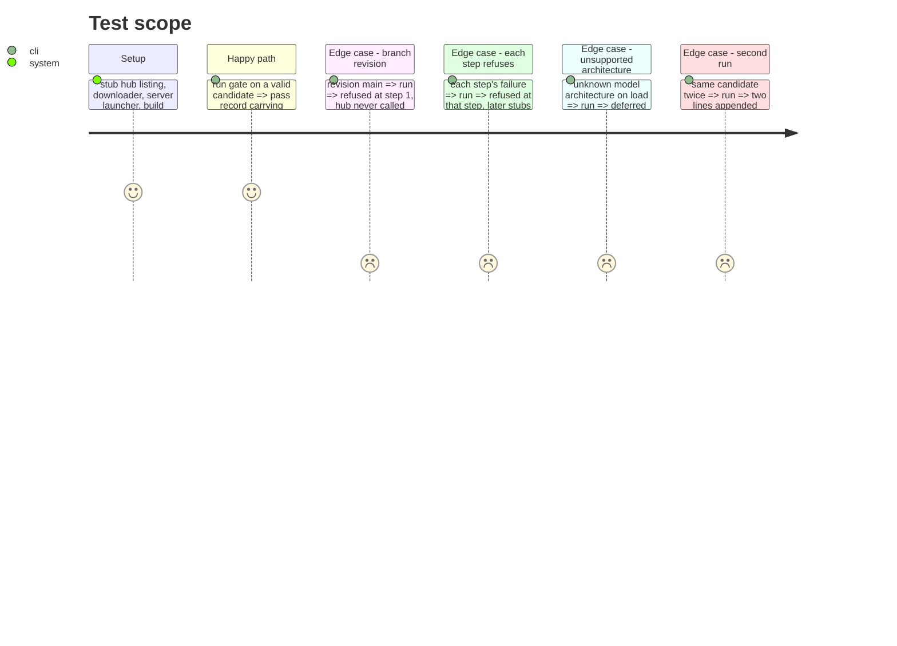

# Instruction: The gate, its steps and its record

## Architecture projection

> Tree of the final files. ✅ create · ✏️ modify · ❌ delete

```txt
.
├── src/wave_local_ai_v2/candidate_gate.py   ✅ declaration, seven steps, record writer, main()
├── src/wave_local_ai_v2/local_client.py     ✏️ probe_reasoning (one generation, nothing sent)
├── src/wave_local_ai_v2/roster.py           ✏️ parse_entry: the loader's own rules for one entry
├── pyproject.toml                           ✏️ wave-local-ai-v2-candidate-gate entry point
├── tests/test_candidate_gate.py             ✅ stubbed hub, download, server
└── tests/test_local_client.py               ✏️ probe_reasoning shapes
```

## User Journey



## Test Scope



## Tasks to do

### `1)` Declaration

> A candidate is a validated JSON declaration.

1. Parse and shape-check; exit 2 naming the field on a malformed one.

### `2)` Steps 1 to 7

> Cheapest first, first failure stops.

1. Each step returns its facts or raises `StepRefused(step, evidence, outcome)`.
2. Seams injected: hub, download, disk free, build probe, server launcher; local HTTP through `local_client`.

### `3)` Record and command

> One appended line per run.

1. Pass record carries the roster entry block; refusal carries step, evidence, date.
2. `main()` exit 0 pass, 1 refused/deferred, 2 operator error.

## Test acceptance criteria

| Task | Acceptance criteria              |
| ---- | -------------------------------- |
| 1 | A declaration missing a field or naming an unknown family exits 2 and writes nothing |
| 2 | Each step can refuse and no later stub is called (no download after a licence refusal, no load after a failed hash) |
| 3 | A pass record's `entry` loads through `roster._parse_entry`; two runs leave two lines |
