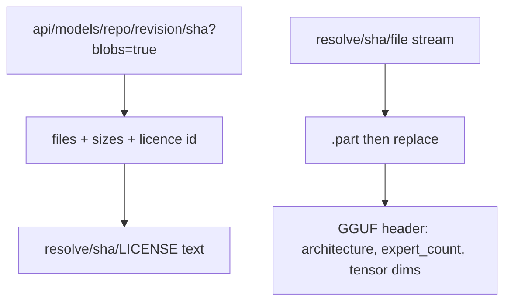
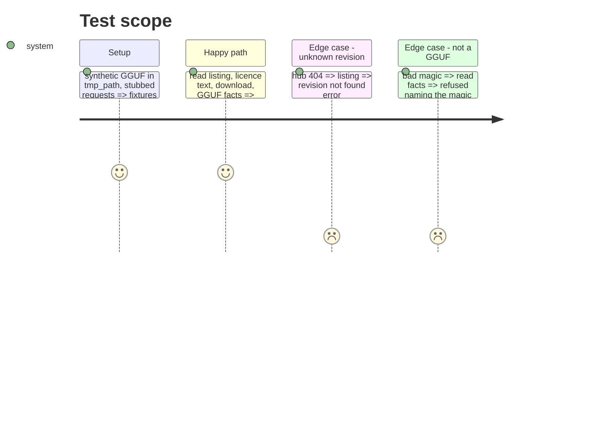

# Instruction: The real hub, download and GGUF seams

## Architecture projection

> Tree of the final files. ✅ create · ✏️ modify · ❌ delete

```txt
.
├── src/wave_local_ai_v2/candidate_gate.py   ✏️ HubClient over requests, stream_download, read_gguf_facts
└── tests/test_candidate_gate.py             ✏️ requests stubbed, a synthetic GGUF written in tmp_path
```

## User Journey



## Test Scope



## Tasks to do

### `1)` Hub client

> Read-only listing, licence id, text file at a revision.

1. `GET /api/models/<repo>/revision/<sha>?blobs=true`; `resolve/<sha>/<path>` for text.

### `2)` Downloader

> Stream to `<dest>.part`, replace on completion.

### `3)` GGUF reader

> Architecture, expert count, total parameters, without loading tensors.

## Test acceptance criteria

| Task | Acceptance criteria              |
| ---- | -------------------------------- |
| 1 | Listing yields file sizes and licence id; a 404 is a not-found error |
| 2 | A download leaves the file and no `.part` |
| 3 | A synthetic GGUF reports its architecture, expert count and dim-sum parameter count |
