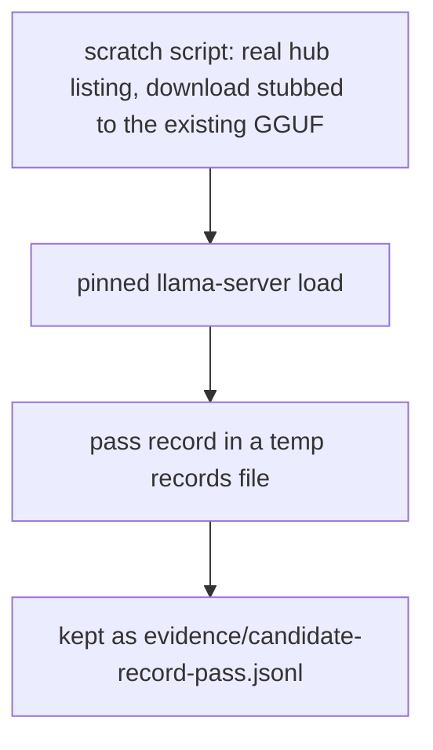
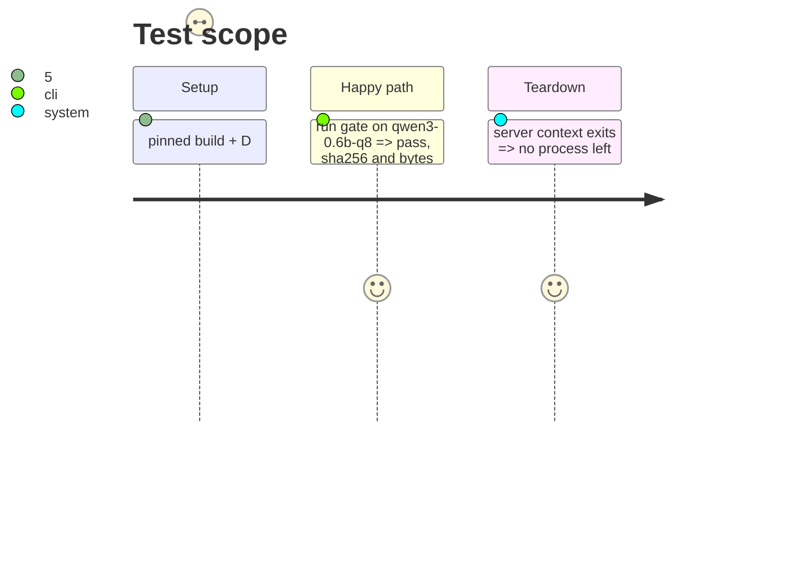

# Instruction: Docs, memory and the live pass record

## Architecture projection

> Tree of the final files. ✅ create · ✏️ modify · ❌ delete

```txt
.
├── docs/setup.md                                ✏️ 3.2 run the gate before adding an entry
├── aidd_docs/memory/cli.md                      ✏️ the command
├── aidd_docs/memory/codebase-map.md             ✏️ module + entry point
└── aidd_docs/tasks/.../evidence/                 ✅ live-gate-run.md, candidate-record-pass.jsonl
```

## User Journey



## Test Scope



## Tasks to do

### `1)` Live run

> The shipped entry passes its own gate.

1. Real hub listing, download seam replaced by a no-op over the existing file, real server.

### `2)` Docs

> The next author runs the gate before authoring an entry.

## Test acceptance criteria

| Task | Acceptance criteria              |
| ---- | -------------------------------- |
| 1 | The kept evidence record is a pass for `qwen3-0.6b-q8` with sha256 `9465e63a...`, 639446688 bytes |
| 2 | setup.md names the command, the declaration and the record file |
