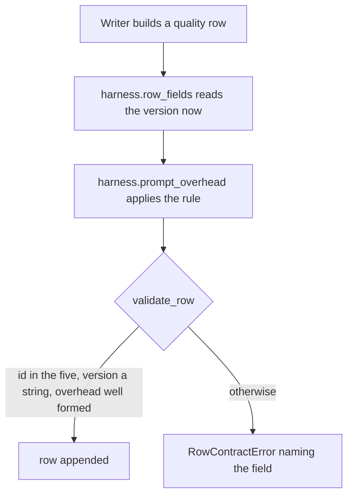
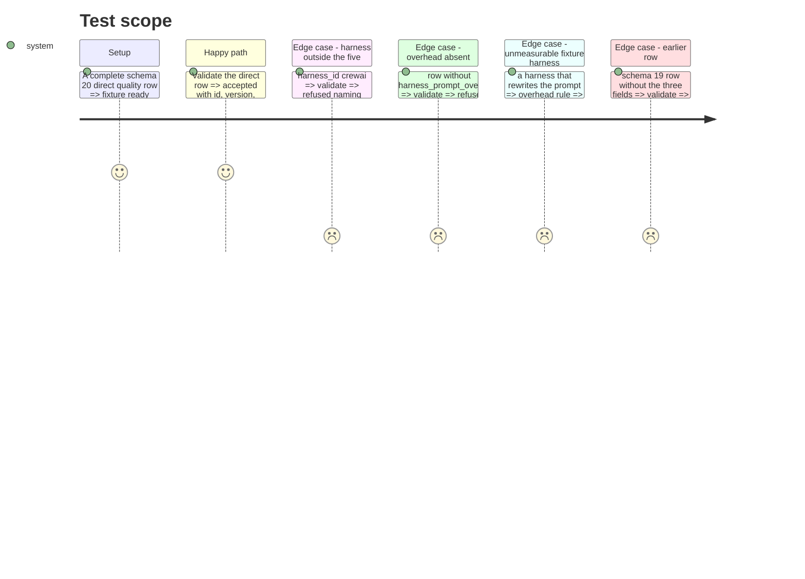

# Instruction: Registry, overhead rule and the schema "20" writer gate

## Architecture projection

```txt
.
├── src/wave_local_ai_v2/
│   ├── harness.py          ✅ the closed registry, version read, overhead rule
│   └── row_contract.py     ✏️ "20": three required quality fields and their refusals
└── tests/
    ├── test_harness.py     ✅ registry, version read, overhead rule
    ├── test_row_contract.py ✏️ the three fields, the refusals, a `direct` fixture row
    └── store_fixtures.py   ✏️ named values for the three fields
```

## User Journey



## Test Scope



## Tasks to do

### `1)` The registry and the rule

> One module owns the five ids, their packages and the overhead subtraction.

1. `harness.py`: ids, `HARNESS_DISTRIBUTIONS`, `HARNESS_IDS`, `harness_version(id)` via `importlib.metadata` refusing an unknown id or an uninstalled package.
2. `PromptOverhead` (`tokens`, `null_reason`), its closed reasons, `prompt_overhead(...)` and `row_fields(id, overhead)`.

### `2)` The gate

> `validate_row` owes and checks the three fields from "20".

1. Bump `SCHEMA_VERSION` to "20", add `HARNESS_FIELDS`, `HARNESS_SCHEMA_VERSION`, required on quality rows; exempt rows below "20".
2. `_validate_harness`: id in the five, version a non-empty string, overhead a two-key object, tokens a non-negative int with null reason, or null with a known reason.

## Test acceptance criteria

| Task | Acceptance criteria              |
| ---- | -------------------------------- |
| 1 | `direct`'s version equals the installed `requests` version at call time; an unknown id or a missing package is refused; tools counted in the item leave a zero overhead; a rewriting harness yields `unmeasurable` |
| 2 | A row naming a harness outside the five, or lacking the overhead, is refused by name; a schema "19" row without the fields validates; a `direct` fixture row carrying all three validates |
