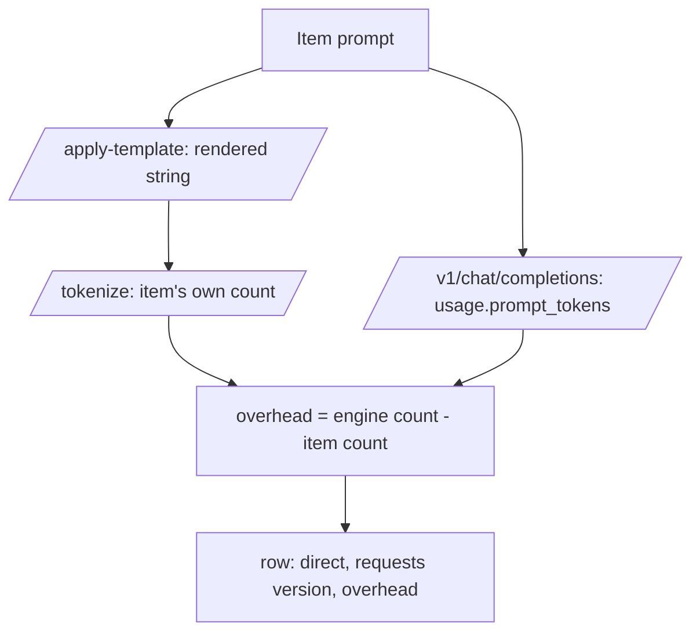
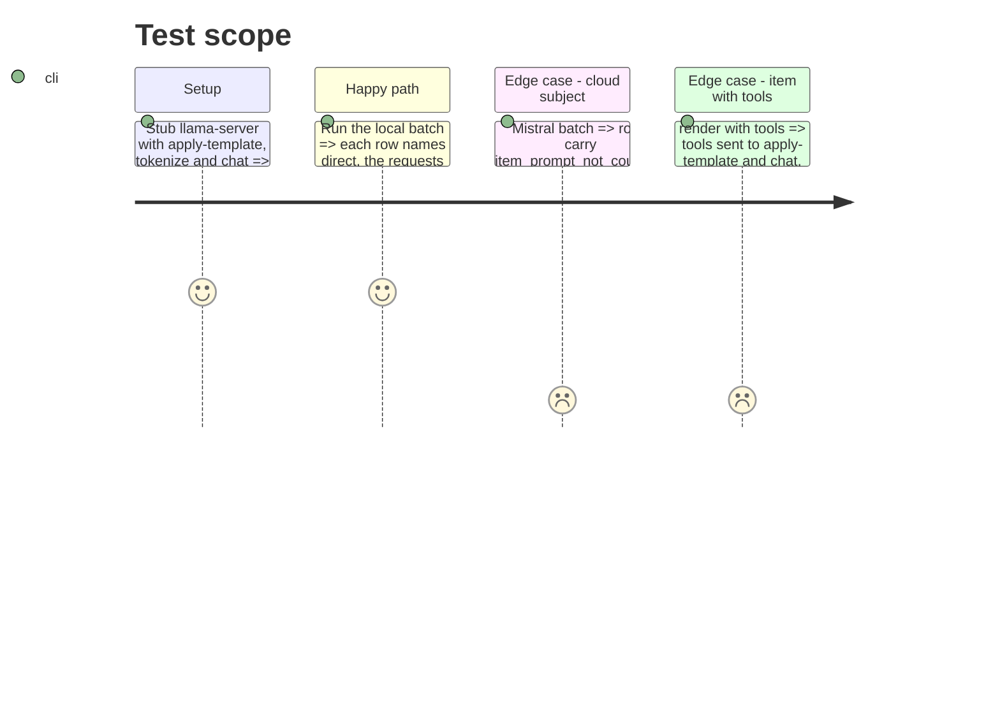

# Instruction: `direct` on both quality writers

## Architecture projection

```txt
.
├── src/wave_local_ai_v2/
│   ├── local_client.py   ✏️ count_tokens (/tokenize); tools on render and chat
│   ├── quality_rows.py   ✏️ direct_harness_fields
│   ├── quality_cli.py    ✏️ count each rendered item, write the three fields
│   └── judge_probe.py    ✏️ same, on the probe's local and cloud rows
└── tests/
    ├── test_local_client.py ✏️ count_tokens, tools on both calls
    ├── test_quality_cli.py  ✏️ /tokenize in the stub routers, overhead on rows
    └── test_judge_probe.py  ✏️ /tokenize in the stub router, overhead on rows
```

## User Journey



## Test Scope



## Tasks to do

### `1)` The local client

1. `count_tokens(base_url, text, timeout)` over `/tokenize` with `add_special: true`, refusing a malformed body.
2. Optional `tools` on `render_prompt` and `complete_chat`, sent on both.

### `2)` The writers

1. `quality_rows.direct_harness_fields(measurement, item_prompt_tokens)`.
2. `quality_cli._run_local_suite` and `judge_probe._generate_local_outputs` count each rendered item; both row builders write the block; cloud rows pass no count.
3. Test stub routers answer `/tokenize`.

## Test acceptance criteria

| Task | Acceptance criteria              |
| ---- | -------------------------------- |
| 1 | `/tokenize` is called with the rendered string; tools reach both endpoints |
| 2 | Local rows carry the engine count minus the tokenized count; cloud rows carry `item_prompt_not_counted`; every row validates |
