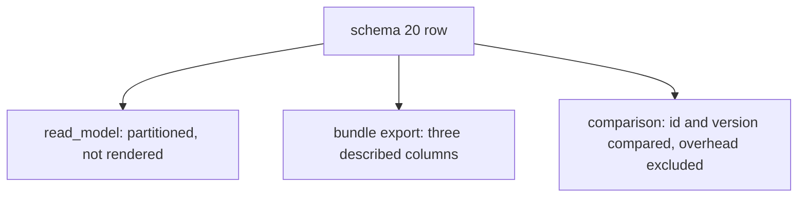
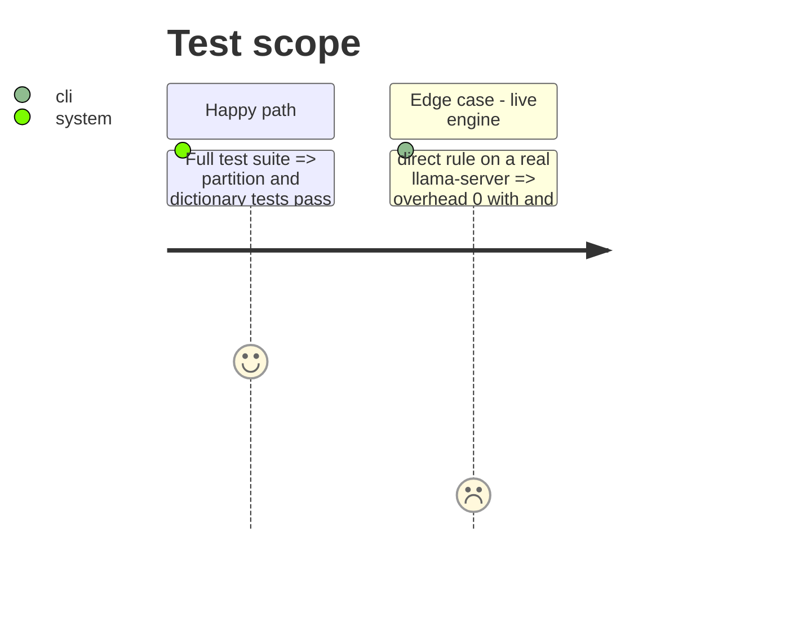

# Instruction: Readers, export dictionary, docs and live evidence

## Architecture projection

```txt
.
├── src/wave_local_ai_v2/
│   ├── read_model.py     ✏️ the three fields partitioned as not rendered
│   ├── comparison.py     ✏️ overhead excluded from the differing fields
│   └── bundle_export.py  ✏️ dictionary entries for the three fields
├── CHANGELOG.md          ✏️ schema "20"
├── aidd_docs/memory/codebase-map.md ✏️ harness.py
└── aidd_docs/tasks/.../evidence/    ✅ live tokenize probe
```

## User Journey



## Test Scope



## Tasks to do

### `1)` Readers

1. `read_model.QUALITY_FIELDS_NOT_RENDERED` gains `HARNESS_FIELDS`; `comparison.EXCLUDED_FROM_DIFFERING` gains the overhead.
2. `bundle_export` documents the three fields and the overhead's two leaves.

### `2)` Docs and evidence

1. CHANGELOG entry; codebase map line.
2. Live probe of the rule through the new `local_client` functions, saved to `evidence/`.

## Test acceptance criteria

| Task | Acceptance criteria              |
| ---- | -------------------------------- |
| 1 | `uv run pytest` passes at the 95% floor; committed stores still validate unedited |
| 2 | The evidence shows engine count equal to the item's own count under `direct`, tools included |
