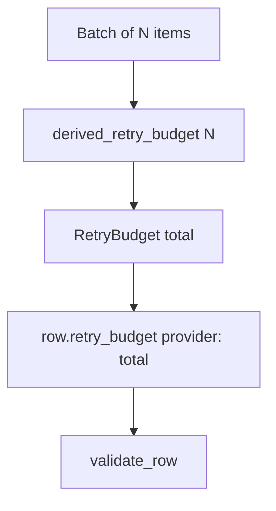
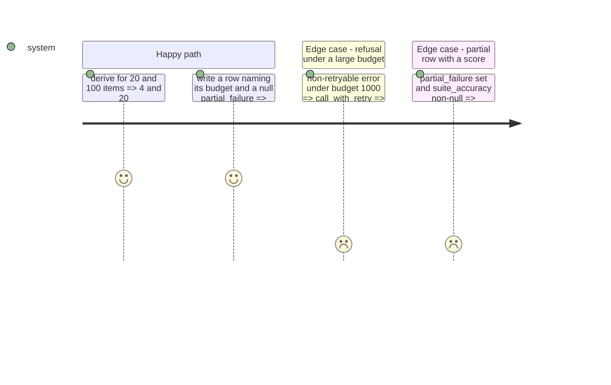

# Instruction: The budget rule and the two row fields (schema "17")

## Architecture projection

```txt
.
├── src/wave_local_ai_v2/
│   ├── settings.py        ✏️ CLOUD_RETRY_MIN_RETRIES + CLOUD_RETRY_RETRIES_PER_ITEM replace CLOUD_RETRY_MAX_ATTEMPTS
│   ├── retry.py           ✏️ derived_retry_budget(); RetryBudget exposes its total
│   ├── row_contract.py    ✏️ retry_budget + partial_failure, "17", their refusals
│   ├── read_model.py      ✏️ fields partitioned; subject card prefers a complete row
│   ├── comparison.py      ✏️ both fields are bookkeeping
│   └── bundle_export.py   ✏️ both fields documented
└── tests/                 ✏️ test_settings, test_retry, test_row_contract, test_read_model
```

## User Journey



## Test Scope



## Tasks to do

### `1)` Budget rule

1. Two settings with defaults and reason; drop the fixed total.
2. `retry.derived_retry_budget(item_count, *, per_item, minimum)`; `RetryBudget.total`.

### `2)` Row fields

1. `retry_budget` and `partial_failure` in the quality required set, "17" with reason.
2. Gate: malformed map, cloud row missing own provider, retries above budget; malformed partial; partial carrying a suite-level score.
3. Partition in read model, comparison, bundle dictionary.

## Test acceptance criteria

| Task | Acceptance criteria              |
| ---- | -------------------------------- |
| 1 | A 100-item batch's budget exceeds a 20-item batch's; a refusal is never retried whatever the budget |
| 2 | A row without either field, or a partial row carrying a headline score, is refused naming the field |
