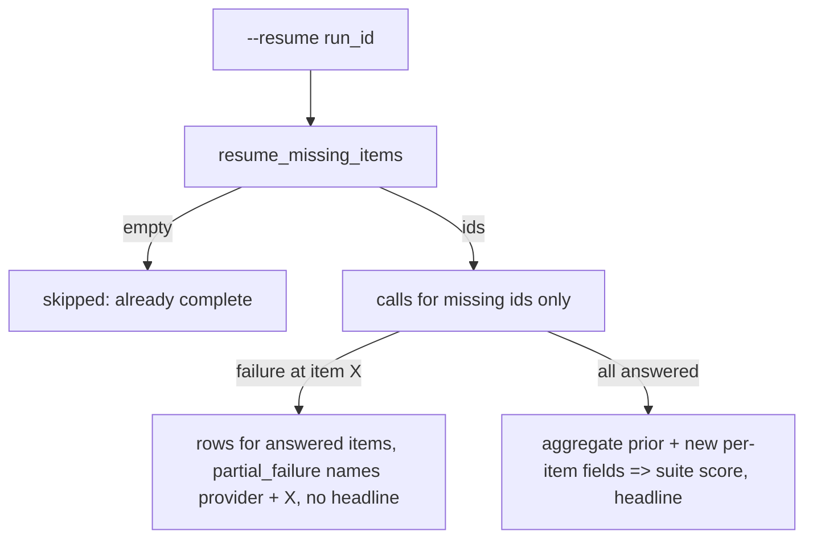
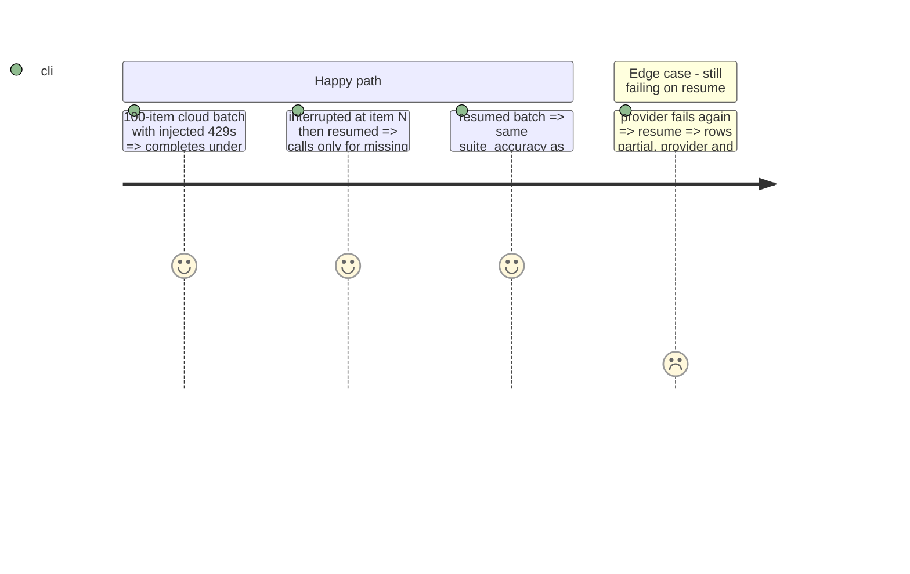

# Instruction: Per-item resume and partial persistence in the suite CLI

## Architecture projection

```txt
.
├── src/wave_local_ai_v2/
│   ├── results.py          ✏️ resume_missing_items replaces resume_skip_reason
│   ├── scoring_rules.py    ✏️ BATCH_AGGREGATES, shared by rule and resume
│   ├── suite_registry.py   ✏️ aggregate_batch(); rule without aggregate refused
│   └── quality_cli.py      ✏️ missing items only; partial rows on mid-batch failure; budget on rows
└── tests/                  ✏️ test_results, test_quality_cli, test_suite_registry
```

## User Journey



## Test Scope



## Tasks to do

### `1)` Missing items

1. `resume_missing_items(path, run_id, provider, item_ids, *, task_suite)`.

### `2)` Aggregates

1. Per-rule aggregate over items + per-item fields; rules call it.

### `3)` CLI

1. Cloud loop stops at the failing item and returns what it answered.
2. Rows for answered items, budget map, partial marker, merged batch score when complete.
3. Local batch resumes per item through the same path.

## Test acceptance criteria

| Task | Acceptance criteria              |
| ---- | -------------------------------- |
| 1 | Partly written batch => exactly its missing ids; complete => none; other suite not counted |
| 2 | Aggregate over all per-item fields equals the rule's batch fields |
| 3 | Stub call count equals the missing items; no item has two rows; prior rows unchanged |
