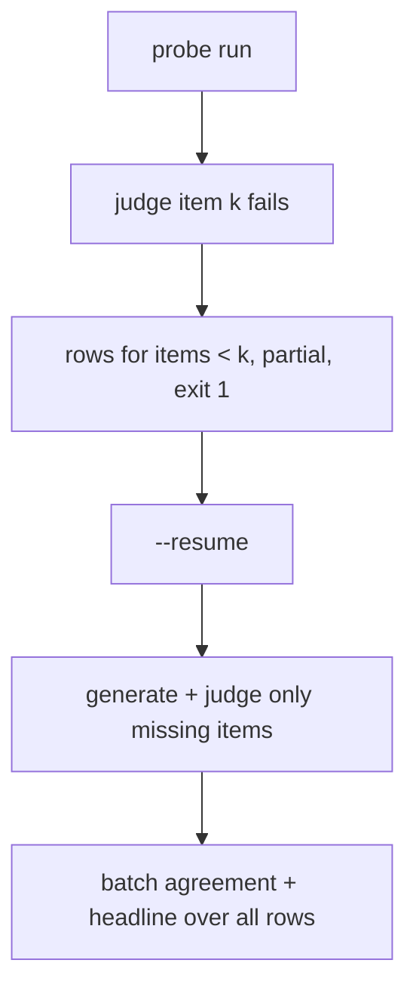
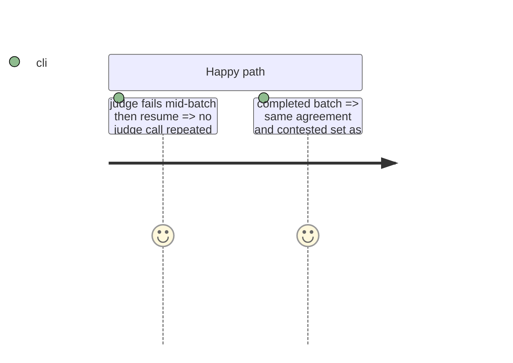

# Instruction: The same rule in the judged probe

## Architecture projection

```txt
.
├── src/wave_local_ai_v2/judge_probe.py  ✏️ derived budgets, partial rows on judge failure, per-item resume
└── tests/test_judge_probe.py            ✏️
```

## User Journey



## Test Scope



## Tasks to do

### `1)` Probe

1. Budgets derived from the items this invocation judges.
2. Judge item by item; on JudgeCallError write the judged rows as partial and re-raise.
3. Resume: missing items only; batch figures over prior + new rows.

## Test acceptance criteria

| Task | Acceptance criteria              |
| ---- | -------------------------------- |
| 1 | Judge stub call count on resume equals 2 x missing items; agreement equals the uninterrupted run's |
