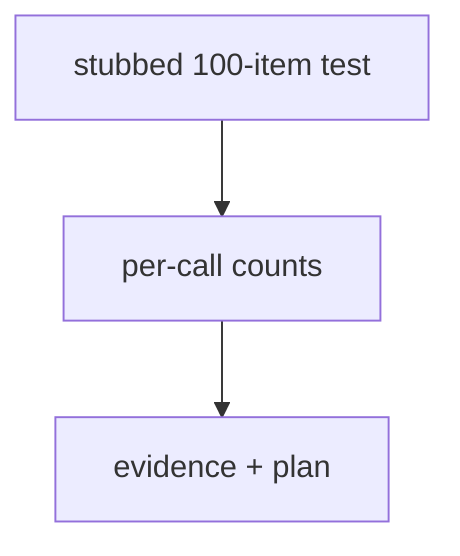
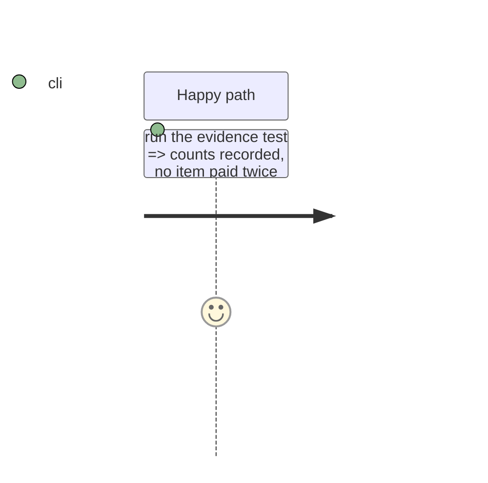

# Instruction: Docs and the 100-item evidence

## Architecture projection

```txt
.
├── CHANGELOG.md                     ✏️
├── aidd_docs/memory/cli.md          ✏️ budget rule, per-item resume, partial
├── aidd_docs/results/README.md      ✏️ schema "17"
└── aidd_docs/tasks/.../evidence/    ✅ stubbed 100-item interrupted-and-resumed run output
```

## User Journey



## Test Scope



## Tasks to do

### `1)` Docs and evidence

1. CHANGELOG, cli.md, results README.
2. Save the evidence test output: [`evidence/stubbed-hundred-item-resume.md`](./evidence/stubbed-hundred-item-resume.md).
   A 100-item Mistral batch stopped by a 400 on its 38th call wrote 37 rows (38 calls); the
   resume issued 63 calls for the 63 missing items and wrote 63 rows; 0 items were answered
   twice; the completed batch's `suite_accuracy` is 0.6600, equal to the uninterrupted
   batch's 0.6600. Under ten injected 429s the derived budget (20) completes the batch,
   while the old fixed total (4) leaves it partial at item `hundred-049`.

## Test acceptance criteria

| Task | Acceptance criteria              |
| ---- | -------------------------------- |
| 1 | Docs name the rule, its defaults and the two fields; evidence shows one call per item |
