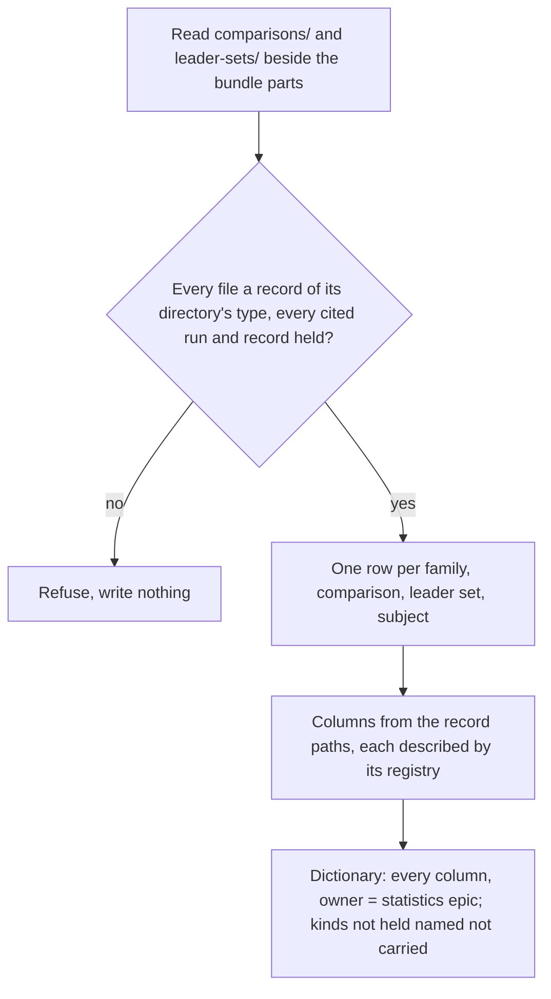
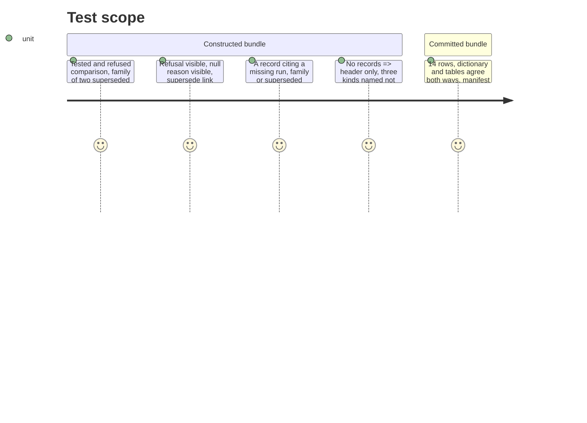

# Instruction: Fifth table, its registries, its reading and its tests

## Architecture projection

> Tree of the final files. ✅ create · ✏️ modify · ❌ delete

```txt
.
├── src/wave_local_ai_v2/
│   ├── bundle_export.py      ✏️ comparison_records table, four record registries, record reading and pointer check, dictionary not-carried kinds, manifest parts, two CLI flags
│   ├── settings.py           ✏️ DEFAULT_COMPARISONS_DIR
│   └── comparison.py         ✏️ COMPARISONS_DIR reads the settings constant
└── tests/test_bundle_export.py  ✏️ helpers carry the record directories; five fifth-table tests; refusal cases
```

## User Journey



## Test Scope



## Tasks to do

- [x] `comparison_records` in `TABLES`; `RECORD_KEY_FIELDS`, `FAMILY_FIELDS`, `COMPARISON_FIELDS`, `LEADER_SET_FIELDS`, `SUBJECT_FIELDS`
- [x] `Source.owner` / `Column.owner` written to the dictionary's `owner` cell
- [x] `BundlePaths.comparisons_dir` / `leader_sets_dir`, `_read_records`, `_check_record_pointers`
- [x] `_record_rows`: family then its comparisons, leader set then its subjects, file-name order
- [x] Dictionary: record kinds not held named `carried=false`; the old owned-elsewhere entry removed
- [x] Manifest parts `comparison_families`, `leader_sets`; `--comparisons-dir`, `--leader-sets-dir`
- [x] Tests, byte-identity over a bundle holding records, every member field the analysis writes described
