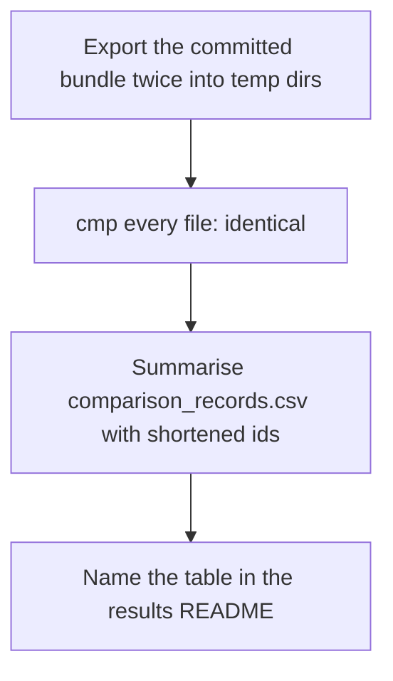
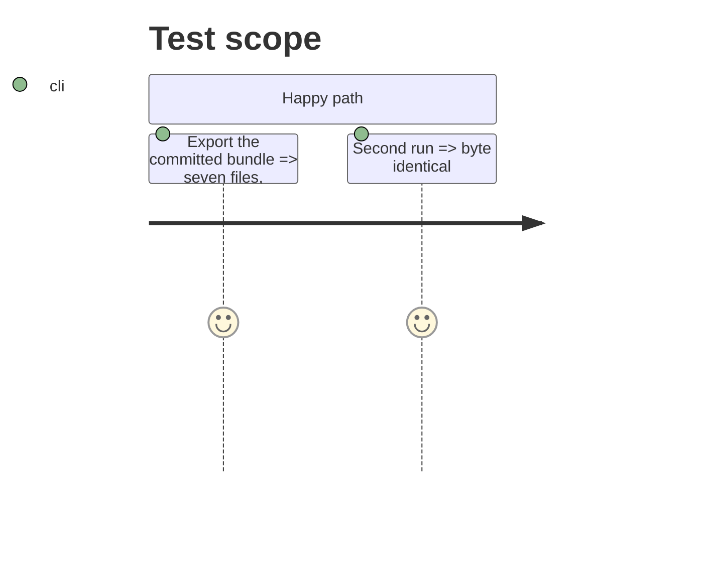

# Instruction: Run over the committed bundle, README and memory

## Architecture projection

> Tree of the final files. ✅ create · ✏️ modify · ❌ delete

```txt
.
├── aidd_docs/results/README.md          ✏️ five tables; the fifth table's rules; leader-set section points at it
├── aidd_docs/memory/cli.md              ✏️ export command names the fifth table and its flags
├── aidd_docs/memory/codebase-map.md     ✏️ export entry names the records
└── aidd_docs/tasks/2026_10/2026_10_01_comparison-and-leader-records-fifth-table/
    └── evidence/fifth-table-run.md      ✅ command output, manifest parts, the 14 rows summarised
```

## User Journey



## Test Scope



## Tasks to do

- [x] Run the export twice; record output in `evidence/fifth-table-run.md`
- [x] README: five tables, the fifth table's rules, the leader-set section's stale "not built yet" line replaced
- [x] Memory: `cli.md`, `codebase-map.md`
