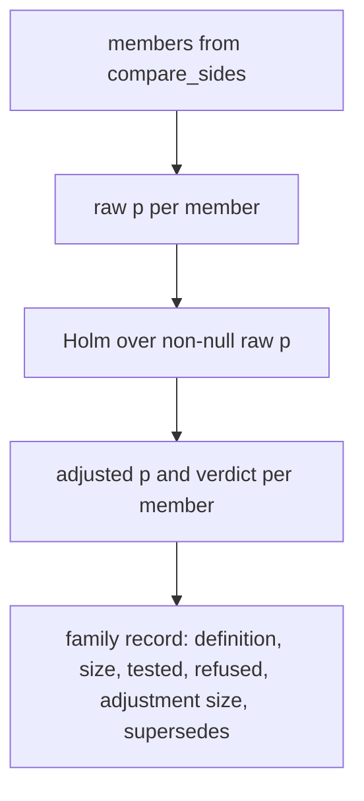
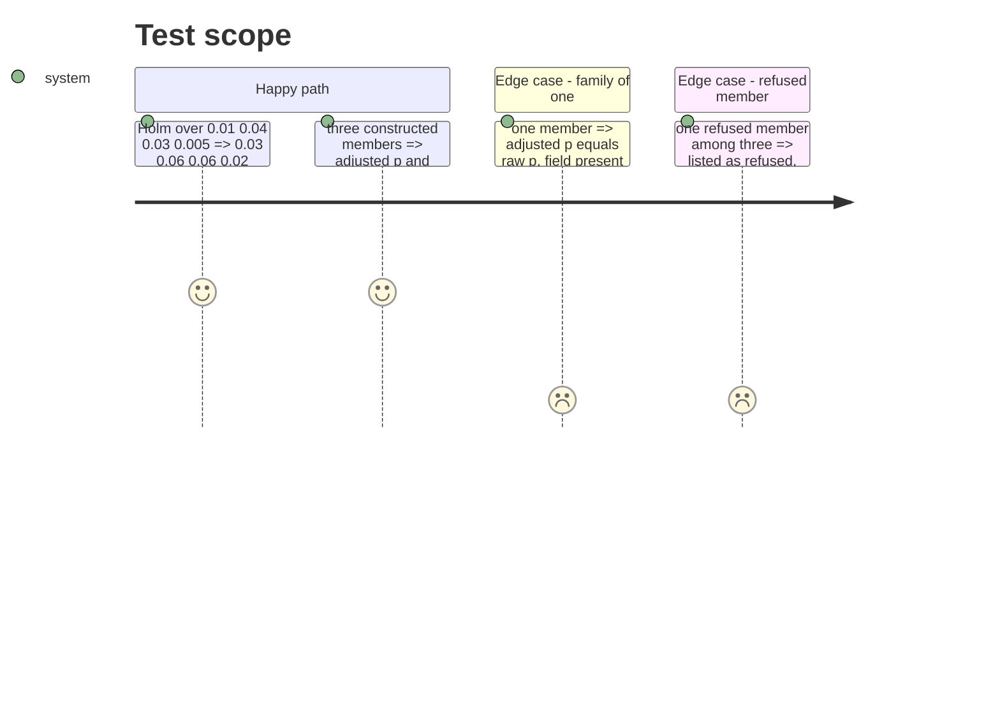

# Instruction: Holm over a closed set and the multi-member family record

## Architecture projection

```txt
.
├── src/wave_local_ai_v2/comparison.py   ✏️ holm_adjust, build_family_record over members, counts, verdict on adjusted p, record_version 2
└── tests/test_comparison.py             ✏️ Holm published example, hand fixture, family of one, refused member
```

## User Journey



## Test Scope



## Tasks to do

### `1)` Holm

> An exact Holm adjustment in input order.

1. `holm_adjust(p_values)` in `Fraction`, ascending order, running max, capped at 1.

### `2)` The family record

> One record over many members.

1. `build_family_record(members, *, alpha, rows_source, supersedes=())`: canonical member order, one family definition (refuse two suites), Holm over members with a raw p, `raw_p_value`, `adjusted_p_value`, null reason `comparison_refused` for refusals, verdict re-read on the adjusted p, counts, `supersedes`, `family_id`.
2. `record_version` `"2"`.

## Test acceptance criteria

| Task | Acceptance criteria |
| ---- | ------------------- |
| 1 | The published example and a hand fixture with a tie and a cap at 1 reproduce exactly. |
| 2 | A family of three has each verdict read against its adjusted p; a family of one states adjusted equal to raw; a refused member is listed, carries no p and is excluded from `adjustment_size`; two suites in one family raise. |
