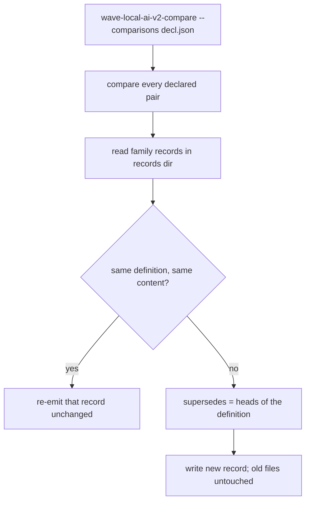
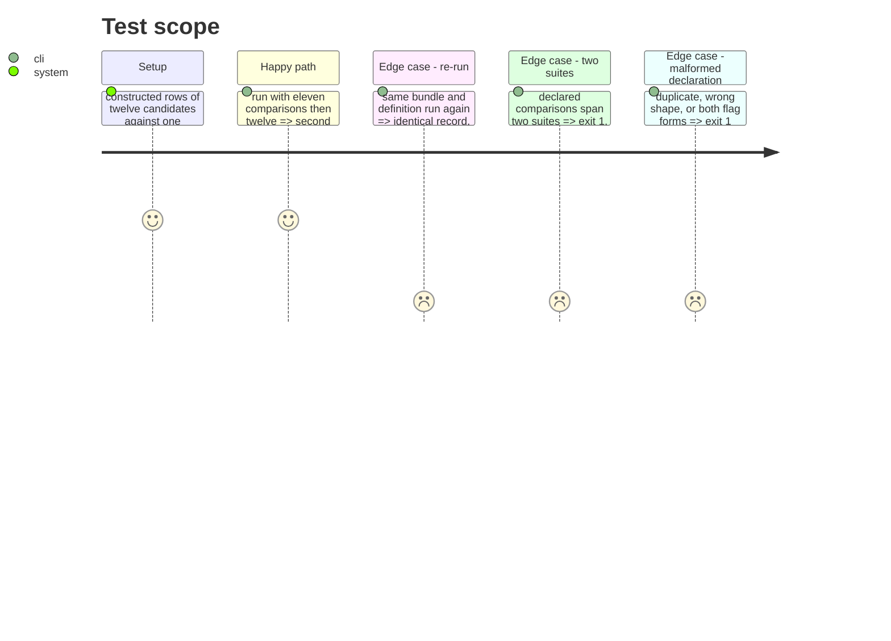

# Instruction: The analysis command, one family per invocation, supersede by id

## Architecture projection

```txt
.
├── src/wave_local_ai_v2/comparison.py   ✏️ --comparisons, --records-dir, head lookup, re-emit identical record
└── tests/test_comparison.py             ✏️ eleven grown to twelve, re-run identical, refusals of the invocation
```

## User Journey



## Test Scope



## Tasks to do

### `1)` Declared comparisons

> Many pairs in one invocation.

1. `--comparisons <json>` parsed into `Side` pairs; mutually exclusive with the single-pair flags.

### `2)` Supersede by id

> The current head of the definition is superseded, never edited.

1. `--records-dir` (default `COMPARISONS_DIR`) read for family records; content match re-emits; else `supersedes` = heads.
2. Default output under the records dir.

## Test acceptance criteria

| Task | Acceptance criteria |
| ---- | ------------------- |
| 1 | Twelve declared comparisons produce one record of twelve members; a malformed declaration exits 1 with nothing written. |
| 2 | Growing eleven to twelve writes a second file naming the first id in `supersedes`, the first file byte-identical; a re-run writes nothing new and returns the same bytes. |
