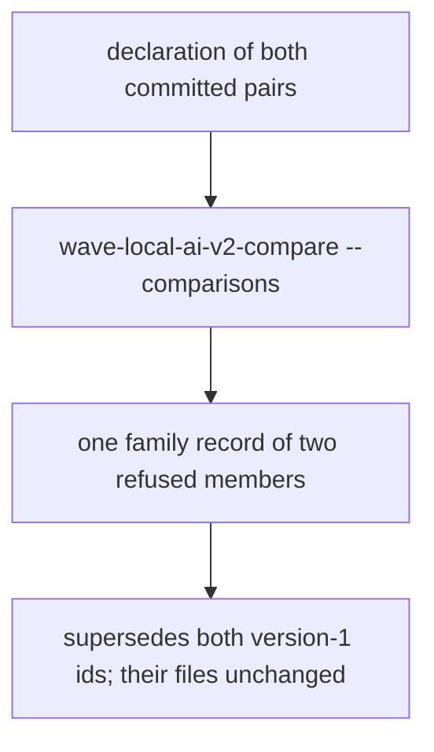
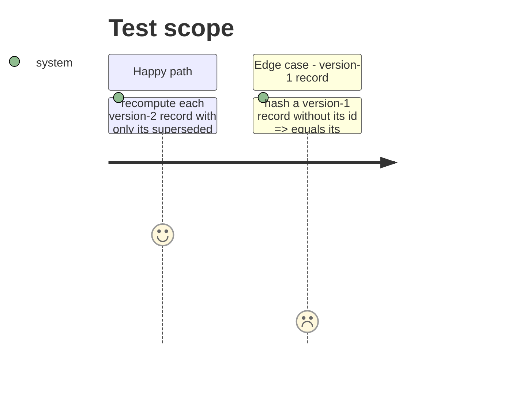

# Instruction: The family record over the committed bundle, README and memory

## Architecture projection

```txt
.
├── aidd_docs/results/comparisons/classification-support-routing@2.model.<id>.json   ✅ record_version 2, both pairs, supersedes both version-1 records
├── aidd_docs/results/README.md                                                    ✏️ the family record beside order 2's records
├── aidd_docs/memory/cli.md                                                        ✏️ --comparisons, --records-dir, supersession
├── aidd_docs/memory/codebase-map.md                                               ✏️ comparison.py now holds Holm and supersession
├── tests/test_comparison.py                                                       ✏️ published-record recompute and self-hash tests
└── aidd_docs/tasks/2026_10/2026_10_01_comparison-family-adjusted-and-superseded/evidence/   ✅ declaration file and command output
```

## User Journey



## Test Scope



## Tasks to do

### `1)` Publish

> The record over the committed bundle.

1. Write the declaration to `evidence/`, run the command, save its output.

### `2)` Tests and docs

> Recompute and immutability proved; README and memory current.

1. Replace the family-of-one recompute test; add the version-1 self-hash test.
2. README section, `cli.md`, `codebase-map.md`.

## Test acceptance criteria

| Task | Acceptance criteria |
| ---- | ------------------- |
| 1 | `comparisons/` holds the two unchanged version-1 records and one version-2 record listing both in `supersedes`, `tested_count` 0, `refused_count` 2. |
| 2 | The recompute test passes per published record; README names the new record and its counts. |
