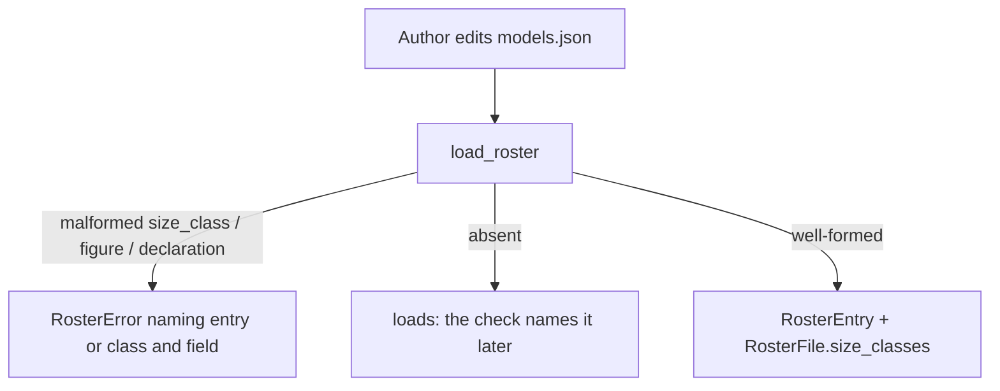

# Instruction: Roster carries the size class, its two figures and the per-class declaration

## Architecture projection

```txt
.
├── src/wave_local_ai_v2/
│   ├── roster.py            ✏️ SIZE_CLASSES + SIZE_CLASS_BANDS, size_class_for(), entry fields, SizeClassDeclaration, RosterFile.size_classes
│   └── bundle_export.py     ✏️ ROSTER_ENTRY_FIELDS documents size_class, bytes_on_disk, architecture.total_params
├── aidd_docs/roster/models.json   ✏️ the three figures on four entries, size_classes block, roster_version 4
├── aidd_docs/results/README.md    ✏️ roster_file_version 3 -> 4 in the bundle section
└── tests/
    ├── test_roster.py         ✏️ shape refusals, band edges, shipped figures
    └── test_bundle_export.py  ✏️ only if a version or column assertion follows the file
```

## User Journey



## Test Scope

```mermaid
---
title: Test scope
---
journey
  section Setup
    constructed roster dict in tmp_path => file on disk: 5: system
  section Happy path
    load the shipped roster => four entries carry size_class, total_params, bytes_on_disk; four declarations: 5: system
  section Edge case - malformed
    size_class outside the vocabulary => load => RosterError naming entry and value: 1: system
    total_params not a positive integer => load => RosterError naming the field: 1: system
    declaration keyed by an unknown class or with a non-boolean label => load => RosterError naming the class: 1: system
  section Edge case - absent
    entry without the three fields and file without size_classes => load => loads with None: 1: system
```

## Tasks to do

### `1)` Vocabulary and bands

> One ordered vocabulary, one edge table beside it.

1. `SIZE_CLASSES` tuple and `SIZE_CLASS_BANDS` ((class, lower edge in parameters)), comment stating edges are revisable after the first full-roster run (Q10 (a)).
2. `size_class_for(total_params) -> str`.

### `2)` Entry fields

1. `RosterEntry.size_class`, `bytes_on_disk`; `Architecture.total_params` (optional, default `None`).
2. Shape checks: class in vocabulary; positive non-bool integers.

### `3)` Per-class declaration

1. `SizeClassDeclaration` dataclass; `RosterFile.size_classes: dict[str, SizeClassDeclaration]` (empty when the file has none).
2. Shape checks: key in vocabulary; two booleans; `moe_entry` and `moe_absent_reason` null or non-empty string.

### `4)` Shipped data

1. Figures read off the four GGUFs on `D:\ia\models` (bytes by `stat`, totals by `candidate_gate.read_gguf_facts`), recorded in phase evidence.
2. `size_classes` block stating the honest state; `roster_version` 4.
3. Bundle export docs for the new entry columns; README version mention.

## Test acceptance criteria

| Task | Acceptance criteria |
| ---- | ------------------- |
| 1 | `size_class_for` returns the lower class just below each edge and the upper class at it |
| 2 | A malformed figure or class is refused at load naming entry and field; an absent one loads as `None` |
| 3 | A malformed declaration is refused naming its class; a file without the block loads |
| 4 | The shipped roster loads at version 4 with figures equal to the ones read off the files; the bundle export of the shipped roster still succeeds |
