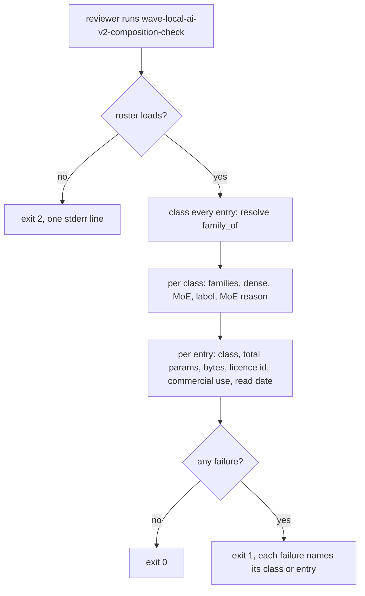

# Instruction: The composition check classes the roster and refuses its silences

## Architecture projection

```txt
.
├── src/wave_local_ai_v2/
│   └── composition_check.py   ✅ check_composition() -> report; render_report(); main() with exit 0/1/2
├── pyproject.toml             ✏️ wave-local-ai-v2-composition-check entry point
└── tests/
    └── test_composition_check.py   ✅ constructed rosters for every outcome; the shipped file as calibration
```

## User Journey



## Test Scope

```mermaid
---
title: Test scope
---
journey
  section Setup
    write a constructed roster to tmp_path => path ready: 5: system
  section Happy path
    one class, two families, MoE reason recorded => run main => exit 0, report names both families: 5: cli
  section Edge case - ladder
    second family removed, label added => run main => exit 0, class reported as labelled ladder: 1: cli
    second family removed, unlabelled => run main => exit 1 naming the class: 1: cli
  section Edge case - MoE
    no MoE and no reason => run main => exit 1 naming the class; with reason => exit 0: 1: cli
  section Edge case - entry silences
    no resolvable family, no size_class, no licence => run main => exit 1 naming the entry: 1: cli
    class disagrees with total params at 1B, 3B, 6B edges => run main => exit 1 naming the entry: 1: cli
    bytes on disk alone suggests another class => run main => entry not named: 1: cli
  section Edge case - shipped
    the shipped roster => run main => four classes, qwen each, exit 1 naming all four unlabelled: 1: cli
```

## Tasks to do

### `1)` Check

1. Load roster (`RosterError` => exit 2).
2. Per entry: family via `roster.family_of(entry.display_id, entry)`; missing class, total params, bytes, licence => entry failure; class vs `size_class_for(total_params)` => entry failure.
3. Per class in vocabulary order: entries, families, dense/MoE presence, declaration; failures: no declaration, unlabelled single family, label on a multi-family class, no MoE and no reason, `moe_entry` inconsistent with the class's MoE entries. Empty class reported, not failed.

### `2)` Report and command

1. Plain-text report: classes, then entries, then failures, then a verdict line.
2. `main(argv)` with `--roster` (default `settings.DEFAULT_ROSTER_PATH`); entry point in `pyproject.toml`.

## Test acceptance criteria

| Task | Acceptance criteria |
| ---- | ------------------- |
| 1 | Each story-listed outcome is reached by a constructed roster and names its class or entry; nothing is skipped |
| 1 | The shipped roster reports four classes, each `qwen` only, and exits 1 naming all four as unlabelled |
| 2 | Exit code is 0 on a pass, 1 on a named failure, 2 on an unloadable roster |
