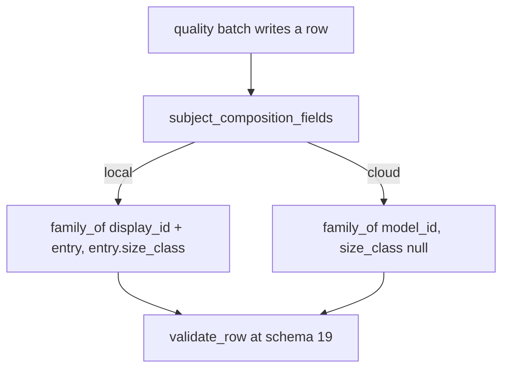
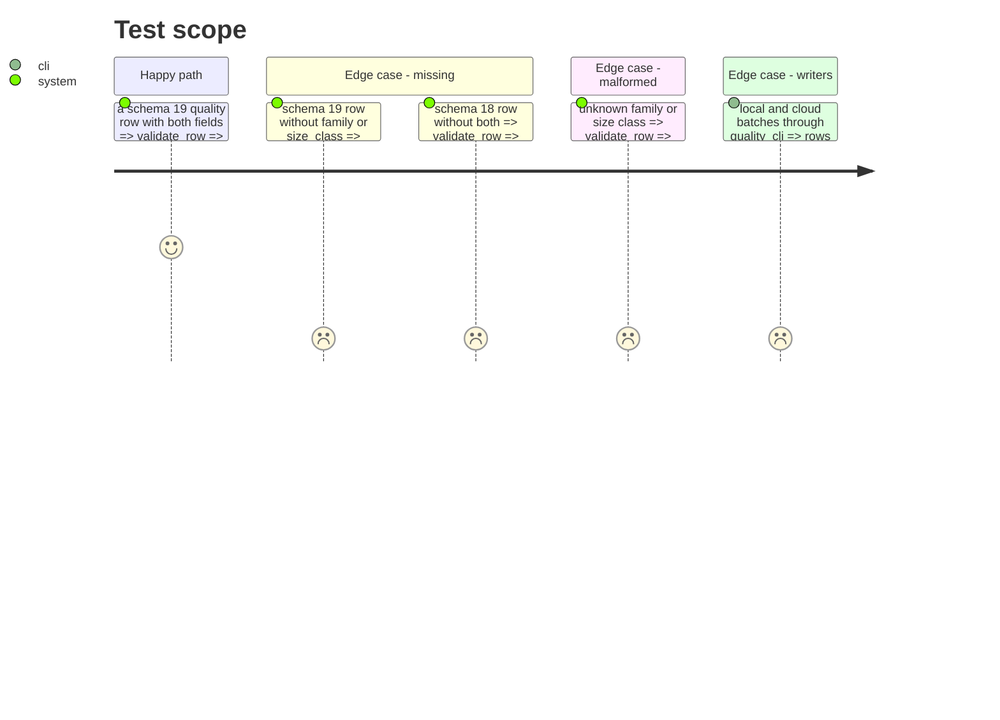

# Instruction: Every quality row names its subject's family and size class

## Architecture projection

```txt
.
├── src/wave_local_ai_v2/
│   ├── row_contract.py   ✏️ SCHEMA_VERSION "19"; family, size_class required from "19"; value checks
│   ├── quality_rows.py   ✏️ subject_composition_fields(model_id, provider, entry)
│   ├── quality_cli.py    ✏️ rows carry the block
│   ├── judge_probe.py    ✏️ rows carry the block
│   ├── read_model.py     ✏️ both fields in QUALITY_FIELDS_NOT_RENDERED
│   └── bundle_export.py  ✏️ ROW_FIELDS documents both
└── tests/
    ├── test_row_contract.py  ✏️ refusal at "19", earlier row validates, schema assertions "19"
    ├── test_quality_rows.py  (none today: helper covered from test_row_contract / test_quality_cli)
    ├── test_quality_cli.py   ✏️ local and cloud rows carry the right values
    └── test_comparison.py and fixtures  ✏️ only where a literal "18" follows the constant
```

## User Journey



## Test Scope



## Tasks to do

### `1)` Contract

1. Bump to "19" with its history comment; `SUBJECT_COMPOSITION_FIELDS`, `SUBJECT_COMPOSITION_SCHEMA_VERSION`.
2. Exempt rows below "19" from the two fields; validate family in `KNOWN_FAMILIES` and size class in vocabulary or null.

### `2)` Writers

1. `quality_rows.subject_composition_fields`; used by `quality_cli._score_and_write` and `judge_probe`'s row builder.

### `3)` Readers

1. Read-model partition; bundle export docs.

## Test acceptance criteria

| Task | Acceptance criteria |
| ---- | ------------------- |
| 1 | A schema "19" row lacking either field is refused naming it; a schema "18" row lacking both validates |
| 2 | A local row carries `qwen` and the entry's class; a cloud row carries its provider's family and `null` |
| 3 | The read-model partition and bundle-export dictionary tests pass with the fields placed |
