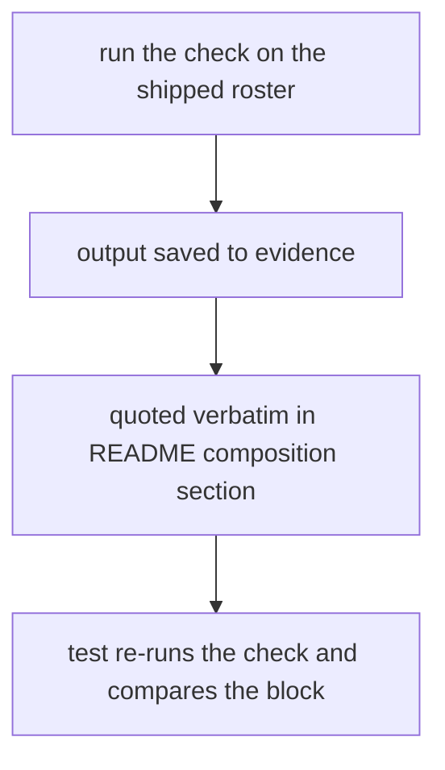
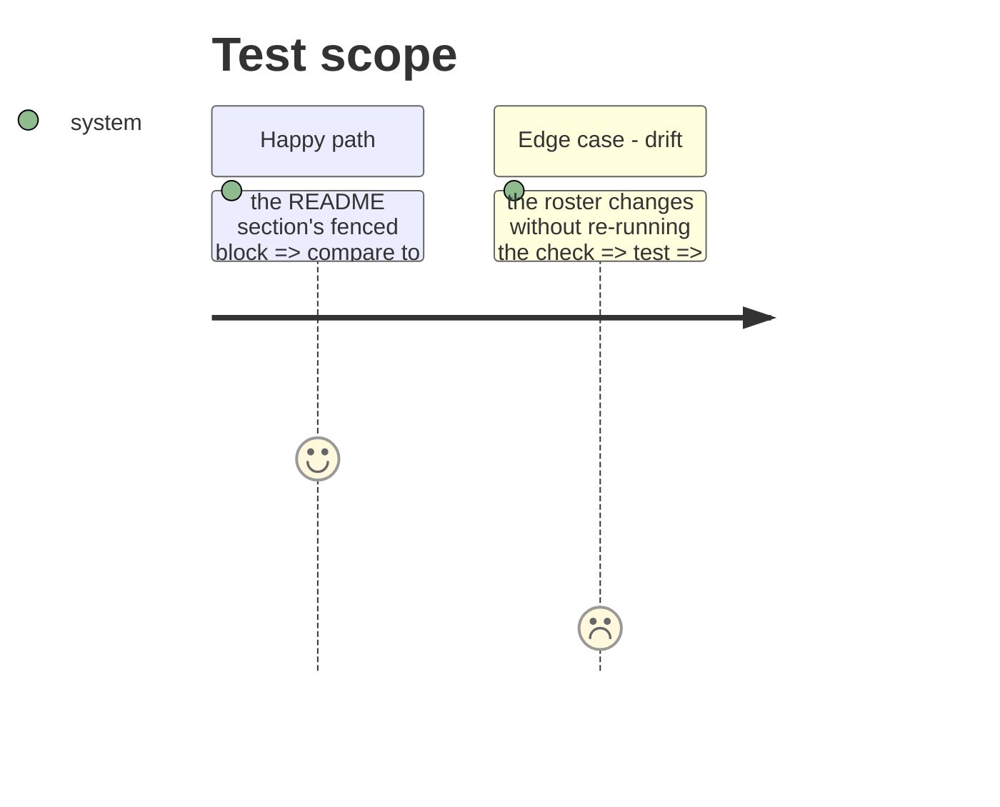

# Instruction: The README publishes the composition the check reports

## Architecture projection

```txt
.
├── aidd_docs/results/README.md           ✏️ "Roster composition" section quoting the check's output
├── aidd_docs/memory/cli.md               ✏️ the command, roster fields, roster_version 4
├── aidd_docs/memory/codebase-map.md      ✏️ composition_check.py and its entry point
├── tests/test_composition_check.py       ✏️ the README's quoted block equals the shipped roster's output
└── aidd_docs/tasks/.../evidence/         ✅ calibration output, GGUF figures
```

## User Journey



## Test Scope



## Tasks to do

### `1)` Evidence

1. Run `uv run wave-local-ai-v2-composition-check`, save stdout and exit code to `evidence/`.

### `2)` README and memory

1. Composition section: what the check reports, today's four unlabelled single-family classes, the quoted output, the step before a roster table is published, why it is not in the merge gate.
2. `cli.md`, `codebase-map.md` entries.

## Test acceptance criteria

| Task | Acceptance criteria |
| ---- | ------------------- |
| 1 | The evidence file shows four `qwen`-only classes and exit 1 naming all four as unlabelled |
| 2 | The README's quoted block is byte-equal to the check's current output on the shipped roster |
