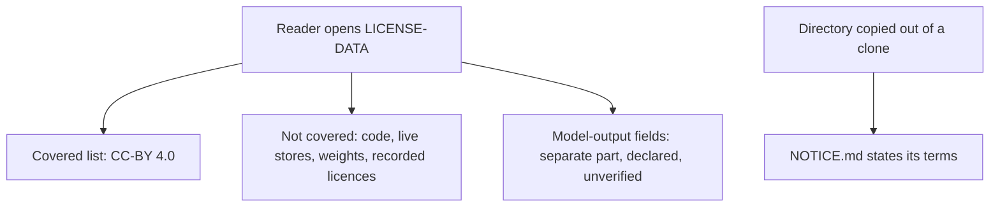
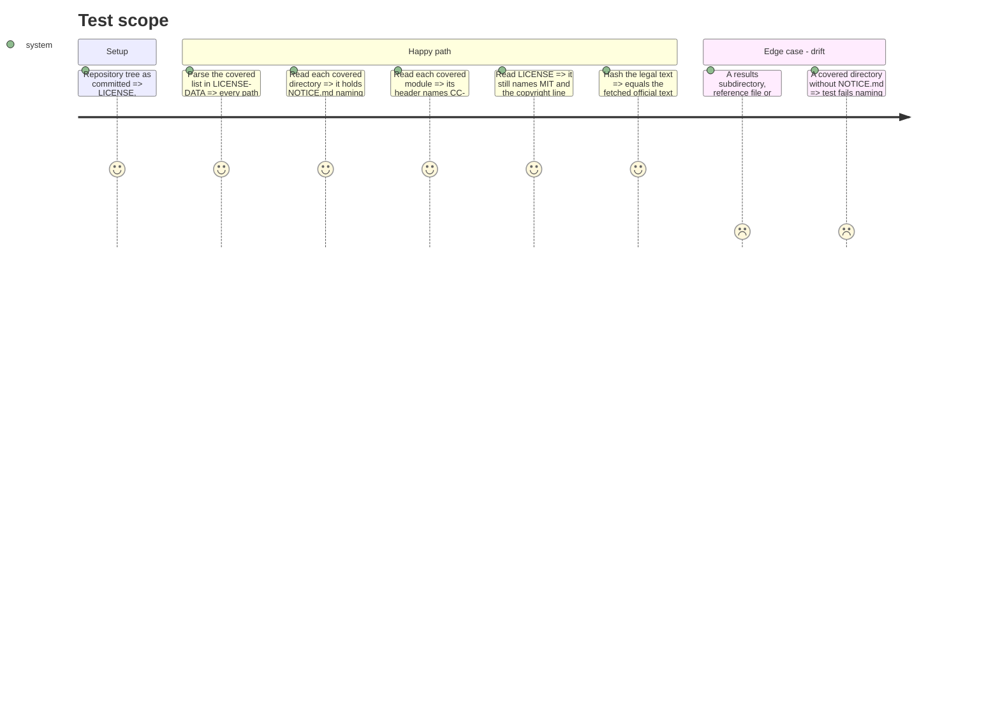

# Instruction: LICENSE-DATA, the directory and module notices, and the test

## Architecture projection

> Tree of the final files. ✅ create · ✏️ modify · ❌ delete

```txt
.
├── LICENSE                                   (unchanged, MIT)
├── LICENSE-DATA                              ✅ scope, drawn items, assumptions, attribution, CC-BY 4.0 legal code
├── aidd_docs/
│   ├── results/
│   │   ├── NOTICE.md                         ✅
│   │   ├── comparisons/NOTICE.md             ✅
│   │   ├── fiches/NOTICE.md                  ✅
│   │   └── suite-definitions/NOTICE.md       ✅
│   └── roster/NOTICE.md                      ✅
├── src/wave_local_ai_v2/
│   ├── judge_probe.py                        ✏️ header notice
│   └── suite_data/NOTICE.md                  ✅
└── tests/test_data_licence.py                ✅
```

## User Journey



## Test Scope



## Tasks to do

### `1)` LICENSE-DATA

> The scoped data licence with the official legal code.

1. Write the preamble, scope (covered list, not covered, model-output part), drawn items, assumptions and attribution sections.
2. Append the fetched legal code verbatim after a marker line.

### `2)` Notices

> Terms stated where the data lives.

1. One `NOTICE.md` per covered directory, tailored to what that directory holds.
2. A header comment in `judge_probe.py` scoping CC-BY 4.0 to `JUDGE_PROBE_ITEMS` and MIT to the code.

### `3)` Test

> Scope and tree kept in step.

1. `tests/test_data_licence.py` parses the covered list and checks paths, notices, module headers, the MIT licence, the legal-text hash, and drift (results/roster subdirectories, reference files, `*ITEMS` list modules).

## Test acceptance criteria

| Task | Acceptance criteria              |
| ---- | -------------------------------- |
| 1 | LICENSE-DATA names each covered path, the untracked stores as not covered, weights, recorded licences and model-output fields as not granted, the drawn-items rule, both assumptions, and carries the official legal code byte for byte |
| 2 | Each covered directory and `judge_probe.py` state their terms and point to LICENSE-DATA; the suite registry still lists exactly the two suite ids |
| 3 | The test passes on the tree and fails when a covered directory loses its notice, a path is renamed, or a new data directory or item-literal module is not in the scope |
