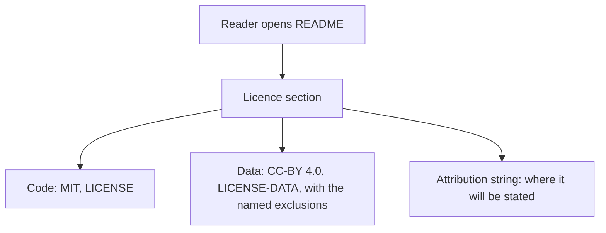
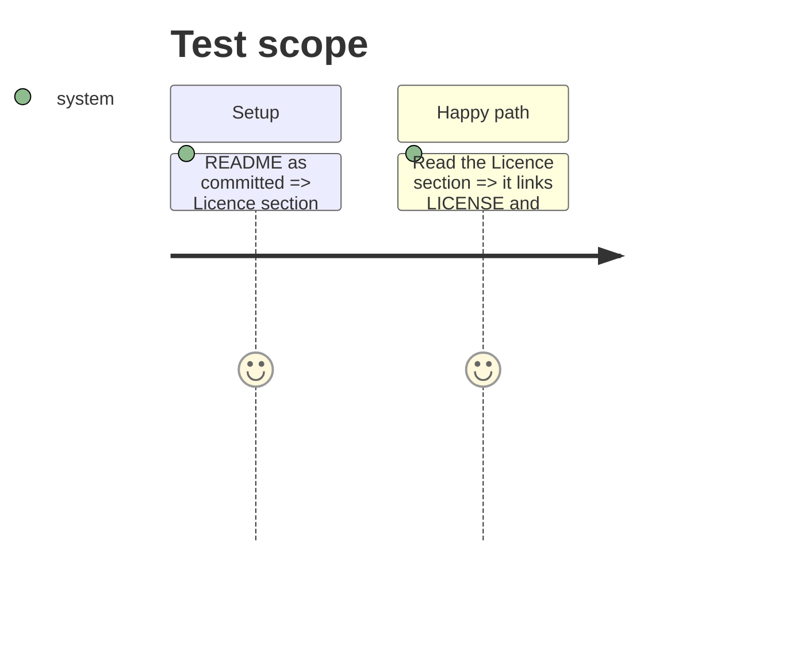

# Instruction: The README licence section

## Architecture projection

> Tree of the final files. ✅ create · ✏️ modify · ❌ delete

```txt
.
└── README.md   ✏️ "Licence" section before "Project status"
```

## User Journey



## Test Scope



## Tasks to do

### `1)` Licence section

> The split in plain words.

1. Add `## Licence` before `## Project status`: code MIT, data CC-BY 4.0, the exclusions (untracked stores, weights, recorded third-party licences, model-output fields), links to both files, and where the attribution string will land.
2. Extend `tests/test_data_licence.py` to check the section links both files.

## Test acceptance criteria

| Task | Acceptance criteria              |
| ---- | -------------------------------- |
| 1 | A reader of the README alone can say the code is MIT, the data is CC-BY 4.0 except the named parts, and where to find the full terms and the future attribution string |
