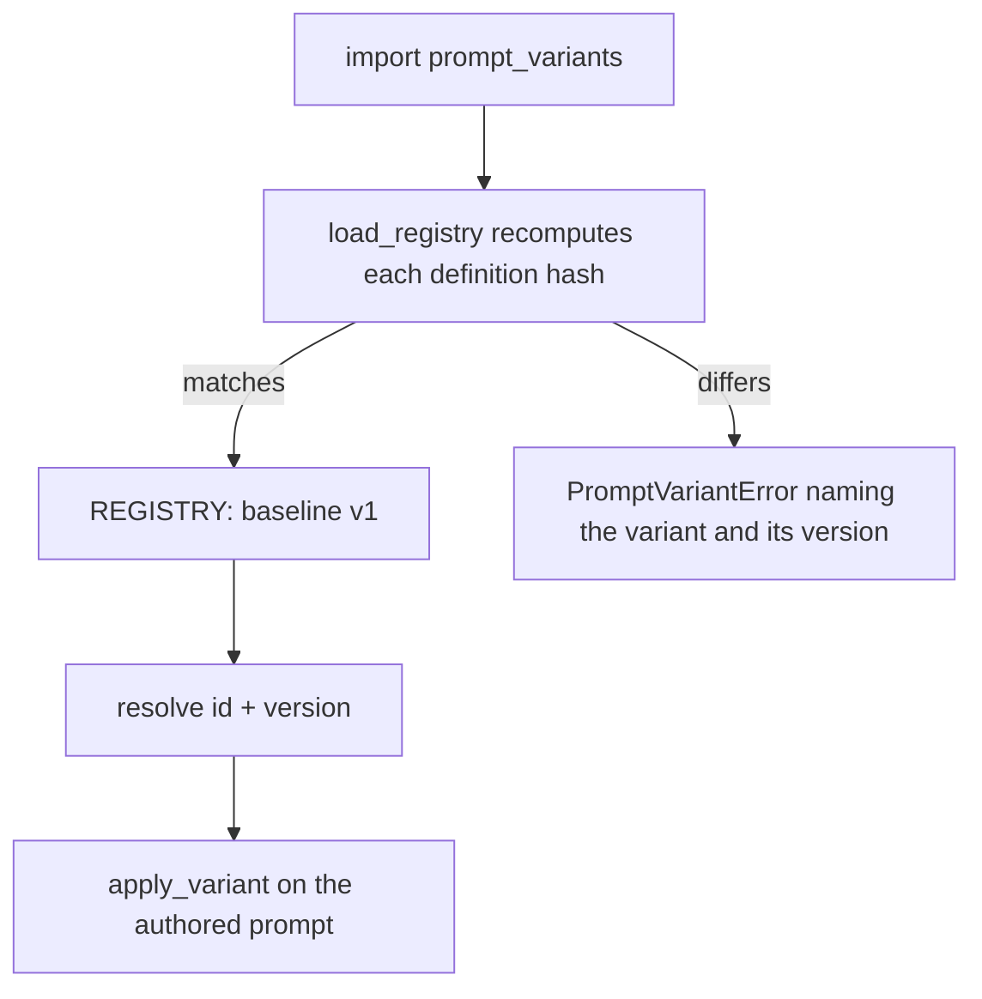
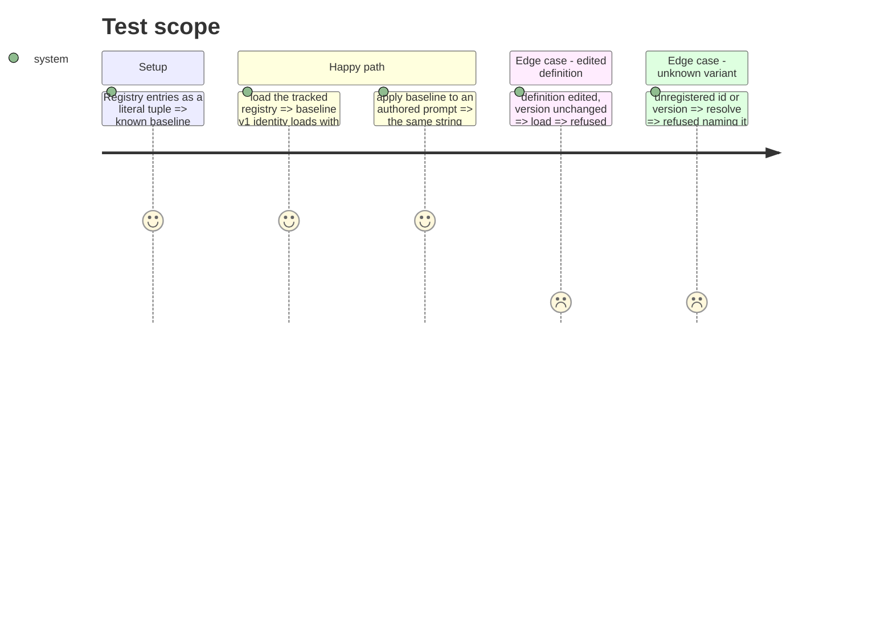

# Instruction: The variant registry, its load-time hash check, and the one application function

## Architecture projection

> Tree of the final files. ✅ create · ✏️ modify · ❌ delete

```txt
.
├── src/wave_local_ai_v2/
│   └── prompt_variants.py      ✅ registry (baseline v1, identity), definition hash, load check, resolve, apply_variant
└── tests/
    └── test_prompt_variants.py ✅ baseline loads; edited definition at unchanged version refused naming it; unknown id/version refused
```

## User Journey



## Test Scope



## Tasks to do

### `1)` Registry and loader

> A tracked registry whose entries carry id, version, definition and definition hash, refused at load on a mismatch.

1. `definition_hash`: sha256 over canonical JSON of the definition.
2. `load_registry(entries)`: recompute each hash, refuse a mismatch naming id and version, refuse duplicate (id, version).
3. Module-level `REGISTRY = load_registry(REGISTERED_VARIANTS)`.

### `2)` Resolve and apply

> One function applies a variant; nothing else transforms a prompt.

1. `resolve(variant_id, version=None)` -> entry, refusing an unknown id or version.
2. `apply_variant(variant, authored_prompt)` dispatching on the definition's transformation (`identity` only).

## Test acceptance criteria

| Task | Acceptance criteria |
| ---- | ------------------- |
| 1 | `baseline` v1 loads; an edited definition at an unchanged version raises naming `baseline` and version `1` |
| 2 | `apply_variant(baseline, text)` returns `text`; an unknown id or version raises naming it |
