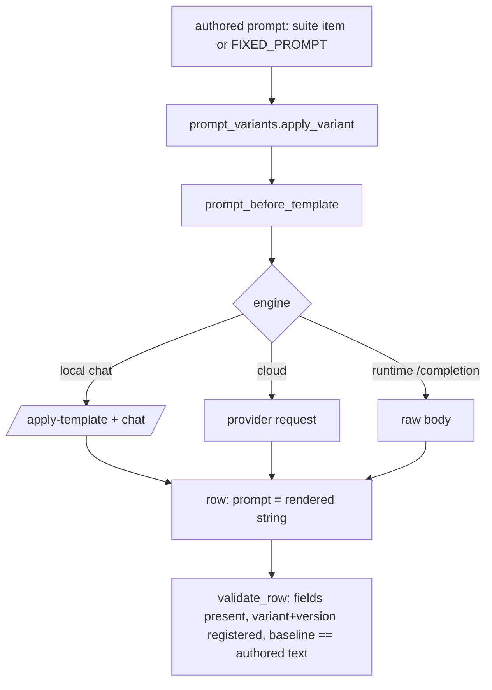
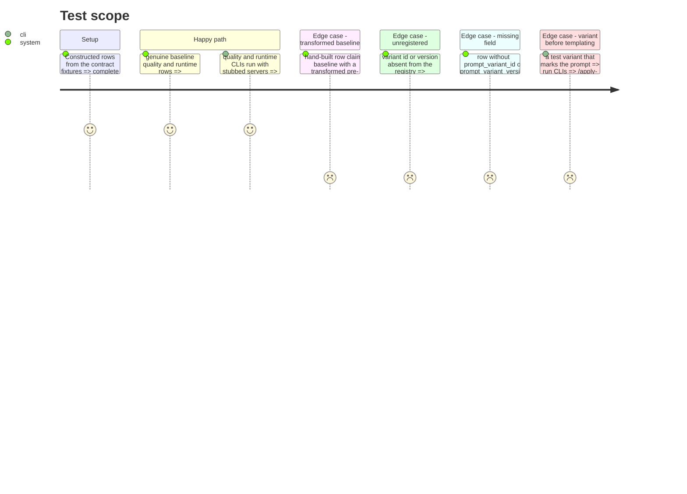

# Instruction: Row fields, gate rules and schema "14", applied on every writer path

## Architecture projection

> Tree of the final files. ✅ create · ✏️ modify · ❌ delete

```txt
.
├── CHANGELOG.md                         ✏️ Unreleased entry for the three fields and the gate
├── aidd_docs/memory/codebase-map.md     ✏️ name prompt_variants.py
├── aidd_docs/tasks/2026_10/2026_10_01_every-row-names-its-prompt-variant/evidence/
│   └── baseline-gate-refusal.txt        ✅ the gate's refusal of the hand-built row, from a test run
├── src/wave_local_ai_v2/
│   ├── row_contract.py                  ✏️ three fields on both kinds; registry + baseline checks; SCHEMA_VERSION "14"
│   ├── __init__.py                      ✏️ runtime fixed prompt passes through apply_variant; row fields
│   ├── quality_cli.py                   ✏️ variant applied once per item before local render and cloud request; row fields
│   ├── judge_probe.py                   ✏️ same on the probe's local and cloud subject paths; judge keeps the authored text
│   └── read_model.py                    ✏️ the three fields placed in *_FIELDS_NOT_RENDERED
└── tests/
    ├── test_row_contract.py             ✏️ fixtures carry the fields; gate refusals by field; genuine baseline passes; version pin
    ├── test_results.py / store_fixtures.py / test_judge.py ✏️ fixtures carry the fields where they are validated
    ├── test_cli.py                      ✏️ runtime row carries the fields; a non-identity variant reaches the request body
    ├── test_quality_cli.py              ✏️ variant runs before templating on local and cloud paths
    └── test_judge_probe.py              ✏️ probe rows carry the fields
```

## User Journey



## Test Scope



## Tasks to do

### `1)` Contract and gate

> The three fields are required on both kinds and the variant claim is checked.

1. Add `prompt_variant_id`, `prompt_variant_version`, `prompt_before_template` to both required sets.
2. Refuse an unregistered id, then an unregistered version, naming the field.
3. For `baseline`, resolve the authored text (suite item by `suite_id`/`suite_version`/`item_id`, or `FIXED_PROMPT`) and refuse a mismatch or an unresolvable item, naming `prompt_before_template`.
4. `SCHEMA_VERSION = "14"` with its history comment; update the pinned-version tests.

### `2)` Writers

> Each writer applies the declared variant once per prompt, before templating, and publishes the three fields.

1. Runtime: send and publish `apply_variant(FIXED_PROMPT)`.
2. Quality CLI: compute the variant prompts once, render/send those on the local and both cloud paths.
3. Judge probe: same on its local batch and its cloud subject item; the judge keeps the authored text.

### `3)` Read model, docs, evidence

> The partition stays complete and the refusal is published.

1. Place the three fields in `RUNTIME_FIELDS_NOT_RENDERED` / `QUALITY_FIELDS_NOT_RENDERED`.
2. CHANGELOG and codebase-map entries.
3. Run the hand-built-row refusal test with `-s` output captured into `evidence/`.

## Test acceptance criteria

| Task | Acceptance criteria |
| ---- | ------------------- |
| 1 | A hand-built `baseline` row with a transformed pre-template prompt is refused naming `prompt_before_template`; unknown variant/version and missing fields refused by name; a genuine baseline row passes; rows below "14" are never back-filled |
| 2 | Every quality and runtime row a CLI writes carries `baseline`, `"1"` and the pre-template prompt; a marking variant's output is what `/apply-template`, the chat call, both cloud requests and the runtime body received |
| 3 | `uv run pytest` passes at the coverage floor; the evidence file shows the refusal message |
