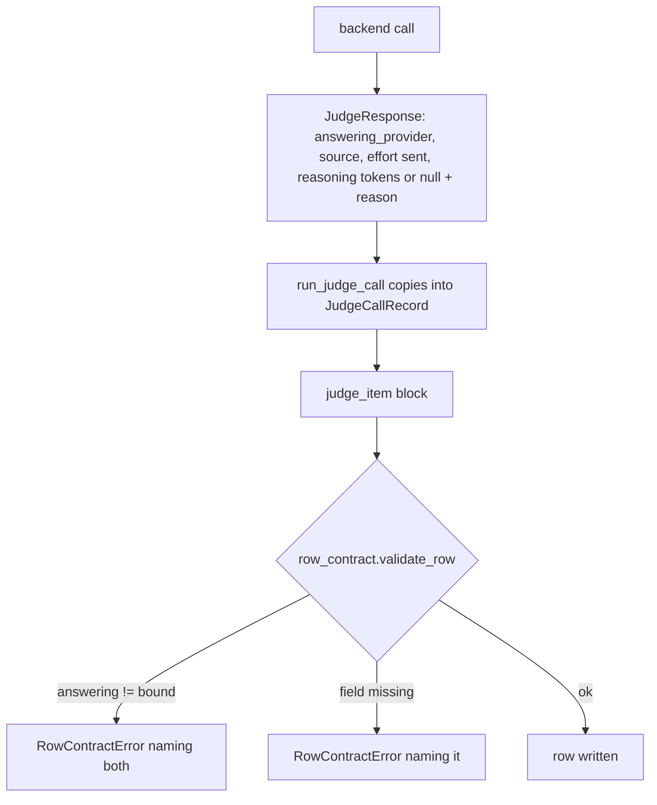
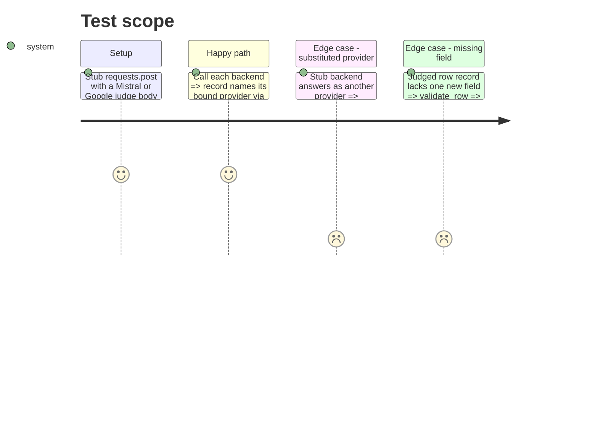

# Instruction: The six record fields, the two backends, and the writer gate

## Architecture projection

> Tree of the final files. ✅ create · ✏️ modify · ❌ delete

```txt
.
├── src/wave_local_ai_v2/
│   ├── judge.py            ✏️ JudgeResponse + JudgeCallRecord gain six fields; vocabulary constants
│   ├── judge_backends.py   ✏️ both backends fill the fields from what they send and receive
│   ├── google_client.py    ✏️ GoogleCompletion.reasoning_tokens: thoughtsTokenCount, else derived from the totals
│   └── row_contract.py     ✏️ SCHEMA_VERSION "13"; answering-provider, source, effort, reasoning-pair checks
└── tests/
    ├── test_judge.py        ✏️ backends record not_sent and null-with-reason; mismatched answering provider refused at write
    ├── test_google_client.py ✏️ reported count, derived count on the pinned shape, None without totals, contradiction refused
    └── test_row_contract.py ✏️ each new record field missing is refused by name; deterministic row unchanged
```

## User Journey



## Test Scope



## Tasks to do

### `1)` Record fields

> Additive TypedDict fields and their closed vocabularies.

1. Add the six keys to `JudgeResponse` and `JudgeCallRecord`; copy them in `run_judge_call`.
2. Declare `ANSWERING_PROVIDER_SOURCES`, `REASONING_EFFORT_NOT_SENT`, `REASONING_TOKENS_NULL_REASONS`.

### `2)` Backends

> Fill from what is actually sent and received.

1. Google client returns `reasoning_tokens` from `thoughtsTokenCount`, else `total - prompt - candidates` flagged as derived when all three are present, else None.
2. Both backends: bound provider + `direct_endpoint`, `not_sent`, reasoning count or null with its reason.

### `3)` Writer gate

> Refuse what the row cannot back.

1. Bump `SCHEMA_VERSION` to "13" with its reason.
2. Per judge record: answering provider equals bound provider (naming both), known source, non-empty effort string, reasoning count xor known null reason.

## Test acceptance criteria

| Task | Acceptance criteria |
| ---- | ------------------- |
| 1 | `JUDGE_CALL_RECORD_FIELDS` includes the six keys and a record carries them |
| 2 | Mistral and Google judge records say `not_sent`; Mistral carries null reasoning tokens with a named reason; Google on the pinned usage shape carries a 0 tagged `derived_from_totals` and a reportable cost; a Google body with `thoughtsTokenCount` yields that count tagged `reported` |
| 3 | A row whose record names a different answering provider is refused naming both; a row missing any new field is refused naming it; a deterministic quality row validates unchanged |
